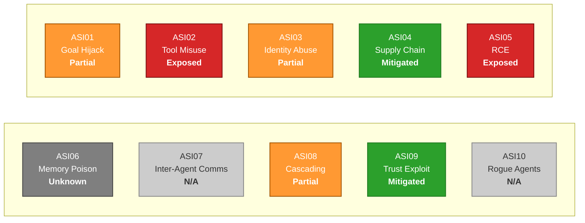

# Output Structure (deterministic)

This document is the canonical structure for the OWASP Agentic Top 10 report the skill produces. Every output document **must** follow this shape, in this order, with these section names. The aim is a deterministic, comparable deliverable that doesn't drift between runs.

## 1. YAML front matter (required)

```yaml
---
title: "OWASP Agentic Top 10 — <Codebase Name> Review"
subtitle: "Static review of <Codebase Name> against the OWASP Top 10 for Agentic Applications 2026"
date: "<YYYY-MM-DD>"
---
```

`<Codebase Name>` defaults to the basename of the input folder. `<YYYY-MM-DD>` is the date the review was run.

## 2. Lead block

Two short paragraphs:

1. One sentence stating that the report measures `<Codebase Name>` (at the absolute path, in the form `` `/abs/path` ``) against the ten Agentic Security Initiative (ASI) entries from *OWASP Top 10 for Agentic Applications 2026*.
2. One paragraph stating the scope of the review: the date / commit reviewed, what was looked at (file types, top-level paths), and any explicit limitations (e.g. *"binary artefacts, generated code under `dist/` and `node_modules/` were not scanned"*).

## 3. `## Executive Summary` (required)

Three to five bullets summarising the posture:

- Total number of ASI entries assessed and the per-verdict count: `Mitigated`, `Partial`, `Exposed`, `Unknown`, `Not applicable`.
- The single highest-severity finding by name (e.g. *"ASI05 — Unexpected Code Execution: Exposed (High) — `eval()` of model output in `agent/runner.py:142`"*).
- The single biggest *systemic* gap (e.g. *"No per-agent identity model: every agent run uses the same long-lived service-account token"*).
- The single most *encouraging* mitigation already in place (e.g. *"Tools are defined with explicit JSON schemas and validated before invocation"*).
- One sentence stating whether the codebase shows agentic-application fingerprints (planner, multi-step reasoning, tool use, peer-agent communication) — and if not, the report calls out that several ASI entries are `Not applicable`.

## 4. `## Risk Status Board` (required, headline visual)

Exactly one Mermaid block — a 2×5 grid of status tiles, one per ASI, tinted by verdict. This is the report's **headline visual summary** and sits immediately under the Executive Summary, before the Codebase Fingerprint table.

The colour palette is **codified across all OWASP reports** (it does not vary per run, per author or per codebase):

| Verdict          | classDef name | Fill      | Text  | Stroke    |
|------------------|---------------|-----------|-------|-----------|
| `Exposed`        | `exposed`     | `#d62728` | white | `#7a1010` |
| `Partial`        | `partial`     | `#ff9933` | white | `#a35400` |
| `Mitigated`      | `mitigated`   | `#2ca02c` | white | `#1f7a1f` |
| `Unknown`        | `unknown`     | `#7f7f7f` | white | `#444444` |
| `Not applicable` | `na`          | `#cccccc` | `#333`| `#888888` |

This is the **one** place this skill diverges from the data-dependency skill's "default theme only" rule (LESSON 6 of that skill's `LESSONS-LEARNED.md`). Verdict colour is the data, not branding — so the palette is fixed and codified, not improvised. **Do not invent new colours per run, do not adjust them for "tone", and do not omit them when running on a low-stakes codebase.** Same colours, every run.

Required structural conventions:

- `flowchart LR` (top-level) with two row-subgraphs each using `direction TB`. This produces a 2-rows-of-5 horizontal grid that fits A4 portrait.
- **Declare `row2` (ASI06-10) before `row1` (ASI01-05).** This is load-bearing: Mermaid renders parallel sibling subgraphs in *reverse* declaration order, so declaring row2 first puts row1 (ASI01-05) on top, in natural reading order. Verified empirically against `mmdc` — see the smoke-test PNGs under each skill's `*.assets/` folder. Do not "fix" this by reordering the declarations; the visual order will flip.
- Subgraph headers are blank (`subgraph row1 [" "]`) — the rows are visual layout aids, not labelled groupings.
- Each tile is a plain rectangle with three `<br/>`-separated lines: ASI number, short title, **bold** verdict (`<b>Exposed</b>`).
- The tile's classDef is set with `:::<verdict>` after the node definition — driven by the Phase 3 verdict for that ASI.
- Use **`<br/>`** for line breaks — never `\n` (LESSON 4 of the shared `LESSONS-LEARNED.md`).
- The diagram is rendered to PNG by the build pipeline before pandoc runs; the classDef palette survives the round-trip via `mmdc`.



A short caption immediately under the diagram restates the colour key in one line:

> Red = Exposed (highest priority), amber = Partial, green = Mitigated, dark grey = Unknown, light grey = Not applicable. Tile contents reflect this run's verdicts; the colour mapping is fixed across all OWASP Agentic Top 10 reports.

## 5. `## Codebase Fingerprint` (required)

A compact `Attribute | Detail` table:

```markdown
| Attribute | Detail |
|-----|--------------------|
| **Path reviewed** | `/abs/path/to/folder` |
| **Primary languages** | e.g. Python (78%), TypeScript (15%), shell (4%), other (3%) |
| **Files scanned** | <integer> |
| **Lines of code** | <integer> (excluding generated / vendored) |
| **Agentic frameworks detected** | LangGraph; Anthropic Agent SDK; (or "None — codebase is not an agentic application") |
| **Vector / memory stores** | Chroma; (or "None") |
| **MCP / A2A surfaces** | One MCP server defined under `mcp_server/`; (or "None") |
| **Tools registered with the agent** | <count> tools across <count> categories (file system, network, …); (or "None") |
| **External integrations** | Brief list of named external systems / APIs touched by tools |
| **Review date / commit** | YYYY-MM-DD / `<short SHA>` (or "uncommitted working tree") |
```

The dash-width pattern `5 / 20` for the separator row keeps the Detail column wide.

## 6. `## At a Glance` (required)

A single 5-column table — one row per ASI, in order ASI01–ASI10:

```markdown
| # | ASI Entry | Verdict | Severity | Headline |
|----|-------------------------------------|--------------|--------------|--------------------------------------------------|
| 01 | Agent Goal Hijack                   | Partial      | Medium       | System prompts version-controlled but RAG inputs unvalidated |
| 02 | Tool Misuse and Exploitation        | Exposed      | High         | `delete_record` tool exposed without confirmation |
| ... | ...                                | ...          | ...          | ... |
```

Rules:

- Verdict cell uses one of: `Mitigated`, `Partial`, `Exposed`, `Unknown`, `Not applicable`. Match the closed vocabulary verbatim.
- Severity cell uses one of: `Critical`, `High`, `Medium`, `Low`, `Informational`, or `—` (when verdict is `Not applicable`).
- Headline cell is **terse — 6–14 words** — the single most-important fact about that ASI in this codebase.
- Separator-dash widths drive Pandoc's column allocation: pattern `4 / 37 / 14 / 14 / 50` (count of dashes per column) gives the Headline column the largest share so its cells wrap to ≤ 2 lines.

## 7. Per-ASI detail entries (required, one per ASI in order)

For each ASI in order ASI01–ASI10:

```markdown
### ASI<NN> — <Title>

<Lead paragraph: 1–2 sentences. Restate the threat in this codebase's terms — what would a successful attack against this codebase look like for this ASI?>

| Attribute | Detail |
|-----|--------------------|
| **Verdict** | <one of: Mitigated / Partial / Exposed / Unknown / Not applicable> |
| **Severity** | <Critical / High / Medium / Low / Informational / —> |
| **Affirmative evidence** | <bullet-friendly list of code-grounded mitigations found, with file:line references; or "None observed" if nothing>; |
| **Risk signals** | <list of concerning patterns found, with file:line references; or "None observed">; |
| **Coverage gap** | <what was not checkable from static review alone — runtime behaviour, network policy, etc.> |
| **Recommendation** | <one or two specific actions, named files where applicable, ordered most-impactful first> |

> Sources: *OWASP Top 10 for Agentic Applications 2026* — ASI<NN>; codified rules at `.claude/lib/check-for-owasp-top10/references/OWASP-AGENTIC-TOP10.md`.
```

Rules:

- The four mandatory rows in the *Detail* column (`Verdict`, `Severity`, `Affirmative evidence`, `Risk signals`) plus `Coverage gap` and `Recommendation` give six rows total. All six must be present even when the answer is "None observed" or "—".
- File references use the form `path/relative/to/input/file.py:42` (line number, single colon). When citing a range, use `:42-58`. When citing a whole file, use `path/file.py` (no line number).
- "Affirmative evidence" and "Risk signals" cells **must trace back to actual code** — not to documentation, not to README claims, not to commit messages. If you cannot point at a file:line, the finding does not go in those rows.
- The `> Sources:` blockquote is mandatory and identical across all entries.

## 8. `## Codebase scan summary` (required)

A short bullet list:

- Top-level directories scanned (with file counts).
- File patterns explicitly excluded (e.g. `**/node_modules/**`, `**/.venv/**`, `**/dist/**`).
- Tools used in the scan (`Glob`, `Grep`, `Read`).
- Any files that could not be read (binary, oversized, permission-denied).

## 9. `## Limitations of static review` (required)

A short bullet list flagging what this report **cannot** assess:

- Runtime behaviour, network policy, IAM configuration, deployed secrets.
- Production logs / monitoring effectiveness.
- The *content* of system prompts (the report can confirm a prompt exists and is version-controlled, not that its wording is hardened).
- Third-party / external services the agent calls (only the call-site is visible).
- Behavioural alignment of the model itself.

## 10. `## References`

- *OWASP Top 10 for Agentic Applications 2026* — OWASP GenAI Security Project, December 2025. CC BY-SA 4.0.
- Codified rules: `.claude/lib/check-for-owasp-top10/references/OWASP-AGENTIC-TOP10.md`.
- Source extract: `.claude/lib/check-for-owasp-top10/references/owasp-top10-source-extract.txt`.

---

# Numbering, anchors and cross-references

Pandoc strips leading numbers from heading IDs. So `### ASI01 — Agent Goal Hijack` becomes anchor `#asi01--agent-goal-hijack`. When you write cross-references, use the no-number form.

# Output filenames

The skill writes:

```
<input-folder>/security/owasp/owasp-agentic-top10-report.md      # Phase 4 markdown
<input-folder>/security/owasp/owasp-agentic-top10-report.pdf     # Phase 5 styled PDF
<input-folder>/security/owasp/owasp-agentic-top10-report.assets/ # Phase 5 build artefacts (Mermaid PNGs, build markdown)
```

If the same review is re-run, all three are **overwritten**. To preserve history, the user should commit / archive before re-running.

# Style enforcement

The visual style of the rendered PDF is **shared** with the data-dependency and functional-modules skills:

- Typography, headings, tables, captions and page setup come from `.claude/lib/_shared/assets/doc-style.css`.
- Mermaid theme and fonts come from `.claude/lib/_shared/assets/mermaid-config.json` (default theme + Helvetica).
- A4 layout, 2 cm × 1.25 cm margins, Helvetica throughout, 11 pt body / 8.5 pt tables, dark-navy headers with white text, zebra rows, page numbers bottom-right.

The OWASP skill **does not** ship its own stylesheet or its own Mermaid theme — it consumes the shared house style verbatim, which keeps every PDF this repo's skills produce visually identical except for content.

The **one** documented divergence is the *Risk Status Board* classDef palette (red Exposed → light grey N/A) which is data, not branding. The palette is codified in §4 above and must not be altered between runs.

Authors should never hard-code colour, font or border choices anywhere else in the document. If a one-off override seems necessary, raise it as a stylesheet change in the shared pipeline so every doc benefits.
