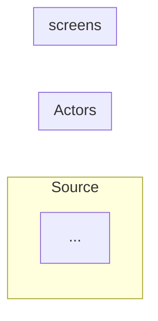
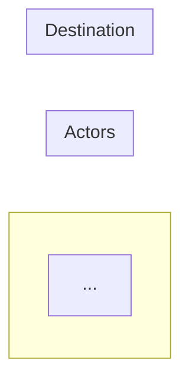

# Output Structure (deterministic)

This document is the canonical structure for the data-dependencies markdown / PDF the skill produces. Every output document **must** follow this shape, in this order, with these section names. The aim is a deterministic, consistent deliverable that doesn't drift between runs.

## 1. YAML front matter (required)

```yaml
---
title: "<System Name> — Data Dependencies"
subtitle: "Inbound and outbound data dependencies of the <SystemShort> system"
---
```

The `--` between title and subject is an em-dash (`—`, U+2014), not a hyphen-minus. Do not include `author:` here — the build pipeline injects "Scrumconnect" automatically.

## 2. Lead paragraph + intent bullets

Two short paragraphs, in order:

1. One sentence: "This document catalogues `<SystemShort>`'s data dependencies on other systems, in both directions:"
2. Bulleted list with **two** entries:
   - **Inbound** — definition specific to this system.
   - **Outbound** — definition specific to this system.
3. One paragraph naming the source documents and flagging that *gap* dependencies (data that should come from a system but is captured manually today) are still listed even if not implemented.

## 3. `## At a Glance` (required)

Single compact summary table with **all** flows in one place. Columns (in this order, no extras):

| `#` | `External System` | `Data Type` | `Data` | `Mechanism` |

Rules:

- One row per dependency. Number them 1..N **in narrative order**: inbound first, then platform, then outbound.
- The `External System` cell **combines direction and system name** in the form `**<Direction>** — <System>` (the direction is bold, em-dash separator). Direction values: `Inbound`, `Outbound`, `Platform`, or (rarely) `Both`. Example cell: `**Inbound** — Judicial Database (eLinks)`. Combining the two collapses what used to be two narrow columns into one, freeing horizontal space for the *Data* and *Mechanism* columns so their cells wrap less and rows are shorter.
- **Separator-dash widths are load-bearing.** Pandoc's pipe-table reader allocates `<col style="width:X%">` from the relative count of `---` characters in the header separator row. The mandatory pattern is `4 / 25 / 13 / 35 / 23` (dashes per column), which gives:
  - `#` → 4%
  - `External System` → 25%
  - `Data Type` → 13%
  - `Data` → **35%** (the largest share, so its cells wrap to ≤ 2 lines)
  - `Mechanism` → 23%
  Copy the separator row verbatim from the template; do *not* normalise the dashes for visual alignment in the source — the lopsided-looking dash counts are intentional.
- **No separate `Direction` column** and **no `Status` column** in this table — direction is folded into the system cell; implementation status lives in the per-section *Attribute / Detail* table only. The summary table is for orientation, not nuance.
- Cells must be **terse — aim for 1–6 words per cell** so the whole table fits on a single page. Drop redundant qualifiers ("system", "infrastructure"), prefer short type labels ("Operational" over "Operational / transactional"), and let the per-section *Attribute / Detail* table carry the full description.
- A short paragraph above the table explains that each row corresponds to a numbered detail section.

### 3a. Manual-copy dependencies are catalogued

When a human regularly transcribes or copies data from a *named upstream system* into `<SystemShort>` — even though there is no system-to-system integration — the upstream system is a first-class **inbound** dependency and **must** appear as a numbered row in this table with `Mechanism` describing the human path (e.g. *"Manual copy by RSU"*) and a `Status` of `Manual copy` in the per-section `Attribute / Detail` table.

"No integration" describes how the data moves, not whether the dependency exists. Dropping a manual-copy row because the documents say "no integration" is the most common cause of run-to-run variance and is what the Phase 2 keyword scan and enumeration artefact exist to prevent.

Genuine first-capture data entry — where there is **no** named upstream system, and the user is the original source of truth (e.g. a court clerk entering availability into a calendar) — is **not** a dependency. It is recorded in `system-enumeration.md` as ruled-out with `Status` = `Manual entry (no upstream system)` and is omitted from this table.

## 4. `## Data flow overview` (required)

Exactly one Mermaid `flowchart LR` block, pre-rendered to PNG by the build pipeline.

Required structural conventions:

- **Three subgraphs**: `Inbound`, `Platform`, `Outbound` (omit `Platform` if the system has none).
- Each subgraph uses `direction TB` so nodes stack vertically.
- **All containers are plain rectangles (ArchiMate style)** — including the central system. Use `SYS["System<br/>Name"]`, *not* `SYS[("System<br/>Name")]` or any other special shape. The hub/dependency distinction is conveyed by layout (centre vs flanking subgraphs), not by shape variation.
- Each external system node label is **prefixed with its number** from the At-a-Glance table: `["1. eLinks"]`.
- Solid arrows for implemented flows; **dashed arrows** (`-.->`) for non-implemented / out-of-band / platform flows.
- Edge labels short, multi-line via `<br/>` — never `\n`.

## 5. Horizontal rule + `## Inbound dependencies` + Inbound flow diagram

Then an H1-level section, in the form:

```markdown
---

## Inbound dependencies

These are flows where <SystemShort> is the **consumer** — data originates outside <SystemShort> and must be received for <SystemShort> to do its job.

The diagram below traces each inbound source through the human actors that move the data and into the <SystemShort> screens that consume it. <one short sentence calling out which arrows are out-of-band / dashed>.


```

The Inbound flow diagram is **mandatory**: a `flowchart LR` with three subgraphs (`Source`, `Actors`, `<SystemShort> screens`) showing the manual / out-of-band steps that sit between each numbered source and the JI screen that consumes it. Same styling as the Data flow overview (rectangles, default theme, `<br/>` line breaks, dashed arrows for genuinely out-of-band flows).

## 6. Numbered inbound detail entries

For **every** inbound row in the At-a-Glance table, in numerical order, repeat:

```markdown
### N. <External System>

<Lead paragraph: 1–2 sentences. Explain what this system is and why it matters for <SystemShort>. Name the system in **bold** on first reference.>

| Attribute | Detail |
|-----|--------------------|
| **Source system** | <full name + replacement / version notes> |
| **Direction** | Inbound — <SystemShort> consumes |
| **Data type** | <e.g. Master / reference data, Operational / transactional, Financial reconciliation> |
| **Data items** | <semicolon-separated list of specific fields / payloads> |
| **Mechanism** | <how the data moves today, in plain terms> |
| **Frequency** | <on change / daily / weekly / event-driven / unknown> |
| **Status** | <one of `Implemented (automated)` / `Manual copy` / `Stated NFR; not implemented`> |
| **Criticality** | <Critical / High / Medium / Low + one-line justification> |

> Sources: *<Doc name>* (section reference); *<Doc name>* (section reference).
```

The eight `Attribute / Detail` rows are **mandatory** for inbound entries. If a value is genuinely unknown, write `Unknown` rather than dropping the row.

The **`Status` cell uses a closed vocabulary** — the value must be **exactly** one of these strings, matched verbatim (no paraphrases):

| Value | When to use it |
|----|----|
| `Implemented (automated)` | A system-to-system integration is in production. |
| `Manual copy` | A human regularly transcribes / re-keys / copies data from a named upstream system into the target system. The upstream system is the dependency. |
| `Stated NFR; not implemented` | An NFR specifies the integration but it has not been built. |

Two further values — `Manual entry (no upstream system)` and `No integration (by design)` — are reserved for `system-enumeration.md` rows that record systems being **ruled out** of the catalogue. They never appear in a per-section `Attribute / Detail` table, because the row is by definition a system that *is* a dependency.

The Phase 2d cross-check (item 6) rejects any non-conforming `Status` string before authoring proceeds.

**Separator-dash widths are load-bearing here too.** Use the exact pattern `|-----|--------------------|` (5 dashes / 20 dashes) so pandoc allocates the columns at **20% / 80%** — narrow Attribute label, wide Detail. Don't normalise the dashes to look symmetrical; the lopsided count is intentional. The same pattern applies to outbound entries (Section 9).

## 7. (Optional) `## Bidirectional / Reconciliation dependencies`

Only when there is a true two-way dependency that doesn't fit neatly into either inbound or outbound. Use the same compact summary table format. Most systems can express reconciliation as the *return leg* of an outbound flow and treat it as an inbound entry — prefer that over a separate section.

## 8. Horizontal rule + `## Outbound dependencies` + Outbound flow diagram

Same shape as section 5, with consumer/producer reversed and a mandatory Outbound flow diagram immediately after the lead paragraph:

```markdown
---

## Outbound dependencies

These are flows where <SystemShort> is the **producer** — data originates inside <SystemShort> and is delivered to a downstream system or consumer.

The diagram below traces <SystemShort>'s outbound payloads through the human actors that handle them and into each destination. <one short sentence calling out routing through Payment Authoriser / DA&I analysts / etc.>


```

The Outbound flow diagram is **mandatory**: a `flowchart LR` with three subgraphs (`<SystemShort>`, `Actors`, `Destination`) showing the human routing steps that sit between each <SystemShort> screen and the numbered destination.

## 9. Numbered outbound detail entries

Same shape as section 6, with these **column changes** in the Attribute / Detail table:

| Inbound row label | Replaced for outbound |
|-------------------|------------------------|
| **Source system** | **Destination system** |
| (no Format row)   | Add `**Format**` row (e.g. *Excel file*, *PDF*, *email message + attachment*) |
| Direction         | `Outbound — <SystemShort> produces` |

So outbound entries have **nine** `Attribute / Detail` rows: Destination, Direction, Data type, Data items, Format, Mechanism, Frequency, Status, Criticality. The same closed `Status` vocabulary applies — `Implemented (automated)`, `Manual copy`, or `Stated NFR; not implemented`, matched verbatim.

## 10. Horizontal rule + `## Summary`

Three to five bullet points. Topics, in order of preference:

- How many flows are manual vs automated (inbound / outbound separately).
- Which platform / runtime dependencies are critical.
- The most operationally critical end-to-end chain — describe it using **dependency names**, not row numbers (e.g. *"HR records → JI sittings → JFEPS payment schedule → JFEPS reconciliation"*, never *"2 → JI → 6 → 3"*).
- Any notable gaps or *not yet implemented* requirements.

## 11. (Optional) Horizontal rule + `## Appendix`

Include this section **only** when a structural decision in the document genuinely needs explaining for the reader (e.g. why an integration that looks like one flow is split into two entries, or why a system mentioned in the source documents was deliberately ruled out of the catalogue).

Each appendix item is a single short bullet — a fact and its justification, sourced where possible. The body prose of the document never carries this reasoning; it lives here, where readers who want it can find it and others can skip it.

If there is nothing structurally non-obvious to record, omit the section entirely — don't add an empty placeholder.

## 12. Horizontal rule + `## Source Documents`

```markdown
This analysis is based **only** on the following documents in `<input-folder-name>/` (top-level files; subfolders not consulted):

- `Document 1.docx`
- `Document 2.doc`
- ...

Plain-text extractions of these documents were produced alongside the input folder at `<input-folder>/output/extracted-text/` and used as the basis of analysis without loading the binary documents into memory.
```

This list must exactly match the files actually present at the top level of the input folder when the skill ran. Don't list documents that weren't read.

---

# Numbering, anchors and cross-references

Pandoc-generated heading IDs **strip leading numbers** when emitting HTML anchors. So `### 7. JFEPS / Finance System (fee-paid payment files)` becomes anchor `#jfeps-finance-system-fee-paid-payment-files`, not `#7-jfeps-...`. When you write cross-references, use the no-number form:

```markdown
✅ [JFEPS / Finance System](#jfeps-finance-system-fee-paid-payment-files)
❌ [7](#7-jfeps-finance-system-fee-paid-payment-files)
```

The link **text** uses the dependency *name*, not its row number — see the prose-style rules below.

# Prose style — what NOT to write in the document

The document's prose explains *what* the data flows are and *what* their attributes are. It never explains *why* the document is structured the way it is. Two patterns to avoid in body prose:

## No skill-internal reasoning

Do not leak the skill's authoring conventions into the prose. Phrases like *"modelled here as a separate inbound entry per the OUTPUT-STRUCTURE convention"*, *"per the structure of this document"*, *"as the convention dictates"*, or *"this is captured below per the rules above"* are noise to the reader — they care about the data flows, not about how we organised the document.

If a particular structural decision *genuinely* requires explanation (e.g. why a single integration is split into two entries, or why a system mentioned in the source documents was deliberately ruled out), put a one-line note in the optional `## Appendix` section (Section 11). Don't pollute body prose with it.

## No numeric dependency references in prose

Tables (the `#` column in *At a Glance*) and diagrams (the `1. eLinks` style node labels) use numbers — that's their job. **Body prose uses names.** When referring to another dependency in prose, link the *name*, not the number:

```markdown
✅ "the [JFEPS / L!BERATA reconciliation flow](#jfeps-lberata-reconciliation) is the return leg of the outbound payment flow to the [JFEPS / JFEBS / L!BERATA finance system](#jfeps-jfebs-lberata-finance-system)"
❌ "Dependency 3 is the return leg of the outbound payment flow at 6"
❌ "the chain runs `2 → JI → 6 → 3`"
```

This keeps the prose readable, and stops it going stale when row numbers shift between runs.

# Style enforcement

The output is rendered with the **shared** house stylesheet (`.claude/lib/_shared/assets/doc-style.css`) and Mermaid theme (`.claude/lib/_shared/assets/mermaid-config.json`) — owned by `_shared/`, consumed by every PDF-producing skill in this repo. Authors should never bake colour, font or border choices into the document — the stylesheet handles all visual concerns. If a one-off override seems necessary, raise it as a stylesheet change in `_shared/` so every doc benefits.
