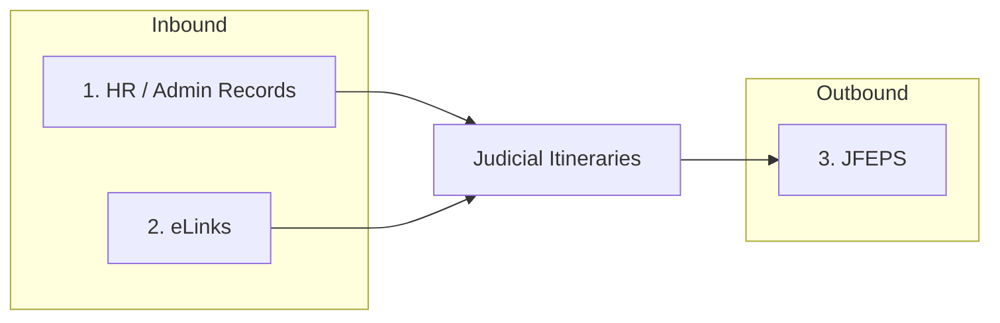

This is a short style guide for any architecture document rendered to PDF via the **shared** build pipeline at `.claude/lib/_shared/scripts/build-pdf.sh`. The pipeline writes outputs alongside the input data (`<input-folder>/output/`), never inside the project running it. The goal is **once-set, never-reinvented styling**: authors focus on content, the build applies the look.

The visual style is fully codified in `_shared/`:

- `.claude/lib/_shared/assets/doc-style.css` — typography, headings, tables, captions, page setup (consumed by WeasyPrint).
- `.claude/lib/_shared/assets/mermaid-config.json` — Mermaid theme, fonts and flowchart layout (consumed by `mmdc`).
- `.claude/lib/_shared/scripts/python/md_to_pdf.py` — wires both into the pandoc + weasyprint + mmdc pipeline.

If the rules below feel restrictive, **edit the stylesheet, not the document**. A one-off override defeats the purpose of having a house style.

---

## 1. File header — use YAML front matter

Every renderable document should start with YAML front matter that supplies a `title:` and (where useful) a `subtitle:`.

```yaml
---
title: "Judicial Itineraries (JI) — Data Dependencies"
subtitle: "Inbound and outbound data dependencies of the JI system across HMCTS"
---
```

The build pipeline renders the title block centred at the top of the PDF in the house typography. **Do not** also start the body with a duplicate `# Title` heading — if you do, the build script will strip it, but it's cleaner to omit it.

If a document has no YAML front matter, the build will fall back to using the first leading `# H1` as the title and strip it from the body.

---

## 2. Headings

| Level | Used for | Style applied |
|-------|----------|----------------|
| `#` (H1) | Major sections of a document (e.g. *Inbound dependencies*) | 22pt, dark navy, generous top margin |
| `##` (H2) | Sub-sections inside a major section (e.g. *At a Glance*, *Visual summary*) | 16pt, dark navy, **with thin underline rule** |
| `###` (H3) | Numbered detail entries (e.g. *3. Court Listing Systems*) | 13pt, dark navy |
| `####` (H4) | Rare — small uppercase labels inside a detail section | 11pt, uppercase, slightly tracked |

Number numbered detail sections inline in the heading (`### 1. HR / Administrative records`). Don't rely on auto-numbering; the numbers must align with the row numbers in the **At a Glance** table at the top of the document.

---

## 3. The "At a Glance" table

Every architecture document of more than ~3 sections should open with an **At a Glance** compact summary table, immediately after the lead paragraph. The table is a navigation aid: each row corresponds to a numbered detail section further down.

The shape is fixed — copy the header *and the separator dashes* verbatim:

```markdown
| # | External System | Data Type | Data | Mechanism |
|----|-------------------------|-------------|-----------------------------------|-----------------------|
| 1 | **Inbound** — Judicial Database (eLinks) | Master / reference | Judge identity, roles, payroll | Manual copy by RSU |
```

Rules:

- **Five columns only**: `#`, `External System`, `Data Type`, `Data`, `Mechanism`. No separate `Direction` column (folded into the system cell), no `Status` column (lives in the per-section table).
- The `External System` cell starts with a **bold direction tag** and an em dash: `**Inbound** — …`, `**Outbound** — …`, `**Platform** — …`. Combining the two collapses what used to be two narrow columns into one and frees space for the wide *Data* column.
- **Separator-dash widths are load-bearing.** The `4 / 25 / 13 / 35 / 23` dash pattern (count `-` per column) tells pandoc to emit `<col style="width: 4% / 25% / 13% / 35% / 23%">`. The wide *Data* share is what keeps its cells to ≤ 2 lines. Don't normalise the dashes for visual alignment — the lopsided count is intentional.
- Cells must be **terse — 1–6 words per cell**. Full nuance lives in the per-section *Attribute / Detail* table.
- Don't add custom HTML to colour cells. The stylesheet provides the visual.

---

## 4. Detail tables ("Attribute / Detail")

Inside a numbered detail section, use a two-column table where the left column is the attribute label (e.g. *Source*, *Data type*, *Mechanism*, *Frequency*, *Criticality*) and the right column is the description.

The shape is fixed — copy the header *and the separator dashes* verbatim:

```markdown
| Attribute | Detail |
|-----|--------------------|
| **Source system** | eLinks (Judicial Database) |
| **Data consumed** | Judge profiles, roles, base locations |
| **Mechanism** | Manual entry by RSU users |
```

Rules:

- **Separator-dash widths are load-bearing.** The `5 / 20` dash pattern produces `<col style="width: 20% / 80%">` — narrow Attribute label, wide Detail. Don't normalise to symmetrical dashes; the lopsided count is intentional.
- The left column holds short bold labels; the right column holds the prose. The stylesheet renders the table with a dark header underline and light horizontal rules between rows — no full grid, no column tinting.
- The `**Status**` row uses one of three verbatim values — `Implemented (automated)`, `Manual copy`, or `Stated NFR; not implemented`. The full closed vocabulary (including the two values reserved for `system-enumeration.md` rule-outs) is defined in [`OUTPUT-STRUCTURE.md`](OUTPUT-STRUCTURE.md). Don't paraphrase — Phase 2d will reject non-conforming strings.

---

## 5. Diagrams — Mermaid only

All architecture diagrams are authored as Mermaid fenced blocks (`` ```mermaid ``` ``). They are pre-rendered to PNG by the build pipeline before the PDF is produced, so the rendered diagram in the PDF is a real raster image with no font/whitespace surprises.

### 5.1 Theme

**Use the Mermaid `default` theme** (the pastel one). It's set in `.claude/lib/_shared/assets/mermaid-config.json` and applied automatically by the build. Don't hand-craft a `classDef` palette per document — that's exactly the "reinvent every time" anti-pattern this guide is here to prevent.

### 5.2 Group with `subgraph`

Use `subgraph` to cluster related nodes by role — e.g. *Inbound*, *Outbound*, *Platform*, *Sources*, *Users*, *Recipients*. Name each subgraph with a single capitalised word.



### 5.3 Line breaks inside node labels

Use `<br/>` to break long node labels onto multiple lines. **Never** use a literal `\n` — it renders as the two-character sequence `\n` in the PNG.

```text
✅  ["1. Judicial Database<br/>(eLinks)"]
❌  ["1. Judicial Database\n(eLinks)"]
```

### 5.4 Numbering

If the document has a numbered "At a Glance" table, prefix each diagram node label with the matching number (`1.`, `2.`, …). This lets the diagram be walked through in sequence and keeps it tied to the table.

### 5.5 Edge labels

Keep edge labels short — three to six words is plenty. Use `<br/>` for multi-line labels:

```text
A -->|"working patterns<br/>(manual entry)"| JI
```

For non-implemented or out-of-band flows, use a **dashed edge** (`-.->`) so the visual carries the "not a real integration" signal.

```text
JFR -. "manual flagging" .-> JI
```

### 5.6 Node shapes — rectangles only (ArchiMate style)

All containers — the central system *and* every external system — are plain rectangles: `["..."]`. Do not use cylinders (`[(...)]`), circles (`((...))`), or any other special Mermaid shape. The hub-vs-dependency distinction is conveyed by **layout** (centre node vs flanking subgraphs) and **clustering**, not by shape variation. This matches ArchiMate's convention of representing application components as uniform rectangles.

---

## 6. Citations and source pointers

When you reference a source document, use a blockquote containing italics:

```markdown
> Sources: *JI Functional and Non Functional Requirements* (Section 5.3.1).
```

The stylesheet renders blockquotes with a light grey left bar and muted text colour, which makes them visually distinct from body prose without dominating the page.

---

## 7. Page layout (handled automatically)

You don't need to set page size, margins, fonts or page numbers in document content — the stylesheet handles them:

- A4, **2 cm top/bottom × 1.25 cm left/right** margins (deliberately narrow horizontally — the wide content area is what lets compact tables stay on one page)
- Page number bottom-right
- Helvetica family throughout
- Body 11 pt, line height 1.55
- **Tables 8.5 pt with line-height 1.35 and 0.3em / 0.5em cell padding** — every doc gets the compact treatment automatically
- Code/monospace at 9 pt with a subtle grey background

If you find yourself wanting to override these, raise it as a stylesheet change so it benefits every document.

---

## 8. Building the PDF

```bash
.claude/lib/_shared/scripts/build-pdf.sh <input-folder>/output/<file>.md
```

This produces `<file>.pdf` next to the source. Mermaid PNGs and the rewritten build markdown are written to `<file>.assets/` for inspection if anything looks off.
