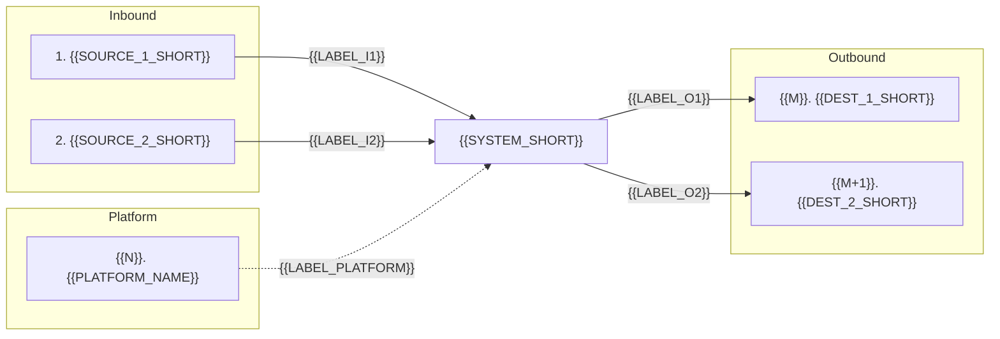

This document catalogues {{SYSTEM_SHORT}}'s data dependencies on other systems, in both directions:

- **Inbound** — data that {{SYSTEM_SHORT}} relies on to function correctly, and the source system that data should originate from.
- **Outbound** — data that {{SYSTEM_SHORT}} produces and delivers to external systems and consumers.

The analysis is grounded only in the input documents listed under [Source Documents](#source-documents). Where the source documentation describes a *gap* (data that ought to come from another system but is currently captured manually), this is flagged explicitly so the dependency stays visible even when the integration is not implemented today.

## At a Glance

The table below is a compact summary of every flow described in this document. Each row corresponds to a numbered detail section under [Inbound dependencies](#inbound-dependencies) or [Outbound dependencies](#outbound-dependencies); each detail section repeats the same compact summary in an `Attribute / Detail` table for ease of reference.

| # | External System | Data Type | Data | Mechanism |
|----|-------------------------|-------------|-----------------------------------|-----------------------|
| 1 | **Inbound** — {{SOURCE_1}} | {{TYPE_1}} | {{DATA_1}} | {{MECH_1}} |
| 2 | **Inbound** — {{SOURCE_2}} | {{TYPE_2}} | {{DATA_2}} | {{MECH_2}} |
| ... | ... | ... | ... | ... |
| N | **Outbound** — {{DEST_N}} | {{TYPE_N}} | {{DATA_N}} | {{MECH_N}} |

The **separator-dash widths above are load-bearing** — copy them verbatim. Pandoc's pipe-table reader uses the relative width of the `---` runs to allocate `<col style="width:X%">` percentages. The pattern `4 / 25 / 13 / 35 / 23` (counting dashes per column) gives the *Data* column the largest share so its cells wrap to ≤ 2 lines. Don't normalise the dashes for visual alignment.

Keep cells **terse** — aim for 1–6 words per cell so the whole table fits on a single page. Drop redundant qualifiers ("system", "infrastructure"), prefer short type labels ("Operational" over "Operational / transactional"), and let the per-section *Attribute / Detail* tables carry the full nuance.

## Data flow overview



---

## Inbound dependencies

These are flows where {{SYSTEM_SHORT}} is the **consumer** — data originates outside {{SYSTEM_SHORT}} and must be received for {{SYSTEM_SHORT}} to do its job.

The diagram below traces each inbound source through the human actors that move the data and into the {{SYSTEM_SHORT}} screens that consume it. {{ONE_SENTENCE_CALLING_OUT_DASHED_ARROWS}}.

```mermaid
flowchart LR
    subgraph sources [Source]
        direction TB
        S1["1. {{SOURCE_1_SHORT}}"]
        S2["2. {{SOURCE_2_SHORT}}"]
    end

    subgraph actors [Actors]
        direction TB
        A1["{{ACTOR_1}}"]
        A2["{{ACTOR_2}}"]
    end

    subgraph ji [{{SYSTEM_SHORT}} screens]
        direction TB
        SC1["{{SCREEN_1}}"]
        SC2["{{SCREEN_2}}"]
    end

    S1 -->|"{{LABEL_S1_A1}}"| A1
    S2 -->|"{{LABEL_S2_A2}}"| A2
    A1 --> SC1
    A2 --> SC2
```

### 1. {{SOURCE_1}}

{{LEAD_PARAGRAPH_1}} (1–2 sentences, no more.)

| Attribute | Detail |
|-----|--------------------|
| **Source system** | {{SOURCE_1_FULL}} |
| **Direction** | Inbound — {{SYSTEM_SHORT}} consumes |
| **Data type** | {{TYPE_1}} |
| **Data items** | {{DATA_ITEMS_1}} (semicolon-separated list) |
| **Mechanism** | {{MECH_1_FULL}} |
| **Frequency** | {{FREQ_1}} |
<!-- Status — exactly one of: `Implemented (automated)` / `Manual copy` / `Stated NFR; not implemented`. The two further values `Manual entry (no upstream system)` and `No integration (by design)` are reserved for system-enumeration.md rule-outs and never appear here. -->
| **Status** | Manual copy |
| **Criticality** | {{CRIT_1}} |

> Sources: *{{SOURCE_DOC_1}}* (section reference); *{{SOURCE_DOC_2}}* (section reference).

### 2. {{SOURCE_2}}

(... repeat the same 1-paragraph + 8-row Attribute table + Sources blockquote pattern for every inbound dependency ...)

---

## Outbound dependencies

These are flows where {{SYSTEM_SHORT}} is the **producer** — data originates inside {{SYSTEM_SHORT}} and is delivered to a downstream system or consumer.

The diagram below traces {{SYSTEM_SHORT}}'s outbound payloads through the human actors that handle them and into each destination. {{ONE_SENTENCE_CALLING_OUT_HUMAN_ROUTING}}.

```mermaid
flowchart LR
    subgraph ji [{{SYSTEM_SHORT}}]
        direction TB
        SC1["{{SCREEN_OR_TRIGGER_1}}"]
        SC2["{{SCREEN_OR_TRIGGER_2}}"]
    end

    subgraph actors [Actors]
        direction TB
        A1["{{ACTOR_1}}"]
        A2["{{ACTOR_2}}"]
    end

    subgraph dests [Destination]
        direction TB
        D1["{{M}}. {{DEST_1_SHORT}}"]
        D2["{{M+1}}. {{DEST_2_SHORT}}"]
    end

    SC1 -->|"{{LABEL_SC1_A1}}"| A1
    A1 -->|"{{LABEL_A1_D1}}"| D1
    SC2 -->|"{{LABEL_SC2_A2}}"| A2
    A2 -->|"{{LABEL_A2_D2}}"| D2
```

### {{M}}. {{DEST_1}}

{{LEAD_PARAGRAPH_M}}

| Attribute | Detail |
|-----|--------------------|
| **Destination system** | {{DEST_1_FULL}} |
| **Direction** | Outbound — {{SYSTEM_SHORT}} produces |
| **Data type** | {{TYPE_M}} |
| **Data items** | {{DATA_ITEMS_M}} |
| **Format** | {{FORMAT_M}} |
| **Mechanism** | {{MECH_M_FULL}} |
| **Frequency** | {{FREQ_M}} |
<!-- Status — exactly one of: `Implemented (automated)` / `Manual copy` / `Stated NFR; not implemented`. The two further values `Manual entry (no upstream system)` and `No integration (by design)` are reserved for system-enumeration.md rule-outs and never appear here. -->
| **Status** | Implemented (automated) |
| **Criticality** | {{CRIT_M}} |

> Sources: *{{SOURCE_DOC_X}}* (section reference).

(... repeat for every outbound dependency ...)

---

## Summary

- (3-5 bullets — high-level observations about the dependency landscape: how many are manual vs automated, the most critical end-to-end chain (described by **dependency name**, not by row number), any notable gaps.)

---

<!-- Optional. Include only if there are structural decisions in this catalogue
     that genuinely need explaining for the reader (e.g. why aliases were
     merged, why a system mentioned in the source docs was deliberately ruled
     out, why a reconciliation flow is split into two entries). One short
     bullet per item. Omit the section entirely if there is nothing to record. -->
## Appendix

- (Optional — one short bullet per structural note. Body prose should never carry this reasoning.)

---

## Source Documents

This analysis is based **only** on the following documents in `{{INPUT_FOLDER_NAME}}/` (top-level files; subfolders not consulted):

- `{{DOCUMENT_1}}`
- `{{DOCUMENT_2}}`
- ...

Plain-text extractions of these documents were produced alongside the input folder at `{{INPUT_FOLDER_NAME}}/output/extracted-text/` and used as the basis of analysis without loading the binary documents into memory.
