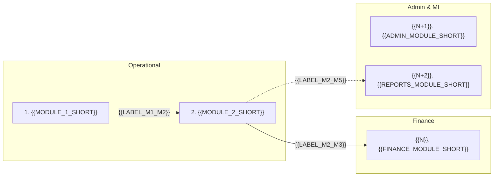

This document catalogues {{SYSTEM_SHORT}}'s functional modules — what each does, who uses it, and how the modules fit together:

- **Module** — a first-class part of the application's functional surface, with its own numbered detail section below.
- **Sub-module / Cross-cutting** — described in the source documents but presented under a parent module or in the closing [Cross-cutting NFRs](#cross-cutting-nfrs) section.

The analysis is grounded only in the input documents listed under [Source Documents](#source-documents). Each module's `Status` cell uses the closed vocabulary `Implemented` / `Partial` / `Discovery required` / `Out of scope`.

## At a Glance

The table below is a compact summary of every module described in this document. Each row corresponds to a numbered detail section under [Modules](#modules); each detail section repeats the same compact summary in an `Attribute / Detail` table for ease of reference.

| # | Module | Primary Users | Purpose | Status |
|----|--------------------------|------------------|------------------------------------|----------------|
| 1 | **{{MODULE_1}}** | {{USERS_1}} | {{PURPOSE_1}} | Implemented |
| 2 | **{{MODULE_2}}** | {{USERS_2}} | {{PURPOSE_2}} | Implemented |
| ... | ... | ... | ... | ... |
| N | **{{MODULE_N}}** | {{USERS_N}} | {{PURPOSE_N}} | Partial |

The **separator-dash widths above are load-bearing** — copy them verbatim. Pandoc's pipe-table reader uses the relative width of the `---` runs to allocate `<col style="width:X%">` percentages. The pattern `4 / 26 / 18 / 36 / 16` (counting dashes per column) gives the *Purpose* column the largest share so its cells wrap to ≤ 2 lines. Don't normalise the dashes for visual alignment.

Keep cells **terse** — aim for 1–8 words per cell so the whole table fits on a single page.

## Module overview

---

## Modules

These are the first-class functional modules of {{SYSTEM_SHORT}}. Each section below mirrors the row above in the *At a Glance* table and provides the full Capabilities list, Attribute / Detail summary and Sources for that module.

### 1. {{MODULE_1}}

{{LEAD_PARAGRAPH_1}} (1–2 sentences, no more.)

**Capabilities**

- {{CAP_1_1}}
- {{CAP_1_2}}
- {{CAP_1_3}}

| Attribute | Detail |
|-----|--------------------|
| **Module ID** | {{MODULE_1_ID}} |
| **Primary users** | {{USERS_1_FULL}} |
| **Trigger / entry points** | {{TRIGGER_1}} |
| **Inputs** | {{INPUTS_1}} |
| **Outputs** | {{OUTPUTS_1}} |
| **Business rules** | {{BUSINESS_RULES_1}} |
| **Cross-module dependencies** | {{CROSS_MODULE_1}} |
| **NFRs** | {{NFRS_1}} |
<!-- Status — exactly one of: `Implemented` / `Partial` / `Discovery required` / `Out of scope`. No paraphrases. -->
| **Status** | Implemented |

**Key user actions**

- **WHEN** {{ACTION_1_1_WHEN}} **THEN** {{ACTION_1_1_THEN}}
- **WHEN** {{ACTION_1_2_WHEN}} **THEN** {{ACTION_1_2_THEN}}

> Sources: *{{SOURCE_DOC_1}}* (section reference); *{{SOURCE_DOC_2}}* (section reference).

### 2. {{MODULE_2}}

(... repeat the same lead + Capabilities + 9-row Attribute table + optional Key user actions + Sources blockquote pattern for every Module-classified row ...)

---

<!-- Optional. Include this section ONLY when the source documents describe NFRs that
     apply across every module (authentication, audit, role-based access, accessibility,
     performance budgets). One short bullet per NFR. Omit the section entirely if there
     are no system-wide NFRs distinct from per-module ones. -->
## Cross-cutting NFRs

- **{{NFR_GROUP_1}}** — {{NFR_GROUP_1_DESC}}
- **{{NFR_GROUP_2}}** — {{NFR_GROUP_2_DESC}}

> Sources: *{{NFR_SOURCE_DOC}}* (section references).

---

## Summary

- (3-5 bullets — high-level observations: how many modules are `Implemented` vs `Partial` vs `Discovery required` vs `Out of scope`, the most operationally critical end-to-end flow described by **module name**, any notable gaps.)

---

<!-- Optional. Include only if there are structural decisions in this catalogue that
     genuinely need explaining for the reader (e.g. why a sub-module is presented under
     a parent, why a module mentioned in the source documents was deliberately ruled out).
     One short bullet per item. Omit the section entirely if there is nothing to record. -->
## Appendix

- (Optional — one short bullet per structural note. Body prose should never carry this reasoning.)

---

## Source Documents

This analysis is based **only** on the following documents in `{{INPUT_FOLDER_NAME}}/` (top-level files; subfolders not consulted):

- `{{DOCUMENT_1}}`
- `{{DOCUMENT_2}}`
- ...

Plain-text extractions of these documents were produced alongside the input folder at `{{INPUT_FOLDER_NAME}}/output-functional-modules/extracted-text/` and used as the basis of analysis without loading the binary documents into memory.
