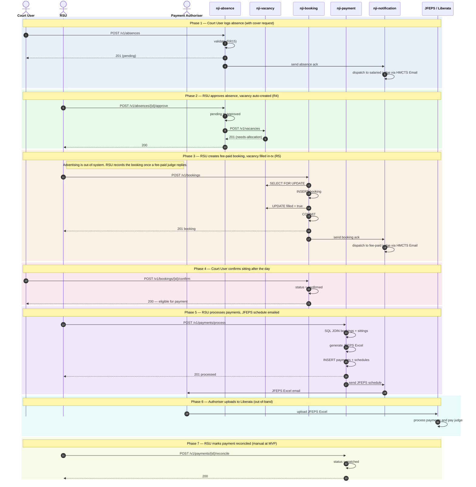

# Absence → Vacancy → Booking → Sitting → Payment → Reconciliation

High-level sequence diagram of the canonical NJI operational cycle: a Court User logs an absence on behalf of a salaried judge, the absence triggers a vacancy, RSU fills the vacancy with a fee-paid booking, the Court User confirms the sitting, RSU processes the payment, the Payment Authoriser uploads the schedule to JFEPS / Liberata, and finally the payment is reconciled.

The flow is split into **seven phases** — each one driven by a different user (or external actor). Phases are colour-tinted in the diagram for visual separation. Within a phase the sequence is ordered top-to-bottom; phases follow each other in business-process order.

**Cross-cutting steps omitted for clarity** (they apply on every UI→service call but would clutter the diagram):

- All UI→service calls flow through Azure API Management.
- Each service's `JWTFilter` validates the inbound JWT signature against HMCTS IdP's JWKS endpoint **before** the controller runs.
- The same `JWTFilter` calls `POST /authz/check` against `nji-authorisation` to resolve role + Region/Area scope + per-region activation flag (FR58).
- Cross-service calls forward the user's JWT (token propagation; no service principals at MVP).

## Phase summary

| Phase | Driver | Architectural rule | Outcome |
|---|---|---|---|
| 1 — Absence logged | Court User | Validation (FR15-style) | Absence record created (pending); ack email to salaried judge |
| 2 — Absence approved | RSU | **R4** — approval triggers vacancy creation | Vacancy created (needs-allocation) |
| 3 — Booking created | RSU | **R5** — pessimistic row lock + in-transaction UPDATE on `vacancies.filled` | Booking persisted; vacancy filled; ack email to fee-paid judge |
| 4 — Sitting confirmed | Court User | State transition (eligible for payment) | Booking status = confirmed |
| 5 — Payment processed | RSU | SQL JOIN over confirmed bookings + sittings; JFEPS Excel content-type | Payment + payment_schedules persisted; JFEPS email to authoriser |
| 6 — Liberata upload | Payment Authoriser | Out-of-band; NJI is not in the loop | Judge paid via JFEPS / Liberata |
| 7 — Reconciliation | RSU | Manual at MVP (automated feed post-MVP) | `payment_reconciliations.status = matched` |

## Where to find more detail

| Detail | Location |
|---|---|
| Service responsibilities and key functions | [`../../architecture.md` → Repository List](../../architecture.md) |
| Data Architecture (shared schema, per-service DB roles, R5 pessimistic-lock pattern) | [`../../architecture.md` → Step 4 *Data Architecture*](../../architecture.md) |
| Integration Points — internal call patterns + external systems | [`../../architecture.md` → Step 6 *Integration Points*](../../architecture.md) |
| Authentication / authorisation cross-cutting steps (omitted from diagram) | [`../../architecture.md` → Step 4 *Authentication & Security*](../../architecture.md), [`../../architecture-summary.md` → *Authentication & Authorisation*](../../architecture-summary.md) |
| Per-table column-level detail (`bookings`, `vacancies`, `payments`, `payment_schedules`, `payment_reconciliations`, `notification_dispatches`, `auth_users`) | [`../data-tables.md`](../data-tables.md) |
| Reconciliation lifecycle (MVP manual; post-MVP roadmap) | [`../../architecture.md` → Step 4 *Data Flow — Canonical Operational Cycle*](../../architecture.md); PRD `FR46` |
| Retry-safety conventions (`@Version` optimistic locking, natural-key unique constraints, `SELECT … FOR UPDATE`) | [`../conventions.md` → *Retry safety and concurrency control*](../conventions.md) |
| JWT propagation pattern (the cross-cutting auth step omitted from the diagram) | [`../conventions.md` → *Communication Patterns / JWT propagation*](../conventions.md) |
