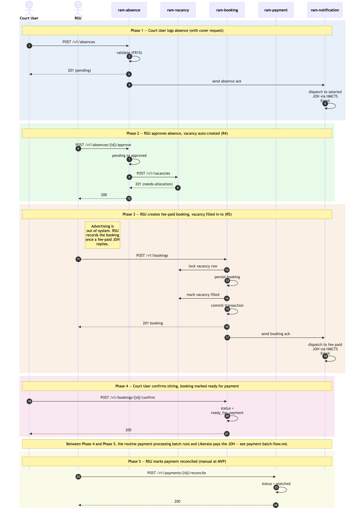

# Absence → Vacancy → Booking → Sitting → Reconciliation

Sequence diagram of the user-initiated RAM Pathfinder operational cycle: a Court User logs an absence for a salaried JOH; the absence triggers a vacancy; RSU fills the vacancy with a fee-paid booking; the Court User confirms the sitting (marking it ready for payment); RSU reconciles the payment after the batch and external systems complete.

Five phases, each driven by a user action. Phases are colour-tinted in the diagram.

## Not in this diagram

User-initiated activities only. The following sit between Phase 4 and Phase 5 but are not drawn because they are not user-initiated:

- **Payment-processing batch** — picks up bookings with `status = ready_for_payment`, SQL-JOINs across confirmed bookings + sittings, generates the JFEPS Excel, persists `ram_payments` + `ram_payment_schedules`, dispatches via email to the Payment Authoriser. Runs on a schedule (e.g. end-of-week). See [`./payment-batch-flow.md`](./payment-batch-flow.md).
- **Payment Authoriser → JFEPS / Liberata** — authoriser reviews the email and uploads to Liberata via the existing JFEPS workflow. Out-of-band.
- **Liberata processing** — Liberata pays the fee-paid JOH. External system.

## Cross-cutting steps omitted

Apply to every Court / RSU → service call:

- All UI → service calls flow through Azure API Management.
- Each service's `JWTFilter` validates the JWT signature against HMCTS IdP's JWKS before the controller runs.
- The same `JWTFilter` calls `POST /authz/check` against `ram-authorisation` for roles + jurisdiction + Region/Area scope + activation flag (FR57).
- Cross-service calls forward the user's JWT.

*Source: [`./absence-to-reconciliation.mmd`](./absence-to-reconciliation.mmd) (Mermaid). Regenerate with `mmdc -i absence-to-reconciliation.mmd -o absence-to-reconciliation.png -w 2400 -s 2 --backgroundColor white`.*

## Phase summary

| Phase | Driver | Architectural rule | Outcome |
|---|---|---|---|
| 1 — Absence logged | Court User | Validation (FR15-style: ticket-type + start date required) | Absence record created (status: pending); ack email to salaried JOH |
| 2 — Absence approved | RSU | **R4** — approval triggers vacancy creation | Vacancy created (status: needs-allocation) |
| 3 — Booking created | RSU | **R5** — booking creation marks the linked vacancy as filled in the same transaction (persistence detail in *Data Architecture*) | Booking persisted; vacancy filled; ack email to fee-paid JOH |
| 4 — Sitting confirmed | Court User | State transition; record marked ready for the payment batch | Booking status = `ready_for_payment` (the batch picks this up later) |
| *(out of scope)* | *(none — batch / external)* | *Routine payment-processing batch + Liberata processing* | *JFEPS Excel generated, dispatched, uploaded; JOH paid* |
| 5 — Reconciliation | RSU | Manual at MVP (automated reconciliation feed from Liberata is post-MVP) | `ram_payment_reconciliations.status = matched` |

## Where to find more detail

| Detail | Location |
|---|---|
| Service responsibilities and key functions | [`../../architecture.md` → Repository List](../../architecture.md) |
| Data Architecture (shared schema, per-service DB roles, R5 pessimistic-lock pattern) | [`../../architecture.md` → Step 4 *Data Architecture*](../../architecture.md) |
| Integration Points — internal call patterns + external systems (HMCTS Email, JFEPS / Liberata) | [`../../architecture.md` → Step 6 *Integration Points*](../../architecture.md) |
| Authentication / authorisation cross-cutting steps (omitted from diagram) | [`../../architecture.md` → Step 4 *Authentication & Security*](../../architecture.md), [`../../architecture-summary.md` → *Authentication & Authorisation*](../../architecture-summary.md) |
| Per-table column-level detail (`ram_bookings`, `ram_vacancies`, `ram_payments`, `ram_payment_schedules`, `ram_payment_reconciliations`, `ram_notification_dispatches`, `ram_auth_users`) | [`../data-tables.md`](../data-tables.md) |
| Reconciliation lifecycle (MVP manual; post-MVP roadmap) | [`../../architecture.md` → Step 4 *Data Flow — Canonical Operational Cycle*](../../architecture.md); PRD `FR46` |
| Retry-safety conventions (natural-key uniqueness, optimistic locking, pessimistic row locking) | [`../../architecture.md` → *Data Architecture*](../../architecture.md) and [`../data-tables.md`](../data-tables.md) |
| JWT propagation pattern (the cross-cutting auth step omitted from the diagram) | [`../conventions.md` → *Communication Patterns / JWT propagation*](../conventions.md) |
| Service-identity question for non-user-initiated flows (which the payment batch is) | [`../gaps.md` → G7](../gaps.md) — explicitly post-MVP open item |
