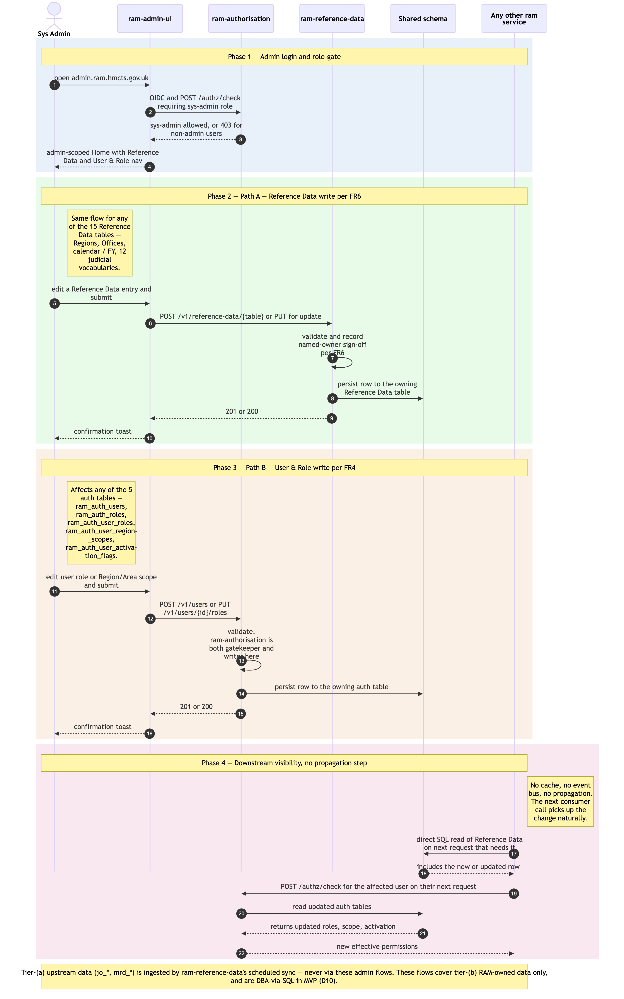

# Admin maintenance flows in `ram-admin-ui`

Sequence diagram of the two admin write paths exposed by `ram-admin-ui` at MVP. Both paths share the same actor (System Administrator), the same auth pattern, and the same UI shell — only the destination service and the downstream effect differ. Both run in `ram-admin-ui`, never in `ram-ui`, per the v2.10 architecture decision separating admin from business workflows at the repo boundary.

- **Path A — Reference Data maintenance (FR6)** — Sys Admin (or RSU-with-admin-rights — same admin module, same role-gate) creates / updates an entry in any of the 15 Reference Data tables (Regions, Offices, calendar / financial-year boundaries, the 12 judicial vocabularies). Writes go via the `ram-reference-data` versioned API. Other services pick up the change on their next direct-SQL read of the affected table (per revised FR7) — no cache invalidation needed because there is no cache (architecture Principle 2).
- **Path B — User & Role admin (FR4)** — Sys Admin updates a user's role and Region/Area scope assignment, or creates a new user record. Writes go via the `ram-authorisation` versioned API. The change is reflected on the affected user's *next* request via the standard per-request `authz/check` (see [`./user-authentication-and-authorisation.md`](./user-authentication-and-authorisation.md) Phase 3) — no propagation step is needed because authz is resolved per request.

Four phases: (1) admin login + role-gate; (2) Reference Data write path; (3) User & Role write path; (4) downstream visibility (no propagation step).

## Not in this diagram

- **Upstream reference-data ingestion** *(replaces the retracted Phase 0 ETL — revised D3, 2026-06-10)* — the JOH eLinks nightly sync and MRD weekly blob pick-up populate the tier-(a) `jo_*`/`mrd_*` tables in-process inside `ram-reference-data`; never via admin UI or admin API. See [`./joh-onboarding-and-sitting-generation.md`](./joh-onboarding-and-sitting-generation.md) Phase 1. The admin maintenance flows here apply to **tier-(b) RAM-owned data only** (FR6).
- **Per-(jurisdiction, region) phased activation cutover** (FR57) — wave-cutover operation that flips `ram_auth_user_activation_flags` by jurisdiction + region. Operator-initiated per wave, DBA-via-SQL per the rollout runbook in MVP[^d10].
- **Named-owner sign-off workflow detail** — Reference Data writes are subject to named-owner sign-off per FR6; the diagram captures the validation point but not the full multi-step approval. Sign-off mechanics are programme-level.
- **Post-MVP admin modules** — per-(jurisdiction, region) activation dashboard and user-action audit viewer. Module placeholders are reserved in `ram-admin-ui`, which is itself post-MVP[^d10] — in MVP every flow on this page is performed by DBAs via direct SQL per operational runbooks.

## Cross-cutting steps omitted for clarity

- **Authentication + per-request authorisation** — Sys Admin's JWT is validated by both `ram-reference-data`'s and `ram-authorisation`'s `JWTFilter`. Admin role gating is enforced by `ram-authorisation` itself (role = `sys-admin`); for User & Role admin, this means `ram-authorisation` is both the gatekeeper *and* the writer of the change. See [`./user-authentication-and-authorisation.md`](./user-authentication-and-authorisation.md) Phase 3.
- All UI → service calls flow through Azure API Management. `ram-admin-ui` deploys to its own hostname (e.g. `admin.ram.hmcts.gov.uk`) but the same APIM tier handles its requests.

*Source: [`./admin-maintenance-flows.mmd`](./admin-maintenance-flows.mmd) (Mermaid). Regenerate with `mmdc -i admin-maintenance-flows.mmd -o admin-maintenance-flows.png -w 2400 -s 2 --backgroundColor white`.*

## Phase summary

| Phase | Driver | Architectural rule | Outcome |
|---|---|---|---|
| 1 — Admin login + role-gate | Sys Admin | OIDC SSO same as business users; `ram-authorisation` role-gate restricts `ram-admin-ui` access to `sys-admin` role | Admin lands on `ram-admin-ui` Home with admin-scoped navigation; non-admin users see a 403 if they try to reach this hostname |
| 2 — Reference Data write path (FR6) | Sys Admin | `ram-reference-data` is the single writer for the 15 Reference Data tables (revised FR7); writes are validated, audited, and persisted to the shared schema | Reference Data row created / updated; visible to every other RAM Pathfinder service on its next direct-SQL read (no cache, no propagation step) |
| 3 — User & Role write path (FR4) | Sys Admin | `ram-authorisation` owns the 5 auth tables (`ram_auth_users`, `ram_auth_roles`, `ram_auth_user_roles`, `ram_auth_user_region_scopes`, `ram_auth_user_activation_flags`); writes are validated and persisted | User / role / scope row created / updated; affected user sees the new effective permissions on their *next* request via per-request `authz/check` |
| 4 — Downstream visibility | (none — passive) | No cache, no event bus, no propagation step (architecture Principle 2 + REST-first synchronous coordination) | Next consumer call picks up the change naturally |

## Where to find more detail

| Detail | Location |
|---|---|
| `ram-admin-ui` repo purpose, MVP modules, and future-surface placeholders | [`../repository-strategy.md`](../repository-strategy.md) — new row added in v2.10 |
| `ram-admin-ui` directory structure | [`../repo-structure.md` → Complete Project Directory Structure — UI repos → `ram-admin-ui`](../repo-structure.md) |
| `ram-reference-data` repo purpose and key functions | [`../repository-strategy.md`](../repository-strategy.md) Phase 0 row |
| `ram-authorisation` repo purpose and key functions | [`../repository-strategy.md`](../repository-strategy.md) Phase 0 row |
| 15 Reference Data tables + 5 Authorisation tables (column-level detail) | [`../data-tables.md`](../data-tables.md) |
| FR4 (User & Role admin) + FR6 (Reference Data maintenance) | PRD `FR4`, `FR6`; both annotated in [`./functional-requirements-coverage.md`](../functional-requirements-coverage.md) with the admin UI location |
| Why admin and business UI are separate repos (v2.10) | [`../../architecture.md` → Step 4 *Frontend Architecture*](../../architecture.md); [`./changelog.md` v2.10](../changelog.md) |
| Per-request authz resolution that picks up Path B changes on the next call | [`./user-authentication-and-authorisation.md`](./user-authentication-and-authorisation.md) Phase 3 |
| Upstream reference-data ingestion (replaces the retracted ETL) | [`../../architecture.md` → *Upstream reference-data ingestion*](../../architecture.md); [`../data-tables.md`](../data-tables.md) tier-(a) tables |
| As-is equivalent — Module 11 *Admin* had only narrow self-service (password change, new-user request); higher-impact admin was off-screen in OPT Support. RAM Pathfinder brings it into a first-class admin module. | [`../../../docs/architecture/asis/functional-modules.md` → Module 11](../../../../docs/architecture/asis/functional-modules.md) |

[^d10]: D10 (2026-05-15) — admin UI is post-MVP; MVP admin operations are DBA-via-SQL per operational runbooks.
