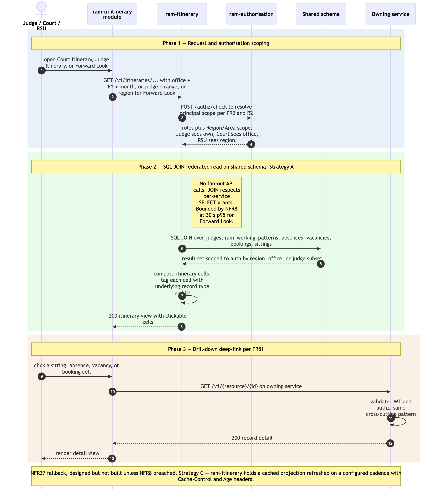

# Itinerary federated read — Court Itinerary, Judge Itinerary, Forward Look

Sequence diagram of how itinerary views are served by `ram-itinerary`. The service holds **no own tables** — it composes Court Itinerary, Judge Itinerary, and Forward Look views by SQL-JOINing across `jo_people`, `ram_working_patterns`, `ram_absences`, `ram_vacancies`, `ram_bookings`, and `ram_sittings` on the shared schema (architecture Principle 1). This is the canonical *Strategy A federated read* pattern; NFR8 bounds it at ≤ 30 s p95 for Forward Look across a Region, with NFR37 specifying Strategy C cached projection as the documented fallback if measurement breaches NFR8.

The as-is equivalents are Module 3 *Court Itinerary*, Module 4 *Judge Itinerary*, and the JFL *Judges Forward Look* sub-module in [`../../../docs/architecture/asis/functional-modules.md`](../../../../docs/architecture/asis/functional-modules.md).

Three phases: (1) request + authorisation scoping; (2) SQL JOIN federated read; (3) drill-down deep-link into the underlying record.

## Not in this diagram

- **Strategy C cache fallback** — designed and documented (NFR37) but not built unless measurement shows NFR8 breached. Adding it would introduce a cache invalidation flow and a freshness header pattern (`Cache-Control` + `Age`) — out of scope for the MVP architectural diagram.
- **Excel / PDF export** (FR52) — a separate render step on top of the same data; same shape as Phase 2's read, then format-shifted. Not drawn separately.
- **Home dashboard tile aggregation** (FR55) — same pattern as this diagram with different aggregations; functionally a sub-case of Court Itinerary monthly view.
- **Cross-Region judge linking display** (FR18) — the federated read shows linked-judge sittings transparently; the linking record itself is created in [`./joh-onboarding-and-sitting-generation.md`](./joh-onboarding-and-sitting-generation.md).

## Cross-cutting steps omitted for clarity

- **Authentication + per-request authorisation** — User's JWT is validated by `ram-itinerary`'s `JWTFilter` and resolved to a principal with roles + Region/Area scope. **Authorisation scoping is critical** for this flow: judges see only their own itinerary (R2), courts see their office, RSU sees their region. The diagram's "auth scoping" note captures the architectural rule; full mechanics are in [`./user-authentication-and-authorisation.md`](./user-authentication-and-authorisation.md).
- All UI → service calls flow through Azure API Management.
- Drill-down requests to the underlying service (e.g. `ram-sitting` for a sitting cell click) follow the same auth pattern.

*Source: [`./itinerary-federated-read.mmd`](./itinerary-federated-read.mmd) (Mermaid). Regenerate with `mmdc -i itinerary-federated-read.mmd -o itinerary-federated-read.png -w 2400 -s 2 --backgroundColor white`.*

## Phase summary

| Phase | Driver | Architectural rule | Outcome |
|---|---|---|---|
| 1 — Request + authorisation scoping | User (Judge / Court / RSU) | FR48–FR50 — select Office + Financial Year + Month (Court Itinerary), Judge + date range (Judge Itinerary), or Region (Forward Look). `ram-authorisation` returns roles + Region/Area scope per FR2/R2. | `ram-itinerary` receives the request with the authorised scope (e.g. RSU sees own region; Judge sees only own profile) |
| 2 — SQL JOIN federated read | `ram-itinerary` (no own tables) | Principle 1 + 2 — direct SQL JOINs across `jo_people`, `ram_working_patterns`, `ram_absences`, `ram_vacancies`, `ram_bookings`, `ram_sittings`; respects per-service SELECT grants; bounded by NFR8 (≤ 30 s p95) | Composed itinerary cells returned to UI, each cell tagged with the underlying record type + ID for drill-down |
| 3 — Drill-down deep-link | User | FR51 — itinerary cells are clickable; UI navigates to the underlying record's detail view in the owning module (Sitting / Absence / Vacancy / Booking) | User sees the underlying record (e.g. opens the `ram-sitting` confirmation screen for a sitting cell, or the `ram-absence` detail for an absence cell) |

## Where to find more detail

| Detail | Location |
|---|---|
| `ram-itinerary` repo purpose and key functions (no own tables — SQL JOINs) | [`../repository-strategy.md`](../repository-strategy.md) Phase 7 row |
| Strategy A federated read and Strategy C cache fallback (NFR8 + NFR37) | [`../../architecture.md` → Step 4 *Data Architecture*](../../architecture.md); PRD `NFR8`, `NFR37` |
| Per-service DB SELECT grants underpinning the SQL JOINs | [`../data-tables.md` → Authoritative Table Ownership Mapping](../data-tables.md) |
| Authorisation scoping per role (R2 — judges see own; courts see office; RSU sees region) | PRD `FR2`, `FR49`; [`./user-authentication-and-authorisation.md`](./user-authentication-and-authorisation.md) Phase 3 |
| Itinerary UI module structure | [`../repo-structure.md` → `ram-ui/src/modules/itinerary/`](../repo-structure.md) |
| Upstream producers — judge profiles + working-pattern-driven sittings | [`./joh-onboarding-and-sitting-generation.md`](./joh-onboarding-and-sitting-generation.md) |
| Upstream producers — operational workflow records | [`./absence-to-reconciliation.md`](./absence-to-reconciliation.md); [`./salaried-sitting-confirmation.md`](./salaried-sitting-confirmation.md) |
| Related read flow — MI Feed / Reports (same SQL-JOIN-on-shared-schema pattern but aggregate-only) | [`./mi-feed-and-reports-consumption.md`](./mi-feed-and-reports-consumption.md) |
| As-is equivalents (Module 3 Court Itinerary, Module 4 Judge Itinerary + JFL) | [`../../../docs/architecture/asis/functional-modules.md` → Modules 3, 4](../../../../docs/architecture/asis/functional-modules.md) |
