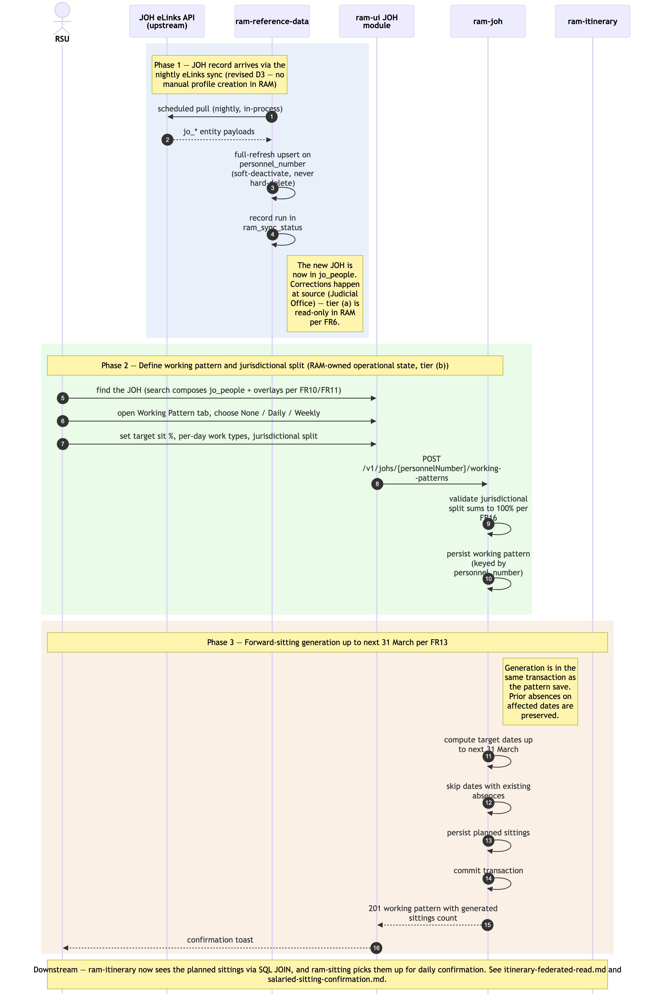

# JOH onboarding + working-pattern-driven sitting generation

Sequence diagram of how a new JOH (Judicial Office Holder) enters RAM Pathfinder and how that JOH's working pattern automatically populates planned sittings up to the next 31 March. This is the upstream of every downstream operational flow — absences, vacancies, bookings, sittings, payments, itineraries all depend on the JOH records and planned sittings produced here.

JOH person records are not created manually in RAM[^d3][^d11]. The canonical record is `jo_people`, refreshed nightly from the **JOH eLinks API** by `ram-reference-data`'s in-process scheduled sync. RAM keeps **RAM-owned operational state** over the upstream records — working patterns, ticket overlays, location overlays, jurisdictional splits — owned by `ram-joh` and keyed by `personnel_number`.

The as-is equivalent is Module 2 *Manage Judges* in [`../../../docs/architecture/asis/functional-modules.md`](../../../../docs/architecture/asis/functional-modules.md) and Integration Flow 1 *Judge Master Data (eLinks / HR → JI)* in [`../../../docs/architecture/asis/integration-dependencies.md`](../../../../docs/architecture/asis/integration-dependencies.md). In the as-is system the data is copied in manually from eLinks and HR records; RAM Pathfinder replaces the manual copy with the live eLinks integration (NFR24 reframed[^d11]).

Three phases: (1) JOH record arrives via the eLinks sync; (2) working pattern + jurisdictional split; (3) forward-sitting generation up to next 31 March.

## Not in this diagram

- **MRD ingestion** (weekly Excel via blob drop — JOH Specialisations) — same tier-(a) pattern as the eLinks sync; see [`../../architecture.md` → *Upstream reference-data ingestion*](../../architecture.md).
- **Cross-Region base-location change** (FR17) — out-of-system; requires OPT Advice Point in the as-is and a programme decision in RAM Pathfinder. In-Region changes land in `ram_joh_location`.
- **Off-circuit / cross-Region JOH linking for bookings** (FR18) — handled as a read-only link in [`./itinerary-federated-read.md`](./itinerary-federated-read.md), not in this flow.
- **Editing an existing working pattern** — same shape as Phase 2 + Phase 3 but with prior-absence preservation logic; not drawn separately to keep the diagram lean. The architectural rule (preserve prior absences when regenerating sittings, FR13) is the same.
- **Ticket overlay maintenance** (FR15 layer (b)) — DBA-via-SQL in MVP[^d10]; admin UI post-MVP.

## Cross-cutting steps omitted for clarity

- **Authentication + per-request authorisation** — RSU's JWT is validated by each service's `JWTFilter` and resolved against `ram-authorisation` on every call (two-population identity resolution[^d9]). See [`./user-authentication-and-authorisation.md`](./user-authentication-and-authorisation.md).
- All UI → service calls flow through Azure API Management.
- Validation errors at any step return RFC 9457 problem-details and the user retries; not drawn explicitly.

*Source: [`./joh-onboarding-and-sitting-generation.mmd`](./joh-onboarding-and-sitting-generation.mmd) (Mermaid). Regenerate with `mmdc -i joh-onboarding-and-sitting-generation.mmd -o joh-onboarding-and-sitting-generation.png -w 2400 -s 2 --backgroundColor white`.*

## Phase summary

| Phase | Driver | Architectural rule | Outcome |
|---|---|---|---|
| 1 — JOH record via eLinks sync | `ram-reference-data` (nightly in-process `@Scheduled` sync) | Revised D3 / FR6 tier (a) — `jo_*` tables refreshed by full-refresh upsert on `personnel_number`; soft-deactivation, never hard-delete; run recorded in `ram_sync_status`; read-only in RAM, corrections at source | New JOH present in `jo_people`; visible to search/profile views (FR10/FR11) |
| 2 — Working pattern + jurisdictional split | RSU (Full Access) | FR12 + FR16 — pattern type (None / Daily / Weekly), target sit %, per-day work types; jurisdictional split percentages must total exactly 100%. RAM-owned operational state (tier (b)) | Working pattern persisted in `ram_working_patterns`, keyed by `personnel_number` |
| 3 — Forward-sitting generation | `ram-joh` (server-side, in-transaction with pattern save) | FR13 — auto-populate planned sittings up to the next 31 March, preserving any prior absences on the affected dates | `ram_sittings` rows in `planned` status for the JOH over the generation horizon; visible to `ram-sitting` for confirmation flows and to `ram-itinerary` for read federation |

## Where to find more detail

| Detail | Location |
|---|---|
| `ram-joh` repo purpose and key functions | [`../repository-strategy.md`](../repository-strategy.md) Phase 1 row |
| eLinks sync + MRD ingestion design (schedule, upsert, failure handling) | [`../../architecture.md` → *Upstream reference-data ingestion*](../../architecture.md) |
| Working-pattern semantics (None / Daily / Weekly; target sit %; jurisdictional split) | PRD `FR12`, `FR13`, `FR16`; Module 2 in [`../../../docs/architecture/asis/functional-modules.md`](../../../../docs/architecture/asis/functional-modules.md) |
| `jo_people`, `ram_working_patterns`, `ram_sittings` tables (column-level detail) | [`../data-tables.md`](../data-tables.md) |
| JOH UI module structure | [`../repo-structure.md` → `ram-ui/src/modules/joh/`](../repo-structure.md) |
| Why this flow is in `ram-ui` and not `ram-admin-ui` (RSU operational vs admin) | [`../../architecture.md` → Step 4 *Frontend Architecture*](../../architecture.md) — v2.10 / D10 |
| Downstream consumers — Itinerary read federation | [`./itinerary-federated-read.md`](./itinerary-federated-read.md) |
| Downstream consumers — Sitting confirmation flow | [`./salaried-sitting-confirmation.md`](./salaried-sitting-confirmation.md) |
| As-is equivalent (Module 2 Manage Judges; manual eLinks/HR entry) | [`../../../docs/architecture/asis/functional-modules.md` → Module 2](../../../../docs/architecture/asis/functional-modules.md); [`../../../docs/architecture/asis/integration-dependencies.md` → Flow 1](../../../../docs/architecture/asis/integration-dependencies.md) |

[^d3]: Revised D3 (2026-06-10) — no data migration from any legacy system; judicial-holder reference data is ingested from the JOH eLinks API and MRD.
[^d9]: Restructured D9 (2026-06-10) — two user populations: JOHs resolve via jo_people to a personnel number; HMCTS admin staff via a RAM-internal identity table. No legacy user migration.
[^d10]: D10 (2026-05-15) — admin UI is post-MVP; MVP admin operations are DBA-via-SQL per operational runbooks.
[^d11]: D11 (2026-06-10, amended 2026-06-18) — SSCS-first pilot: wave 1 replaces **ListAssist** (the SSCS judicial-scheduling tool); **GAPS (SSCS case management) is retained, not replaced**; waves 2+ replace JI/APEX per Courts region.
