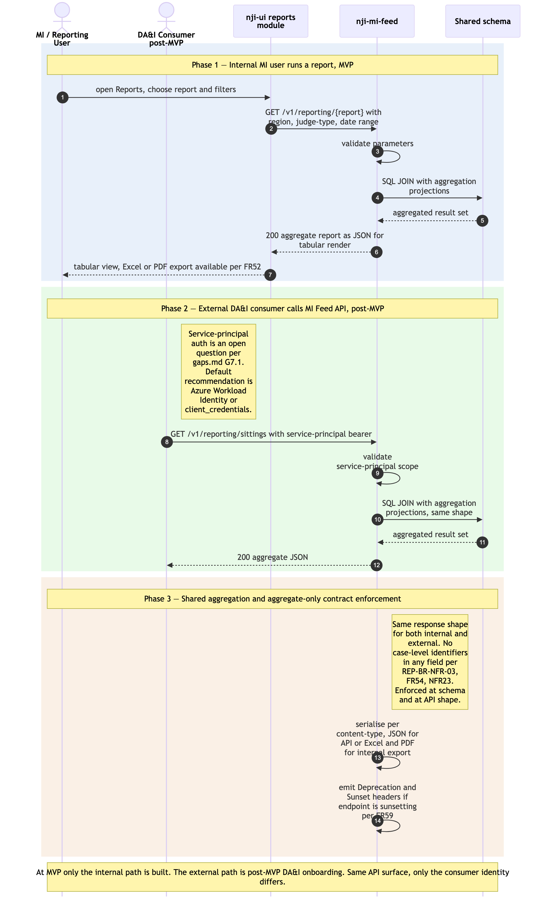

# MI Feed / Reports consumption

Sequence diagram of how aggregate management-information is consumed from `ram-mi-feed`, by two distinct actors:

1. **Internal MI / Reporting users** — at MVP, open the Reports module in `ram-ui`, pick a standard report (utilisation, sitting analysis, jurisdictional split, etc.), apply parameter filters, render results, and export to Excel or PDF.
2. **External DA&I consumer** — post-MVP, calls the MI Feed REST API directly as a service principal to ingest aggregate data into their own pipelines, replacing today's manual export-and-transform chain.

Both paths hit the same backend (`ram-mi-feed`) and are bound by the **same aggregate-only contract**: no case-level data anywhere in the response, ever (REP-BR-NFR-03 / FR54 / NFR23). This contract is the most important architectural invariant in the read-model layer — it bounds FOI scope (NFR33), protects against the data-scope concerns flagged in the PRD, and is enforced both at the schema level (no case-level columns exist in any RAM Pathfinder table that MI Feed reads from) and at the API-contract level (no case-level field in any response shape).

`ram-mi-feed` holds **no own tables** — it SQL-JOINs aggregates from the shared schema, the same Strategy A pattern as `ram-itinerary` ([`./itinerary-federated-read.md`](./itinerary-federated-read.md)), but with aggregation projections rather than per-record cells.

The as-is equivalents are Module 12 *Reports* in [`../../../docs/architecture/asis/functional-modules.md`](../../../../docs/architecture/asis/functional-modules.md) and Integration Flow 7 *Management Information & Reporting (JI → DA&I)* in [`../../../docs/architecture/asis/integration-dependencies.md`](../../../../docs/architecture/asis/integration-dependencies.md). The as-is flow is export-and-transform (Excel/PDF copied out of JI, transformed in DA&I); the RAM Pathfinder MI Feed API is the post-MVP replacement.

Three phases: (1) internal MI user runs a report; (2) post-MVP external DA&I consumer calls the same API; (3) shared aggregation + contract enforcement.

## Not in this diagram

- **External consumer onboarding** (service-principal credential issuance, OAuth scopes, rate-limit policy assignment) — programme-management activity, not a runtime flow.
- **MI Feed cache** — none at MVP per architecture Principle 2. Considered if NFR8-like measurement shows reports breaching ≤ 30 s.
- **Tribunals data extension** — flagged as a strategic gap in [`../../../docs/architecture/asis/data-dependencies.md`](../../../../docs/architecture/asis/data-dependencies.md) and the as-is Reports module; out of scope for RAM Pathfinder MVP.
- **Per-report parameter validation detail** — varies per report; handled by the controller as standard request validation. Not drawn.

## Cross-cutting steps omitted for clarity

- **Authentication + per-request authorisation** — both flows. Internal MI users go through HMCTS IdP OIDC; external DA&I consumers use a service principal (currently a post-MVP open question per [`../gaps.md` G7.1](../gaps.md) — default recommendation Azure Workload Identity, or `client_credentials` against the IdP if it supports non-human principals). The diagram shows the auth boundary only. Full mechanics: [`./user-authentication-and-authorisation.md`](./user-authentication-and-authorisation.md).
- All UI → service and external → APIM calls flow through Azure API Management; APIM is where rate-limit and `Deprecation`/`Sunset` policies apply.

*Source: [`./mi-feed-and-reports-consumption.mmd`](./mi-feed-and-reports-consumption.mmd) (Mermaid). Regenerate with `mmdc -i mi-feed-and-reports-consumption.mmd -o mi-feed-and-reports-consumption.png -w 2400 -s 2 --backgroundColor white`.*

## Phase summary

| Phase | Driver | Architectural rule | Outcome |
|---|---|---|---|
| 1 — Internal MI user runs a report | MI / Reporting User | FR53 — fixed catalogue of standard reports with parameter filters per report. Region/Office/judge-type/date-range scoped per FR49 / R2. | Tabular report rendered in `ram-ui`; copy/export to Excel or PDF via FR52 |
| 2 — External DA&I consumer calls MI Feed API (post-MVP) | DA&I analyst script / system | FR54 — aggregate-only REST contract; service-principal auth; standard parameter filters; same data shape as internal reports | Aggregate JSON returned to consumer; replaces today's export-and-transform chain |
| 3 — Shared aggregation + contract enforcement | `ram-mi-feed` (no own tables) | Principle 1 + 2 — SQL JOIN over the shared schema with aggregation projections; **no case-level data in any response shape** (REP-BR-NFR-03 / FR54 / NFR23); contract enforced at schema (no case-level columns) and at API shape (no case-level fields) | Aggregated result with no case-level identifiers; serialised per content-type negotiation (JSON for API; Excel/PDF for internal export) |

## Where to find more detail

| Detail | Location |
|---|---|
| `ram-mi-feed` repo purpose and key functions (no own tables — SQL JOINs) | [`../repository-strategy.md`](../repository-strategy.md) Phase 8 row |
| Aggregate-only contract enforcement (REP-BR-NFR-03 + FR54 + NFR23) | PRD `FR54`, `NFR23`; [`../../architecture.md` → Step 2 *Cross-Cutting Concerns* (Forbidden data)](../../architecture.md) |
| Reports catalogue (utilisation, sitting analysis, jurisdictional split, summary by court / work type, …) | PRD `FR53`; Module 12 in [`../../../docs/architecture/asis/functional-modules.md`](../../../../docs/architecture/asis/functional-modules.md) |
| Reports UI module structure | [`../repo-structure.md` → `ram-ui/src/modules/reports/`](../repo-structure.md) |
| Service-principal auth for external consumers (open question; pre-Phase-9 decision) | [`../gaps.md` G7.1](../gaps.md); [`../assumptions.md` A35](../assumptions.md) |
| Related read flow — Itinerary federated read (same SQL-JOIN-on-shared-schema pattern, per-record cells rather than aggregates) | [`./itinerary-federated-read.md`](./itinerary-federated-read.md) |
| As-is equivalents (Module 12 Reports; Integration Flow 7 MI & Reporting → DA&I) | [`../../../docs/architecture/asis/functional-modules.md` → Module 12](../../../../docs/architecture/asis/functional-modules.md); [`../../../docs/architecture/asis/integration-dependencies.md` → Flow 7](../../../../docs/architecture/asis/integration-dependencies.md) |
