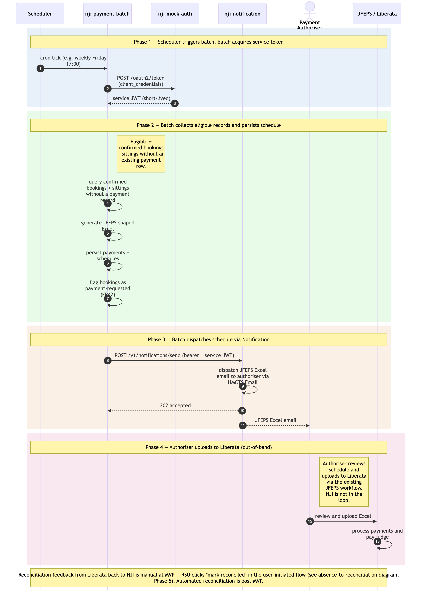

# Payment-batch flow

Sequence diagram of the scheduled, non-user-initiated half of the operational cycle. A scheduler triggers the payment-processing batch. The batch authenticates as a service principal, picks up bookings/sittings that are confirmed but unpaid, generates the JFEPS Excel, and dispatches it via Notification → HMCTS Email to the Payment Authoriser. The authoriser uploads to Liberata out-of-band; Liberata pays the JOH.

**SSCS applicability verified (2026-06-11, per SCP 2026-06-10 / D11):** this flow is preserved **unchanged** for SSCS wave 1 — tribunal-member payments (Medical, Disability-Qualified, Disability (Other) members) use the same JFEPS Excel + email-to-Authoriser + Liberata path as Courts fee-paid bookings (NFR21 amended 2026-06-10). No SSCS-specific variation to the batch, the schedule shape, or the dispatch mechanism.

Companion to [`./absence-to-reconciliation.md`](./absence-to-reconciliation.md). The user-initiated flow ends with a booking marked confirmed and ready for payment; this batch picks up the record on its next scheduled run.

Four phases: (1) scheduler + batch authentication; (2–3) the batch's work; (4) out-of-band processing in Liberata. Phases are colour-tinted in the diagram.

## What is and isn't in this diagram

**Included** (the batch's runtime activity):

- Scheduler trigger (Kubernetes CronJob, or Spring `@Scheduled` annotation — implementation choice deferred).
- Batch acquiring its service-principal token via OAuth `client_credentials` against `ram-mock-auth` (non-prod) — production issuer per [`../gaps.md` G7.1](../gaps.md), default recommendation Azure Workload Identity.
- Batch SQL-JOIN read across the shared schema for eligible records.
- Batch persisting `ram_payments` + `ram_payment_schedules` and marking the related bookings as *payment requested*.
- Batch calling the Notification API (with bearer service token) to dispatch the JFEPS Excel email.
- Authoriser → Liberata upload as the bridge between RAM Pathfinder and the external payment system (out-of-band but architecturally relevant).
- Liberata processing the payment.

**Not included** (explicitly out of scope of this diagram):

- User-initiated activities (logging absences, approving them, creating bookings, confirming sittings, marking payments reconciled) — those are in [`./absence-to-reconciliation.md`](./absence-to-reconciliation.md).
- Reconciliation feedback from Liberata back into RAM Pathfinder — at MVP this is a manual RSU action (see the user-initiated diagram, Phase 5). Automated reconciliation feed from Liberata is post-MVP.
- The mock-auth's internal token-issuing logic (signing, JWKS, etc.) — covered by the architecture's Authentication & Security section and the auth/JWKS sequences in `architecture.md`.

## Cross-cutting steps omitted for clarity

- The Notification API call from the batch to `ram-notification` flows through Azure API Management (same path as user-initiated calls).
- Notification's `JWTFilter` validates the batch's service-principal JWT against the issuer's JWKS — same mechanism as for human user JWTs.
- Notification calls `ram-authorisation` `POST /authz/check` to resolve the service principal's permissions (service principals have records in `ram_auth_users` with a kind flag distinguishing them from humans).

*Source: [`./payment-batch-flow.mmd`](./payment-batch-flow.mmd) (Mermaid). Regenerate with `mmdc -i payment-batch-flow.mmd -o payment-batch-flow.png -w 2400 -s 2 --backgroundColor white`.*

## Phase summary

| Phase | Driver | Architectural rule | Outcome |
|---|---|---|---|
| 1 — Scheduler triggers batch + token acquisition | Scheduler (cron) | Batch authenticates as service principal via OAuth `client_credentials` | Batch holds a short-lived service JWT for its run |
| 2 — Eligible records collected + schedule persisted | Batch (no user) | SQL JOIN over confirmed bookings + sittings without payments; FR41–FR45 retry safety via native DB primitives (see *Data Architecture*) | Payment + schedule rows created; bookings flagged as payment-requested |
| 3 — Schedule dispatched | Batch (no user) | Service-token bearer on Notification API call; Notification `JWTFilter` validates same as user JWTs (via JWKS) | JFEPS Excel email delivered to Payment Authoriser |
| 4 — Liberata processing | Payment Authoriser → JFEPS | Out-of-band; RAM Pathfinder is not in the loop | JOH paid; awaiting reconciliation (which is user-initiated — see other diagram) |

## Where to find more detail

| Detail | Location |
|---|---|
| User-initiated activities — absence to reconciliation | [`./absence-to-reconciliation.md`](./absence-to-reconciliation.md) |
| Service-principal auth model + production issuer options | [`../../architecture.md` → Step 4 *Authentication & Security*](../../architecture.md); [`../gaps.md` G1.2 + G7.1](../gaps.md); [`../assumptions.md` A2 + A26 + A35](../assumptions.md) |
| `ram-payment` Repository List entry — synchronous API + batch component | [`../../architecture.md` → Repository List](../../architecture.md) |
| Per-table column-level detail (`ram_payments`, `ram_payment_schedules`, `ram_payment_reconciliations`, `ram_notification_dispatches`, `mock_oauth_clients`) | [`../data-tables.md`](../data-tables.md) |
| FR41–FR45 (Payment) and NFR12 (Authentication) | PRD `FR41`, `FR42`, `FR43`, `FR44`, `FR45`, `NFR12` |
| JWT propagation (the user-initiated counterpart pattern) | [`../conventions.md` → *Communication Patterns / JWT propagation*](../conventions.md) |
