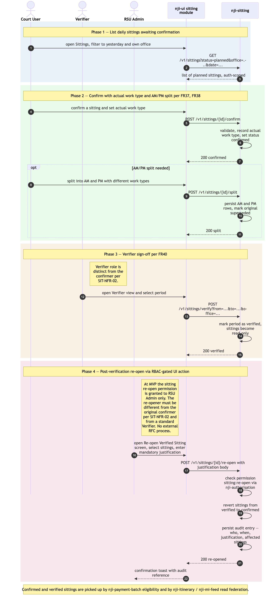

# Salaried sitting confirmation + verifier sign-off

Sequence diagram of the daily salaried-sitting confirmation flow: a Court User confirms that yesterday's planned sittings actually took place, recording actual work type and splitting AM/PM where relevant; a Verifier later signs off the period, which makes the data read-only. Post-verification amendments are handled inside the UI by a **re-open action gated by RBAC** — not by an out-of-system RFC ticketing process (revised 2026-05-11). This is distinct from the booking-confirmation step shown in [`./absence-to-reconciliation.md`](./absence-to-reconciliation.md) Phase 4 — that diagram covers *fee-paid bookings*; this one covers *salaried sittings*.

Confirmed-and-verified salaried sittings feed [`./payment-batch-flow.md`](./payment-batch-flow.md) Phase 2 (alongside confirmed fee-paid bookings) for fee-paid recorder cases, and feed [`./itinerary-federated-read.md`](./itinerary-federated-read.md) and [`./mi-feed-and-reports-consumption.md`](./mi-feed-and-reports-consumption.md) as utilisation data.

The as-is equivalent is Module 10 *Sittings* in [`../../../docs/architecture/asis/functional-modules.md`](../../../../docs/architecture/asis/functional-modules.md) and Integration Flow 3 *Sitting & Booking Confirmation* in [`../../../docs/architecture/asis/integration-dependencies.md`](../../../../docs/architecture/asis/integration-dependencies.md).

Four phases: (1) list daily sittings awaiting confirmation; (2) confirm with actual work type + AM/PM split; (3) Verifier sign-off; (4) post-verification re-open via RBAC-gated UI action.

## Not in this diagram

- **Fee-paid booking confirmation** — distinct flow in [`./absence-to-reconciliation.md`](./absence-to-reconciliation.md) Phase 4 (`POST /v1/bookings/{id}/confirm`).
- **Ad-hoc sitting creation** (FR39) — a small follow-up CRUD; same shape as Phase 2 with a different starting point.
- **Sittings → Payments handoff** — Phase 2 of [`./payment-batch-flow.md`](./payment-batch-flow.md) shows the batch reading confirmed bookings + sittings; not duplicated here.
- **Working-pattern generation of the planned sittings being confirmed** — see [`./joh-onboarding-and-sitting-generation.md`](./joh-onboarding-and-sitting-generation.md) Phase 3.
- **External Request-for-Change ticketing** — does not exist in RAM Pathfinder (revised 2026-05-11). Post-verification amendment is a UI action gated by RBAC, with mandatory justification captured in-form and full audit. The legacy APEX "RFC" external workflow is retired.

## Cross-cutting steps omitted for clarity

- **Authentication + per-request authorisation** — Court User's and Verifier's JWTs are validated by `ram-sitting`'s `JWTFilter` on every call; role gating (only authorised roles can confirm; only Verifiers can verify; a Verifier cannot also be the original confirmer per SIT-NFR-02). See [`./user-authentication-and-authorisation.md`](./user-authentication-and-authorisation.md).
- All UI → service calls flow through Azure API Management.

*Source: [`./salaried-sitting-confirmation.mmd`](./salaried-sitting-confirmation.mmd) (Mermaid). Regenerate with `mmdc -i salaried-sitting-confirmation.mmd -o salaried-sitting-confirmation.png -w 2400 -s 2 --backgroundColor white`.*

## Phase summary

| Phase | Driver | Architectural rule | Outcome |
|---|---|---|---|
| 1 — List daily sittings awaiting confirmation | Court User | FR36 — filter by Region/Office/judge/date range; auth scope-gated by `ram-authorisation` | UI shows the list of `planned` sittings for the user's scope |
| 2 — Confirm with actual work type + AM/PM split | Court User | FR37 + FR38 — set outcome (confirmed / cancelled / rejected), update actual work type, split into AM/PM rows where applicable; once-per-sitting natural-key idempotency | Sitting status = `confirmed` (or cancelled/rejected); actual work type recorded; split rows persisted if applicable |
| 3 — Verifier sign-off | Verifier (Read-only / Verifier role) | FR40 — verifier different from confirmer (SIT-NFR-02); marks the period as verified | Sitting becomes read-only; visible to payment-batch eligibility (Recorder fee-payment cases) and to MI Feed as verified utilisation data |
| 4 — Post-verification re-open (RBAC-gated) | RSU Admin (the `sitting:re-open` permission is granted to RSU Admin only at MVP; distinct from the original confirmer per SIT-NFR-02 and from a standard Verifier) | FR40 *(revised 2026-05-11)* — verified data is read-only; re-opening is a UI action requiring the `sitting:re-open` permission, captures a mandatory justification, and is fully audited. No external RFC ticketing. | Specified sittings revert from verified to confirmed for amendment; justification recorded; audit entry written |

## Where to find more detail

| Detail | Location |
|---|---|
| `ram-sitting` repo purpose and key functions | [`../repository-strategy.md`](../repository-strategy.md) Phase 5 row |
| Sitting confirmation semantics (planned / confirmed / cancelled / rejected / verified; AM/PM split; work-type override) | PRD `FR35`–`FR40`; Module 10 in [`../../../docs/architecture/asis/functional-modules.md`](../../../../docs/architecture/asis/functional-modules.md) |
| Sittings table schema | [`../data-tables.md`](../data-tables.md) |
| Sitting UI module structure | [`../repo-structure.md` → `ram-ui/src/modules/sitting/`](../repo-structure.md) |
| Payment-batch eligibility (the downstream consumer of confirmed sittings) | [`./payment-batch-flow.md`](./payment-batch-flow.md) Phase 2 |
| Itinerary read federation that displays confirmed/verified sittings | [`./itinerary-federated-read.md`](./itinerary-federated-read.md) |
| As-is equivalent (Module 10 Sittings; Integration Flow 3) | [`../../../docs/architecture/asis/functional-modules.md` → Module 10](../../../../docs/architecture/asis/functional-modules.md); [`../../../docs/architecture/asis/integration-dependencies.md` → Flow 3](../../../../docs/architecture/asis/integration-dependencies.md) |
