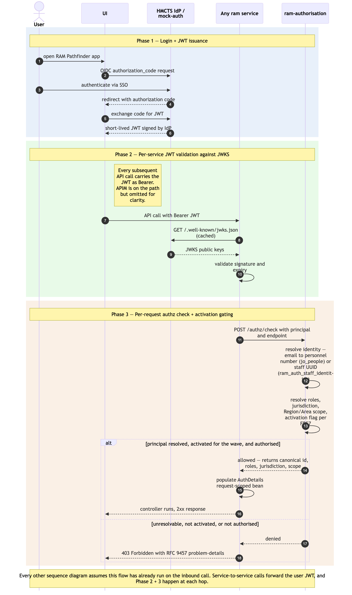

# User authentication + per-request authorisation

Sequence diagram of the cross-cutting authentication and per-request authorisation flow that underpins every user-initiated interaction in RAM Pathfinder. A user authenticates once at the HMCTS IdP (or `ram-mock-auth` in non-prod); the issued JWT is then forwarded by the UI on every subsequent API call. Each backend service's custom `JWTFilter` validates the token against the issuer's JWKS endpoint and asks `ram-authorisation` to resolve the principal's identity and scope before the controller is allowed to run. Per the restructured D9 (2026-06-10), identity resolution is **two-population**: a JOH user's IdP email is looked up against `jo_people` to resolve the **personnel number**; an HMCTS admin-staff user's email is looked up against `ram_auth_staff_identities` to resolve the RAM-assigned UUID. The authz result carries roles + **jurisdiction** + Region/Area scope + the (jurisdiction, region) activation flag (FR57).

This is the cross-cutting flow that the other sequence diagrams ([`./absence-to-reconciliation.md`](./absence-to-reconciliation.md), [`./payment-batch-flow.md`](./payment-batch-flow.md), [`./joh-onboarding-and-sitting-generation.md`](./joh-onboarding-and-sitting-generation.md), [`./salaried-sitting-confirmation.md`](./salaried-sitting-confirmation.md), [`./itinerary-federated-read.md`](./itinerary-federated-read.md), [`./mi-feed-and-reports-consumption.md`](./mi-feed-and-reports-consumption.md), [`./admin-maintenance-flows.md`](./admin-maintenance-flows.md)) explicitly omit for clarity. Read this diagram once; treat it as implicit on every API call shown in the others.

Three phases: (1) login + JWT issuance; (2) per-service JWT validation against JWKS; (3) per-request `authz/check` resolving identity (two-population) + roles + jurisdiction + scope + activation flag.

## Not in this diagram

- **Service-principal authentication** for batch components — `ram-payment-batch` uses OAuth `client_credentials` rather than the human SSO flow. See [`./payment-batch-flow.md`](./payment-batch-flow.md) Phase 1.
- **Mock-auth internal mechanics** (signing keys, token issuance, JWKS publication) — implementation detail. The mock-auth surface is OIDC-conformant; how it produces tokens is out of scope here.
- **Token refresh / expiry handling** in the UI — standard OIDC behaviour; not RAM Pathfinder-specific.
- **Sign-out** — clears the local session; not a server-side flow worth diagramming.

## Cross-cutting steps omitted for clarity

- All UI → service calls flow through Azure API Management. APIM is omitted from the arrows below; assume every UI → service arrow passes through it (rate-limit policies, header injection, `/actuator/*` restriction).
- The two UIs (`ram-ui` and `ram-admin-ui`) follow the same auth pattern. The diagram uses "UI" generically.

*Source: [`./user-authentication-and-authorisation.mmd`](./user-authentication-and-authorisation.mmd) (Mermaid). Regenerate with `mmdc -i user-authentication-and-authorisation.mmd -o user-authentication-and-authorisation.png -w 2400 -s 2 --backgroundColor white`.*

## Phase summary

| Phase | Driver | Architectural rule | Outcome |
|---|---|---|---|
| 1 — Login + JWT issuance | User | OIDC `authorization_code` against HMCTS IdP (mock-auth in non-prod) | UI holds a short-lived JWT for the session |
| 2 — Per-service JWT validation | Any backend service | Custom `JWTFilter` validates JWT signature against issuer's JWKS endpoint (cached per service) | Token integrity + expiry verified before any controller logic runs |
| 3 — Per-request authz check | Any backend service | `JWTFilter` calls `ram-authorisation` `POST /authz/check`; resolves IdP email → canonical identifier (personnel number via `jo_people` for JOHs; RAM UUID via `ram_auth_staff_identities` for admin staff) → roles + jurisdiction + Region/Area scope + `ram_auth_user_activation_flags` (FR57); populates request-scoped `AuthDetails` bean | Controller method invoked with authorised principal in scope; or 403 if unresolvable or not active for the (jurisdiction, region) |

## Where to find more detail

| Detail | Location |
|---|---|
| Authentication & Security model (JWT propagation pattern, JWKS validation, mock-auth in non-prod, HMCTS IdP in production) | [`../../architecture.md` → Step 4 *Authentication & Security*](../../architecture.md) |
| `JWTFilter` per-service implementation pattern and `AuthDetails` request-scoped bean | [`../starter-template.md` → Per-service RAM Pathfinder Conventions](../starter-template.md); [`../repo-structure.md` per-service `config/JWTFilter.java`, `config/AuthDetails.java`](../repo-structure.md) |
| Authorisation tables (`ram_auth_users`, `ram_auth_staff_identities`, `ram_auth_roles`, `ram_auth_user_roles`, `ram_auth_user_region_scopes`, `ram_auth_user_activation_flags`) + the `jo_people` identity lookup | [`../data-tables.md`](../data-tables.md) |
| FR1, FR2, FR3 (Identity & Authorisation) and NFR12 *(revised v2.6)*, NFR13 | PRD `FR1`–`FR3`, `NFR12`, `NFR13` |
| Per-(jurisdiction, region) phased activation (FR57) and the wave-cutover semantics it enforces | PRD `FR57`; [`../../architecture.md` → Step 4 *Deployment topology*](../../architecture.md) |
| Mock-auth scope and production-issuer open question | [`../gaps.md` G1.1, G1.2, G7.1](../gaps.md) |
| Two-UI repo split (`ram-admin-ui` post-MVP[^d10]; same auth pattern) | [`../../architecture.md` → Step 4 *Frontend Architecture*](../../architecture.md) — v2.10 / D10 |

[^d10]: D10 (2026-05-15) — admin UI is post-MVP; MVP admin operations are DBA-via-SQL per operational runbooks.
