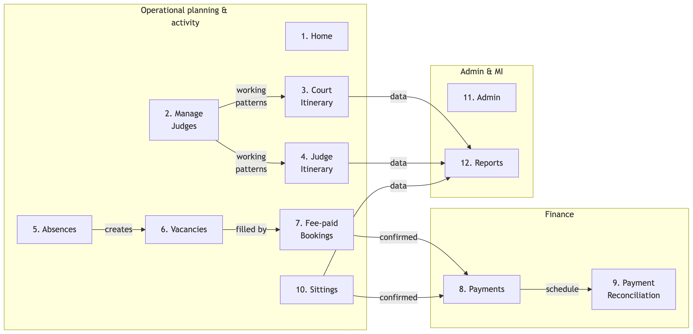

This document catalogues JI's functional modules — what each does, who uses it, and how the modules fit together:

- **Module** — a first-class part of the application's functional surface, with its own numbered detail section below.
- **Sub-module / Cross-cutting** — described in the source documents but presented under a parent module or in the closing [Cross-cutting NFRs](#cross-cutting-nfrs) section.

The analysis is grounded only in the input documents listed under [Source Documents](#source-documents). Each module's `Status` cell uses the closed vocabulary `Implemented` / `Partial` / `Discovery required` / `Out of scope`. Where a module produces or consumes data that is also catalogued in the sibling data-dependencies document, this catalogue links to it by name rather than restating the data flow.

## At a Glance

The table below is a compact summary of every module described in this document. Each row corresponds to a numbered detail section under [Modules](#modules); each detail section repeats the same compact summary in an `Attribute / Detail` table for ease of reference.

| # | Module | Primary Users | Purpose | Status |
|----|--------------------------|------------------|------------------------------------|----------------|
| 1 | **Home** | All users | Landing page; nav; dashboard counts | Implemented |
| 2 | **Manage Judges** | RSU; Court | Maintain judges, working patterns, tickets | Implemented |
| 3 | **Court Itinerary** | RSU; Court; Judges | Monthly / annual office views | Implemented |
| 4 | **Judge Itinerary** | RSU; Court; Judges | Per-judge schedule + forward look | Implemented |
| 5 | **Absences** | RSU; Court; Judges | Record, approve, manage judicial absences | Implemented |
| 6 | **Vacancies** | RSU; Court | Capture cover requirements; advertise | Implemented |
| 7 | **Fee-paid and Other Bookings** | RSU | Allocate fee-paid judges to vacancies | Implemented |
| 8 | **Payments** | RSU; Finance | Generate JFEPS-compatible schedules | Implemented |
| 9 | **Payment Reconciliation** | RSU; Finance | Match payments back to bookings | Implemented |
| 10 | **Sittings** | RSU; Court | Confirm and verify salaried sittings | Implemented |
| 11 | **Admin** | Sys Admin; All | Password change; new-user requests | Implemented |
| 12 | **Reports** | MI; RSU; Leadership | Standard MI reports; Excel exports | Implemented |

## Module overview

---

## Modules

These are the first-class functional modules of JI. Each section below mirrors the row above in the *At a Glance* table and provides the full Capabilities list, Attribute / Detail summary and Sources for that module.

### 1. Home

The **Home** module is JI's landing page and navigation hub. It surfaces a top control panel, the main horizontal menu, dashboard summary tiles for the selected Region and Area, and a "How do I?" help panel that links into every other module.

**Capabilities**

- Render the top control panel (Change Password, Logout, *Logged on as <USERNAME>*) and breadcrumb trail
- Provide horizontal navigation to all top-level modules (Home, Manage Judges, Court Itinerary, Judge Itinerary, Absences/Vacancies/Bookings, Sittings, Admin, Reports)
- Filter dashboard counts by Region (`P1_REGION`) and Area (`P1_AREA`)
- Display summary metrics for the selected scope: judges, absences, vacancies, fee-paid bookings, pending payments, payments made, unreconciled
- Refresh the dashboard counts when Region / Area change
- Surface quick "How do I?" guidance for the most common user tasks

| Attribute | Detail |
|-----|--------------------|
| **Module ID** | HOME |
| **Primary users** | All authenticated users (Judges, Judges' Clerks, RSU, Court, Finance, MI, Sys Admin) |
| **Trigger / entry points** | Default landing page on login; HMCTS / OPT logo click from any module |
| **Inputs** | Authenticated session (OPT / APEX); aggregated counts from every other module |
| **Outputs** | Navigation context (`P1_REGION`, `P1_AREA`); dashboard counts |
| **Business rules** | Counts are read-only and aggregate-only; no case data is exposed; Region / Area selections persist as context for downstream modules |
| **Cross-module dependencies** | Aggregates counts from [Manage Judges](#manage-judges), [Absences](#absences), [Vacancies](#vacancies), [Fee-paid and Other Bookings](#fee-paid-and-other-bookings), [Payments](#payments), [Payment Reconciliation](#payment-reconciliation) |
| **NFRs** | HOME-NFR-01 (≤ 3 s static load); HOME-NFR-02 (≤ 5 s dashboard refresh); HOME-NFR-04 (HMCTS accessibility); HOME-NFR-05 (Region / Area sourced from controlled reference data) |
| **Status** | Implemented |

**Key user actions**

- **WHEN** a user selects a Region and Area on the Home page **THEN** the dashboard tiles refresh to show counts scoped to that selection.
- **WHEN** a user clicks a "How do I?" link **THEN** the system navigates to the relevant module with the same scope context preserved.

> Sources: *JI Functional and Non-Functional Requirements* §4.1a (HOME-FR-01..10), §4.1b (HOME-NFR-01..06); *Judicial Itineraries High Level Requirements* (HLR-01..04); *OPT JI Training Brief DRAFT 02* §3.4, §5.1.

### 2. Manage Judges

The **Manage Judges** module is JI's system of entry for judge profiles. RSU users maintain personal details, role-specific data, working patterns, jurisdictional split and tickets here; Court users have read-only access except for DJs in their own office.

**Capabilities**

- Search and filter judges by name, base location, location type and judge type
- Maintain judge profile (name, contact details, base office, judge type, active / inactive status)
- Record role-specific details per judge (payroll number, retirement date, name for itinerary, heading, fee-payment status, London weighting)
- Maintain ticket information per role (ticket type, start date)
- Define and update **Working Patterns** (None / Daily / Weekly), with target sit %, jurisdictional split and per-day work-type pattern
- Auto-populate the judge's itinerary up to the next 31st March from the working pattern, preserving prior absences
- Convert salaried judges between full-time and part-time and adjust mandatory sitting days
- Switch a judge's base location to another office in the same Region
- Maintain per-judge financial-year statistics (sitting vs non-sitting days; breakdown by work type)
- Link to judges managed by other offices (off-circuit / cross-Region) for booking purposes

| Attribute | Detail |
|-----|--------------------|
| **Module ID** | MJ |
| **Primary users** | RSU (Full Access; Admin); Court (Full Access for DJs; Enhanced CJ for Circuit Judges) |
| **Trigger / entry points** | "Manage Judges" top-level tab; deep-link from [Judge Itinerary](#judge-itinerary) and [Court Itinerary](#court-itinerary) |
| **Inputs** | Judge identity / contact data manually copied from eLinks (see Data Dependencies — *eLinks*); contractual working arrangements manually copied from HR systems (see Data Dependencies — *HR systems / Administrative records*) |
| **Outputs** | Judge records consumed by every operational module (Court Itinerary, Judge Itinerary, Absences, Vacancies, Fee-paid Bookings, Sittings) and by Reports |
| **Business rules** | Working patterns auto-overwrite future sittings up to 31st March; existing absences are preserved on pattern change; base location can only be changed within a Region (cross-Region needs OPT Advice Point); jurisdictional split percentages must total 100%; only judicial-team users may amend tickets, even for DJs |
| **Cross-module dependencies** | Feeds [Judge Itinerary](#judge-itinerary), [Court Itinerary](#court-itinerary); consumed by [Vacancies](#vacancies) for fee-paid matching; consumed by [Fee-paid and Other Bookings](#fee-paid-and-other-bookings) for booking allocation |
| **NFRs** | MJ-NFR-01 (search ≤ 10 s for Region-level data); MJ-NFR-02 (only RSU may update); MJ-NFR-03 (auditable: user, timestamp, before/after); MJ-NFR-04 (jurisdictional-split totals validated); MJ-NFR-05 (keyboard / assistive-tech navigation) |
| **Status** | Implemented |

**Key user actions**

- **WHEN** an RSU user selects a judge from the filtered results **THEN** the system opens the judge's maintenance view with personal, role-specific and working-pattern tabs.
- **WHEN** an RSU user creates a new working pattern with a `Weekly` type **THEN** the system requires the start date to be a Monday and regenerates sittings up to 31st March, preserving any previously-recorded absences.
- **WHEN** an RSU user adds a ticket without a start date or ticket type **THEN** the system rejects the save with a validation error.

> Sources: *JI Functional and Non-Functional Requirements* §4.2a (MJ-FR-01..15), §4.2b (MJ-NFR-01..05), §5.1 (Assumption 2), §5.3.3 (Dependencies — HR systems); *Judicial Itineraries High Level Requirements* (HLR-05..08); *OPT JI Training Brief DRAFT 02* §5.1–5.7.

### 3. Court Itinerary

The **Court Itinerary** module is the office-centric view: which judges are sitting at a given court, when fee-paid bookings are in place, where vacancies are open and which absences are *not to be filled* (NTBF). It supports both monthly and annual views over the same data set.

**Capabilities**

- Filter by Office (`P5_LOC_TYPE` / `P5_LOC`), Financial Year (`P5_FIN_YR`), Month (`P5_MTH`) and override Week-of-Date (`P5_WEEK_OF_DATE`)
- Multi-select view options (`P5_ITIN_SHOW`) to control attributes shown — at minimum *Vacancy Judge Type* and *Work Type*
- Render the monthly itinerary table with planned sittings, fee-paid bookings, vacancies and NTBF absences for each day and office
- Render the annual itinerary as a per-month summary, navigable down to monthly or detail views
- Make every itinerary cell clickable to open the relevant detail screen (Sittings, Absences, Vacancies, Fee-paid bookings)
- Support copy / export to Excel via the *Select Report (Ctrl-C then Ctrl-V)* pattern for both monthly and annual views

| Attribute | Detail |
|-----|--------------------|
| **Module ID** | CIT |
| **Primary users** | RSU (Full Access; Read-only / Verifier); Court (Full Access; Limited / Read-only); Presiding Judges and Clerks (read-only) |
| **Trigger / entry points** | "Court Itinerary" top-level tab; sub-menu "Annual Court Itinerary"; deep-links from [Home](#home) dashboard tiles |
| **Inputs** | Sitting and booking data from [Sittings](#sittings) and [Fee-paid and Other Bookings](#fee-paid-and-other-bookings); absence data from [Absences](#absences); vacancy data from [Vacancies](#vacancies); judge data from [Manage Judges](#manage-judges) |
| **Outputs** | Read-only itinerary view; Excel-pasteable tabular data for offline analysis |
| **Business rules** | View is read-only — updates happen via the deep-linked detail screens with role-based access; valid Office and month must be selected before refresh; layout must remain readable when copied to Excel |
| **Cross-module dependencies** | Read-only consumer of [Manage Judges](#manage-judges), [Absences](#absences), [Vacancies](#vacancies), [Fee-paid and Other Bookings](#fee-paid-and-other-bookings), [Sittings](#sittings) |
| **NFRs** | CIT-MON-NFR-01 (monthly refresh ≤ 10 s); CIT-ANN-NFR-01 (annual render ≤ 15 s); CIT-MON-NFR-02 (read-only with role-gated edit links); CIT-MON-NFR-04 / CIT-ANN-NFR-02 (Excel-readable layout); CIT-MON-NFR-06 (date validation) |
| **Status** | Implemented |

**Key user actions**

- **WHEN** a Court user selects an Office and Financial Year and clicks Refresh **THEN** the system displays the monthly itinerary populated with that office's sittings, bookings, vacancies and NTBF absences.
- **WHEN** a user clicks a vacancy cell in the itinerary **THEN** the system opens the [Vacancies](#vacancies) detail screen scoped to that record.
- **WHEN** a user uses *Select Report (Ctrl-C / Ctrl-V)* on the itinerary **THEN** the table is copied to the clipboard with column boundaries preserved for paste into Excel.

> Sources: *JI Functional and Non-Functional Requirements* §4.3a–d (CIT-MON-FR-01..14, CIT-MON-NFR-01..06, CIT-ANN-FR-01..09, CIT-ANN-NFR-01..04); *Judicial Itineraries High Level Requirements* (HLR-09..11).

### 4. Judge Itinerary

The **Judge Itinerary** module is the judge-centric view of planned and confirmed time. It shows what each judge is scheduled to sit, where, and when — without case detail — and includes the *Judges Forward Look* sub-module for longer-horizon planning across multiple judges.

**Capabilities**

- Select Base office (`P8_LOC_TYPE` / `P8_LOC`), date range and one or more judges
- Render per-judge daily entries showing planned sittings and absences with work type
- Distinguish planned vs confirmed vs cancelled vs rejected sittings, based on outcomes from [Sittings](#sittings) and [Fee-paid and Other Bookings](#fee-paid-and-other-bookings)
- Make every sitting and absence cell clickable to open the underlying record for view / update
- Distinguish sitting and non-sitting days according to the configured working pattern and absence types
- Support export to Excel via the *Select Report* pattern, consistent with Court Itinerary
- Provide the *Judges Forward Look* sub-module — a longer-term, multi-judge view filterable by Region / Office and judge type / specific judges, with cells linking to the relevant detail or back to Judge Itinerary

| Attribute | Detail |
|-----|--------------------|
| **Module ID** | JIT (sub-module: JFL — Judges Forward Look) |
| **Primary users** | RSU (Full Access; Read-only / Verifier); Court (Full Access; Limited / Read-only); Judges and Judges' Clerks (own / managed itineraries only) |
| **Trigger / entry points** | "Judge Itinerary" top-level tab; sub-menu "Judges forward look (NB – can be slow to load)" |
| **Inputs** | Working patterns from [Manage Judges](#manage-judges); sittings from [Sittings](#sittings); bookings from [Fee-paid and Other Bookings](#fee-paid-and-other-bookings); absences from [Absences](#absences) |
| **Outputs** | Read-only itinerary view per judge; Excel-pasteable tabular data; emailed itinerary copies (HLR-15) |
| **Business rules** | No case identifiers exposed; users can only view itineraries for judges they are authorised to manage; Forward Look may be paged or filtered to limit horizon and judge subset |
| **Cross-module dependencies** | Read-only consumer of [Manage Judges](#manage-judges), [Sittings](#sittings), [Fee-paid and Other Bookings](#fee-paid-and-other-bookings), [Absences](#absences) |
| **NFRs** | JIT-NFR-01 (single-judge month ≤ 10 s); JIT-NFR-03 (role-gated visibility); JIT-NFR-05 (changes audited); JFL-NFR-01 (Forward Look targeted ≤ 30 s for a Region); JFL-NFR-02 (paging if dataset exceeds threshold) |
| **Status** | Implemented |

**Key user actions**

- **WHEN** a Judge logs in **THEN** the system renders only their own itinerary (and itineraries of judges they manage, where applicable).
- **WHEN** a user clicks an absence cell in the itinerary **THEN** the system opens the underlying [Absences](#absences) record for view or update.
- **WHEN** a user opens *Judges forward look* **THEN** the system warns that the page may be slow to load and applies the configured paging / horizon limits.

> Sources: *JI Functional and Non-Functional Requirements* §4.4a–b (JIT-FR-01..11, JIT-NFR-01..05), §4.4c–d (JFL-FR-01..07, JFL-NFR-01..04); *Judicial Itineraries High Level Requirements* (HLR-12..15); *OPT JI Training Brief DRAFT 02* §5.8.

### 5. Absences

The **Absences** module records and approves judicial unavailability — leave, sickness, training, official business — with type, date range and partial-day options. It is the upstream of vacancy creation: confirmed absences that need cover trigger vacancies; absences marked NTBF block availability without creating one.

**Capabilities**

- List existing absences filtered by Region / Office and judge or judge type, showing dates, type, status and NTBF flag
- Create absence records with start / end date, partial-day options (full / half) and an absence type from a controlled list
- Distinguish absences created by judicial teams (auto-confirmed) from those requested by Courts or judges (require confirmation)
- Mark absences as *Not To Be Filled* (NTBF) or *needs fee-paid cover*; route the latter into [Vacancies](#vacancies)
- Support an approval workflow (request → approve / reject / cancel) handled by RSU / court admins, with the option to send acknowledgement emails (disabled in training)
- Update affected itineraries automatically on confirmation; flag conflicts with scheduled sittings
- Allow viewing future and past absences for a judge, scoped by financial year
- Support extension of *sickness* absences (only) without creating a new record; for non-sickness extensions, create a new absence

| Attribute | Detail |
|-----|--------------------|
| **Module ID** | ABS |
| **Primary users** | RSU / Judicial Team (confirm / approve); Court (raise on behalf of judges); Judges (request own where permitted) |
| **Trigger / entry points** | "Absences, Vacancies and Bookings → Absences" sub-menu; deep-link from *Outstanding Actions* on Home; deep-link from [Judge Itinerary](#judge-itinerary) and [Court Itinerary](#court-itinerary) |
| **Inputs** | Absence dates and types entered by Court / Judge / RSU; controlled absence-type list from configuration |
| **Outputs** | Approved absences feed [Vacancies](#vacancies) (when cover is needed) and update [Judge Itinerary](#judge-itinerary) / [Court Itinerary](#court-itinerary) |
| **Business rules** | Court-raised absences require RSU confirmation; absences cannot be open-ended (would otherwise wipe judge sittings); extensions only available for sickness; date ranges must not overlap and end ≥ start; absence acknowledgement email is opt-in |
| **Cross-module dependencies** | Triggers [Vacancies](#vacancies); displayed by [Judge Itinerary](#judge-itinerary) and [Court Itinerary](#court-itinerary); consumed by [Reports](#reports) |
| **NFRs** | ABS-NFR-01 (filter results ≤ 10 s); ABS-NFR-02 (only judicial-team roles confirm / amend); ABS-NFR-03 (auditable); ABS-NFR-04 (date validation); ABS-NFR-05 (UI clearly indicates confirmed / NTBF) |
| **Status** | Implemented |

**Key user actions**

- **WHEN** a Court user creates an absence on behalf of a judge with the *Request fee-paid cover* radio set **THEN** the system requires work type, ticket type and fee-paid judge type before sending the request to RSU for processing.
- **WHEN** an RSU user approves an absence with cover required **THEN** the system creates a vacancy automatically and lists it on the [Vacancies](#vacancies) page.
- **WHEN** a sickness absence is extended **THEN** only the date is updated and prior sittings remain absent for the new range; non-sickness extensions require a new absence record.

> Sources: *JI Functional and Non-Functional Requirements* §4.5a (ABS-FR-01..10), §4.5b (ABS-NFR-01..05); *Judicial Itineraries High Level Requirements* (HLR-16..19); *OPT JI Training Brief DRAFT 02* §5.10–5.12.

### 6. Vacancies

The **Vacancies** module captures the requirement for fee-paid cover, either as a consequence of an approved absence or as a standalone capacity request. Vacancies are the inputs to the [Fee-paid and Other Bookings](#fee-paid-and-other-bookings) workflow.

**Capabilities**

- List vacancies filtered by Region / Office, showing court, week or date, judge type required and status
- Create vacancies — automatically from an approved absence or manually as standalone
- Capture office, dates / week, judge type required, work type, ticket type and notes
- Edit vacancy daily breakdown — cancel individual days with a reason; extend or shorten the period
- Mark vacancies as filled by linking to a fee-paid booking
- Provide quick links to *Vacancies by week for County Courts (DDJs)* and *Vacancies by week for Crown Courts (Recorders)* periodic reports
- Cancel or close vacancies (e.g. when an absence becomes NTBF)
- Surface fee-paid judges matching the vacancy's filter as a hint for advertising (advertising itself is **not** automated — judicial teams use their own mailing lists)

| Attribute | Detail |
|-----|--------------------|
| **Module ID** | VAC |
| **Primary users** | RSU / Judicial Team (create, advertise, link); Court (Full Access — request / standalone vacancies for own office) |
| **Trigger / entry points** | "Absences, Vacancies and Bookings → Vacancies" sub-menu; auto-creation from confirmed [Absences](#absences) needing cover |
| **Inputs** | Confirmed absences from [Absences](#absences); manual standalone vacancy parameters |
| **Outputs** | Vacancy records consumed by [Fee-paid and Other Bookings](#fee-paid-and-other-bookings); Excel exports for external advertising |
| **Business rules** | A vacancy can be filled only once unless explicitly configured otherwise (VAC-NFR-03); vacancy days cannot be cancelled once a booking is made; standalone vacancies are discouraged when a linked-to-absence pattern is available; vacancy advertising is manual and out-of-system |
| **Cross-module dependencies** | Consumed by [Fee-paid and Other Bookings](#fee-paid-and-other-bookings); displayed by [Court Itinerary](#court-itinerary); fed by [Absences](#absences); reported in [Reports](#reports) |
| **NFRs** | VAC-NFR-01 (list refresh ≤ 10 s); VAC-NFR-02 (only authorised users create / close); VAC-NFR-03 (no over-allocation); VAC-NFR-04 (export-friendly format) |
| **Status** | Implemented |

**Key user actions**

- **WHEN** an RSU user processes a confirmed absence with *Create Vacancy* **THEN** the system creates the vacancy with work type, ticket and judge type captured, and lists it on the Vacancies page ready for advertising.
- **WHEN** an RSU user edits a multi-day vacancy and cancels two of the days **THEN** the vacancy period shortens accordingly, requiring a reason for each cancelled day.
- **WHEN** a fee-paid booking is recorded against a vacancy **THEN** the vacancy displays its linked booking reference and is excluded from further booking selections.

> Sources: *JI Functional and Non-Functional Requirements* §4.6a (VAC-FR-01..09), §4.6b (VAC-NFR-01..04); *Judicial Itineraries High Level Requirements* (HLR-20..22); *OPT JI Training Brief DRAFT 02* §6.1–6.4.

### 7. Fee-paid and Other Bookings

The **Fee-paid and Other Bookings** module records sessions that fee-paid judges (Recorders, DDJs, deputies) sit, either to cover a vacancy or to provide additional capacity. It is the upstream of the [Payments](#payments) workflow — confirmed bookings are what get paid.

**Capabilities**

- List bookings filtered by Region / Office, judge type and date range
- Create bookings (linked to a vacancy or standalone) capturing judge, court, date, session, booking type and work type
- Support booking sessions: full-day, half-day (AM / PM), evening, reserved matter (¼-day)
- Track booking status (planned, provisional, confirmed, cancelled, rejected) with reason capture for cancellation
- Link bookings to underlying vacancies and / or absences for context
- Send acknowledgement email to the booked judge (overnight or immediate via *Create Booking(s) and email now*)
- Surface fee-payment flag (Y / N) per booking — supports cases where salaried staff sit as Recorders without receiving a fee
- Allow viewing a fee-paid judge's future bookings via deep-link to [Judge Itinerary](#judge-itinerary)
- Make confirmed bookings eligible for downstream payment processing (export to JFEPS / JFEBS)

| Attribute | Detail |
|-----|--------------------|
| **Module ID** | FPB |
| **Primary users** | RSU / Judicial Team (create, confirm); Court (confirm bookings post-sitting) |
| **Trigger / entry points** | "Absences, Vacancies and Bookings → Fee-paid and other bookings" sub-menu; deep-link from selected [Vacancies](#vacancies) |
| **Inputs** | Vacancy records from [Vacancies](#vacancies); judge records from [Manage Judges](#manage-judges); fee-payment flag per judge / per booking |
| **Outputs** | Confirmed bookings consumed by [Payments](#payments); booking acknowledgements emailed to judges; booking entries displayed in [Court Itinerary](#court-itinerary) and [Judge Itinerary](#judge-itinerary) |
| **Business rules** | Fee-paid judges may not be double-booked for overlapping sessions (FPB-NFR-04); cancelled or rejected bookings are excluded from payment and utilisation counts; configured min / max sitting-day limits per fee-paid judge are tracked but not enforced today; Y / N fee flag is mandatory when judge is configured as *Ask when booking* |
| **Cross-module dependencies** | Consumes [Vacancies](#vacancies), [Manage Judges](#manage-judges); feeds [Payments](#payments); displayed by [Court Itinerary](#court-itinerary), [Judge Itinerary](#judge-itinerary); fed into [Reports](#reports) |
| **NFRs** | FPB-NFR-01 (list refresh ≤ 10 s); FPB-NFR-02 (only authorised create / confirm / cancel); FPB-NFR-03 (auditable; user + timestamp); FPB-NFR-04 (no double-booking); FPB-NFR-05 (export status clear) |
| **Status** | Implemented |

**Key user actions**

- **WHEN** an RSU user selects vacancies and clicks *Create Fee Paid Bookings for Selected Vacancies* **THEN** the system opens the booking creation page with the selected fee-paid judge and ticket details displayed.
- **WHEN** a Court user confirms a booking after it has been sat **THEN** the system updates the booking status, captures the actual work type, and makes the booking eligible for payment.
- **WHEN** an RSU user creates a booking for a judge whose fee-payment status is *Ask when booking* **THEN** the system requires a Y / N answer before saving.

> Sources: *JI Functional and Non-Functional Requirements* §4.7a (FPB-FR-01..10), §4.7b (FPB-NFR-01..05); *Judicial Itineraries High Level Requirements* (HLR-23..25); *OPT JI Training Brief DRAFT 02* §6.5–6.7, §7.1, §9.1.

### 8. Payments

The **Payments** module derives the JFEPS-compatible payment schedule from confirmed fee-paid bookings and routes it to a Payment Authoriser by email. JI does not transmit directly to the finance system — the Authoriser reviews and forwards.

**Capabilities**

- List confirmed fee-paid bookings (and *other bookings*) eligible for payment, with judge, court, date, session, booking type, work type and payment status
- Filter by Region / Office, judge, date range, payment status (pending, requested, paid)
- Show counts for *Pending payments* and *Payments made* — consistent with the [Home](#home) dashboard tiles
- Mark eligible bookings as *payment requested*, generating records for downstream financial processing
- Bulk-select bookings for batch payment requests
- Display whether a booking has been exported to JFEPS / JFEBS and the export date
- Generate the JFEPS-compatible Excel schedule and email it to a chosen Payment Authoriser for review and forwarding
- Navigate to [Payment Reconciliation](#payment-reconciliation) for further tracking

| Attribute | Detail |
|-----|--------------------|
| **Module ID** | PAY |
| **Primary users** | RSU / Judicial Team (run schedule); Finance / Payment Authoriser (receive, review, forward) |
| **Trigger / entry points** | "Absences, Vacancies and Bookings → Payments" sub-menu; deep-link from [Home](#home) dashboard tiles |
| **Inputs** | Confirmed bookings from [Fee-paid and Other Bookings](#fee-paid-and-other-bookings) and confirmed sittings from [Sittings](#sittings) where applicable |
| **Outputs** | JFEPS-compatible Excel payment schedule; email to Payment Authoriser; *payment requested* records for [Payment Reconciliation](#payment-reconciliation); see Data Dependencies — *JFEPS / L!BERATA (Finance)* |
| **Business rules** | Schedule cannot be produced until bookings are confirmed by Court (post-sitting); same booking cannot be double-submitted (PAY-NFR-04); Payment Authoriser must be available to forward — JI does not auto-send to finance; bank details remain in the finance system, never in JI (PAY-NFR-05) |
| **Cross-module dependencies** | Consumes [Fee-paid and Other Bookings](#fee-paid-and-other-bookings) and [Sittings](#sittings); feeds [Payment Reconciliation](#payment-reconciliation); writes to email transport (see Data Dependencies — *HMCTS Email infrastructure*) |
| **NFRs** | PAY-NFR-01 (list refresh / batch ≤ 15 s); PAY-NFR-02 (only payments admin may flag / update); PAY-NFR-03 (auditable); PAY-NFR-04 (no double submission); PAY-NFR-05 (no bank-detail exposure) |
| **Status** | Implemented |

**Key user actions**

- **WHEN** an RSU user selects bookings and clicks *Process payments* **THEN** the system displays the proposed payment schedule and prompts for an authoriser.
- **WHEN** an authoriser is selected and *Send payment schedule for authorisation* clicked **THEN** the system emails the Excel-format schedule to the authoriser's inbox; the authoriser then forwards it to L!BERATA out-of-system.
- **WHEN** the same booking is selected for payment a second time **THEN** the system rejects the request and prevents re-submission.

> Sources: *JI Functional and Non-Functional Requirements* §4.8a (PAY-FR-01..09), §4.8b (PAY-NFR-01..05), §5.3.1 (Dependencies — JFEPS); *Judicial Itineraries High Level Requirements* (HLR-26..27, Integrations As-Is — Finance / Judicial Payments (JFEPS)); *OPT JI Training Brief DRAFT 02* §8.1.

### 9. Payment Reconciliation

The **Payment Reconciliation** module is the return leg of the Payments flow: it shows which bookings have been paid by JFEPS / L!BERATA, which remain pending and where there are mismatches. Reconciliation status comes back from finance out-of-band and is flagged manually in JI.

**Capabilities**

- List payment requests generated from [Payments](#payments) with reconciliation status (pending, matched, queried)
- Filter by Region / Office, judge, date range and reconciliation status
- Show, per payment, the linked bookings, amount, payment-request date and reconciliation flag
- Allow authorised users to flag payments as reconciled once finance confirmation is received
- Capture reconciliation notes (mismatch reasons, manual adjustments)
- Support exporting reconciliation data (e.g. copy / paste to Excel) for audit and reporting
- Prevent re-request of a payment once fully reconciled (REC-FR-08)

| Attribute | Detail |
|-----|--------------------|
| **Module ID** | REC |
| **Primary users** | RSU / Judicial Team; Finance / Payment Authoriser |
| **Trigger / entry points** | "Absences, Vacancies and Bookings → Payment Reconciliation" sub-menu; deep-link from [Payments](#payments); deep-link from [Home](#home) *Unreconciled* tile |
| **Inputs** | *Payment requested* records from [Payments](#payments); reconciliation feedback received from JFEPS / L!BERATA out-of-band (see Data Dependencies — *JFEPS / L!BERATA (reconciliation)*) |
| **Outputs** | Reconciled / queried flag per payment; Excel-pasteable audit data |
| **Business rules** | Once a payment is fully reconciled, it cannot be re-requested for the same booking; only finance / RSU roles may amend reconciliation status (REC-NFR-02); all reconciliation changes are auditable |
| **Cross-module dependencies** | Reads from [Payments](#payments); receives status from external finance (out-of-band) |
| **NFRs** | REC-NFR-01 (queries ≤ 15 s); REC-NFR-02 (role-gated); REC-NFR-03 (auditable); REC-NFR-04 (sort / filter native to module) |
| **Status** | Implemented |

**Key user actions**

- **WHEN** finance confirmation arrives for a payment request **THEN** an authorised user flags the payment as reconciled and captures any adjustment notes.
- **WHEN** a user attempts to re-request payment for a fully reconciled booking **THEN** the system rejects the request.

> Sources: *JI Functional and Non-Functional Requirements* §4.8c (REC-FR-01..08), §4.8d (REC-NFR-01..04); *Judicial Itineraries High Level Requirements* (HLR-28).

### 10. Sittings

The **Sittings** module records and confirms salaried-judge court sessions. Confirmed sittings are the basis for utilisation reporting (and, in County Courts, for the Sitting Days return) and contribute to fee-payment processing where part-time salaried staff sit as Recorders.

**Capabilities**

- Create and maintain sittings for salaried judges (court, date, duration, work type) — derived from working patterns or scheduled ad-hoc
- Filter sitting records by Region / Office, judge type, judge and date range
- Allow authorised users to confirm that a sitting actually took place; update outcomes (confirmed, cancelled, rejected) used downstream
- Set or update work type (planned / actual; e.g. *Public Law Family*, *Civil*) per sitting; supports detailed work-type changes that "remember" on confirmation
- Split a sitting into AM / PM / different work types within a single day
- Create ad-hoc sittings for salaried judges (including DJ(MC)s and Legal Advisers in County Courts) — *County Court Sitting Days* return is sourced from this module post-April
- Verify confirmed sittings (Verifier role only) — once verified, data publishes to OPT reports and cannot be amended without an RFC
- Provide links to sitting-analysis reports (e.g. *Sitting analysis for CJs / DJs*, *Sittings by Court for CJs / DJs*)
- Support copy / export of sitting data for reporting and analysis

| Attribute | Detail |
|-----|--------------------|
| **Module ID** | SIT |
| **Primary users** | RSU / Judicial Team; Court (Full Access — confirm); Verifier (Read-only / Verifier — verify) |
| **Trigger / entry points** | "Sittings" top-level tab; deep-link from [Court Itinerary](#court-itinerary) and [Judge Itinerary](#judge-itinerary) |
| **Inputs** | Working patterns from [Manage Judges](#manage-judges); ad-hoc sitting data entered manually; previously-confirmed sittings for verification |
| **Outputs** | Confirmed sittings feed [Payments](#payments) (where applicable for fee-paid recorders) and [Reports](#reports); verified sittings publish to OPT reports / Sitting Days return |
| **Business rules** | Only authorised roles may confirm or amend (SIT-NFR-02); verifiers cannot also confirm; once verified, data is read-only and changes need a Request for Change (RFC); confirmation should be progressive (day-by-day) rather than month-end (per Training Brief guidance) |
| **Cross-module dependencies** | Consumes [Manage Judges](#manage-judges) (working patterns); feeds [Payments](#payments); displayed by [Court Itinerary](#court-itinerary), [Judge Itinerary](#judge-itinerary); fed into [Reports](#reports) |
| **NFRs** | SIT-NFR-01 (list / update ≤ 10 s); SIT-NFR-02 (role-gated confirmation); SIT-NFR-03 (auditable); SIT-NFR-04 (analysis ≤ 30 s; exportable) |
| **Status** | Implemented |

**Key user actions**

- **WHEN** a Court user confirms a salaried sitting **THEN** the system updates the work type, session type and *confirmed* status and includes the sitting in utilisation statistics.
- **WHEN** a Verifier verifies the previous month's data **THEN** the system publishes the data to OPT reports and prevents further edits without an RFC.
- **WHEN** a user splits a sitting from full-day to AM / PM with different work types **THEN** the system warns about overwriting the original sitting and updates the itinerary on confirmation.

> Sources: *JI Functional and Non-Functional Requirements* §4.9a (SIT-FR-01..07), §4.9b (SIT-NFR-01..04); *Judicial Itineraries High Level Requirements* (HLR-29..31); *OPT JI Training Brief DRAFT 02* §7.2–7.4.

### 11. Admin

The **Admin** module covers two narrowly-scoped self-service flows: changing the user's password (HMCTS-policy-compliant) and requesting creation of a new JI user. Higher-impact administrative actions (role changes, deactivation, configuration) are performed by System Administrators / OPT Support outside the user-facing screens.

**Capabilities**

- Change password — current + new + confirm new — enforced complexity rules per HMCTS policy
- Display success / error messages via standard APEX message regions; on error the password is not updated
- Optionally invalidate existing sessions on password change (per security policy)
- Open *Request creation of new user* APEX dialog populated with the requesting user's details
- Capture name, email / username, required role / profile, Region / Office and justification
- Create the user-creation request record for OPT support to process
- Confirm submission on screen; allow cancellation without submitting

| Attribute | Detail |
|-----|--------------------|
| **Module ID** | ADM |
| **Primary users** | All authenticated users (password change); RSU / Court (request new user); Sys Admin / OPT Support (process requests off-screen) |
| **Trigger / entry points** | "Admin" top-level tab; "Change Password" link in the top control panel |
| **Inputs** | Current and new password; new-user request fields manually entered |
| **Outputs** | Updated password hash (never logged in plain text — ADM-PW-NFR-02); new-user request record routed to OPT support |
| **Business rules** | Password complexity rules per HMCTS policy; password expires after 90 days (Training Brief §3.3); password values are never logged; only authenticated users can submit new-user requests |
| **Cross-module dependencies** | Authentication is cross-cutting — see [Cross-cutting NFRs](#cross-cutting-nfrs) |
| **NFRs** | ADM-PW-NFR-01 (encrypted storage / transport per MoJ); ADM-PW-NFR-02 (auditable; never log password values); ADM-PW-NFR-03 (≤ 5 s under normal load); ADM-NU-NFR-01 (only authenticated users); ADM-NU-NFR-02 (auditable, who + when); ADM-NU-NFR-03 (dialog open / submit ≤ 5 s) |
| **Status** | Implemented |

**Key user actions**

- **WHEN** a user enters the wrong current password on the *Change Password* screen **THEN** the system rejects the change and displays an error without updating the password.
- **WHEN** an authenticated user submits *Request creation of new user* with the required fields **THEN** the system creates a request record for the OPT support team and confirms submission on-screen.

> Sources: *JI Functional and Non-Functional Requirements* §4.10a (ADM-PW-FR-01..06, ADM-NU-FR-01..06), §4.10b (ADM-PW-NFR-01..03, ADM-NU-NFR-01..03); *Judicial Itineraries High Level Requirements* (HLR-32..33); *OPT JI Training Brief DRAFT 02* §3.3.

### 12. Reports

The **Reports** module is the primary management-information surface for JI. It provides a defined set of standard reports based on itinerary, absence, vacancy, sitting and booking data only — never case-level detail — and supports parameterised filtering and Excel / PDF export for offline analysis.

**Capabilities**

- Provide a *Basic reports* page with a fixed set of standard reports — at minimum: weekly sitting-day projections, weekly vacancies, absence / official business analysis, vacancy analysis by court, confirmed sittings / bookings by judge, confirmed sittings / bookings by judge type and court, sitting / booking details by judge, judge utilisation (sitting vs absent)
- Surface report-specific extras via the Reports menu: *Annual leave reduction by Judge & month (CJs / DJs)*, *Booking analysis for DDJs / Recorders*, *Jurisdictional split (CJs / DJs)*, *Sitting analysis (CJs / DJs)*, *Sittings by Court (CJs / DJs)*, *Summary Report by Court / Judge Type / Work Type*, *Vacancies by week for County Courts / Crown Courts*
- Apply parameter filters appropriate to each report (Region / Office, judge type, date range, financial year, judge)
- Render report results as tabular browser output
- Support copy / export to Excel and PDF (via *Select Report* pattern)
- Aggregate from sittings, absences, bookings, vacancies and payments per the configured definitions; never expose case-level detail

| Attribute | Detail |
|-----|--------------------|
| **Module ID** | REP |
| **Primary users** | MI / Reporting users (run, export); RSU / Judicial Team (run / export within their region); Leadership (consume) |
| **Trigger / entry points** | "Reports" top-level tab; sub-menu links to specific report types |
| **Inputs** | Confirmed sittings from [Sittings](#sittings); bookings from [Fee-paid and Other Bookings](#fee-paid-and-other-bookings); absences from [Absences](#absences); vacancies from [Vacancies](#vacancies); payments from [Payments](#payments); reference data from [Manage Judges](#manage-judges) |
| **Outputs** | Tabular MI output; Excel / PDF exports consumed by DA&I and HMCTS leadership (see Data Dependencies — *DA&I MI / Performance Reporting*) |
| **Business rules** | Reports must not expose case-level information (REP-BR-NFR-03); judge-level detail visible only to authorised users; aggregated reports may have wider access; standard filters required per report type |
| **Cross-module dependencies** | Read-only consumer of [Manage Judges](#manage-judges), [Court Itinerary](#court-itinerary), [Judge Itinerary](#judge-itinerary), [Absences](#absences), [Vacancies](#vacancies), [Fee-paid and Other Bookings](#fee-paid-and-other-bookings), [Payments](#payments), [Sittings](#sittings) |
| **NFRs** | REP-BR-NFR-01 (≤ 30 s for standard filters); REP-BR-NFR-02 (judge-level detail role-gated); REP-BR-NFR-03 (no case-level exposure); REP-BR-NFR-04 (UI consistency) |
| **Status** | Implemented |

**Key user actions**

- **WHEN** an MI user selects a report and applies filters (Region, judge type, date range) **THEN** the system renders the result and surfaces a copy-to-Excel link for offline analysis.
- **WHEN** a Court user runs *Sittings by Court* for their own office **THEN** the system returns the office-scoped result without exposing data from other Regions.

> Sources: *JI Functional and Non-Functional Requirements* §4.11a (REP-BR-FR-01..06), §4.11b (REP-BR-NFR-01..04); *Judicial Itineraries High Level Requirements* (HLR-34..36).

---

## Cross-cutting NFRs

These NFRs apply across every module, drawn from per-module NFR rows that recur across the source documents. Per-module tables list module-specific NFRs only; system-wide ones are hoisted here to keep each table tight.

- **Authentication & session management** — All modules require an authenticated JI session enforced by the OPT / Oracle APEX runtime; the APEX session-timeout plug-in handles idle timeout and warning messages; passwords expire after 90 days and follow MoJ complexity rules; password values are never logged.
- **Audit logging** — Every create, update and delete action across [Manage Judges](#manage-judges), [Absences](#absences), [Vacancies](#vacancies), [Fee-paid and Other Bookings](#fee-paid-and-other-bookings), [Payments](#payments), [Payment Reconciliation](#payment-reconciliation) and [Sittings](#sittings) is auditable with user, timestamp and before / after values.
- **Role-based access** — Twelve user roles are defined with module-by-module permissions (Judge, Judge's Clerk, Presiding Judge / Clerk, Regional Admin / RSU, Regional (Full Access), Regional (Verifier / Read-only), Court (Full Access), Court (Enhanced CJ), Court (Limited / Read-only), Finance / Payment Authoriser, MI / Reporting User, System Administrator / OPT Support); permissions are enforced per-module via NFR-02-style rules.
- **Accessibility** — All UI complies with HMCTS accessibility standards: keyboard navigation, ARIA labels for tabbed content, assistive-technology compatibility.
- **Performance budgets** — Page-level NFRs across modules target ≤ 5 s for dashboard refreshes, ≤ 10 s for typical list / filter operations, ≤ 15 s for batch / annual operations, ≤ 30 s for report and forward-look queries.

> Sources: *JI Functional and Non-Functional Requirements* §3 (User Roles), §4.1b (HOME-NFR-04), §4.2b (MJ-NFR-02..05), §4.5b (ABS-NFR-02..03), §4.6b (VAC-NFR-02), §4.7b (FPB-NFR-02..03), §4.8b (PAY-NFR-02..03), §4.8d (REC-NFR-02..03), §4.9b (SIT-NFR-02..03), §4.10b (ADM-PW-NFR-01..02), §5.2 (Constraints — APEX session timeout); *OPT JI Training Brief DRAFT 02* §3.3.

---

## Summary

- All twelve catalogued modules are `Implemented` in the as-is system; the document records no `Partial` modules. Two areas are recorded as `Discovery required` (Tribunal Support and Magistrates Management) and case-management integration is `Out of scope` — these are kept in `module-enumeration.md` rather than the catalogue.
- The most operationally critical end-to-end flow is **Manage Judges → Absences → Vacancies → Fee-paid and Other Bookings → Sittings → Payments → Payment Reconciliation**: working-pattern data enters at Manage Judges, propagates through absence cover into bookings, becomes confirmed sittings, drives the JFEPS payment schedule, and reconciles back into JI from the finance system.
- [Reports](#reports) and [Court Itinerary](#court-itinerary) are read-only crystallisations of the operational chain; [Judge Itinerary](#judge-itinerary) is its judge-centric view; [Home](#home) summarises the same data into dashboard tiles.
- The *Forward Look* sub-module under [Judge Itinerary](#judge-itinerary) is the only documented sub-module in the catalogue; everything else maps to a single first-class module H3.
- Notable gaps: Tribunals and Magistrates are explicitly marked *Discovery required*; no system-to-system integration exists today between [Payments](#payments) and the external JFEPS / L!BERATA finance system — payment delivery is a human forwarding step.

---

## Appendix

- **Forward Look is presented as a sub-module of Judge Itinerary**, not as its own H3, because the source documents place its FRs (`JFL-FR-01..07`) under §4.4c–d of *Judge Itinerary* rather than as a standalone ribbon. Promoting it to its own H3 would inflate the catalogue without distinguishing it functionally.
- **Court Itinerary (Monthly) and Court Itinerary (Annual) are merged into one [Court Itinerary](#court-itinerary) H3** even though the FRD splits them into §4.3a–b and §4.3c–d. They share data, navigation, view options and the *Select Report* export pattern; treating them as one module keeps the catalogue aligned with how a user thinks of the ribbon.
- **Tribunal Support, Magistrates Management and case-management integration are kept in `module-enumeration.md` only.** The first two are explicitly marked *Discovery required* in the source; the third is an *integration*, which belongs in the data-dependencies catalogue (where it is itself ruled out as "No direct integration is described").
- **External systems** (eLinks, JFEPS / L!BERATA, OPT / APEX, HMCTS Email, DA&I MI, HR systems) deliberately do not appear here; they live in `data-dependencies.md`. Module entries link by name into that catalogue where relevant.

---

## Source Documents

This analysis is based **only** on the following documents in `ji-input-docs/` (top-level files; subfolders not consulted):

- `High level Capabilities JI.docx`
- `JI Functional and Non Functional Requirements.docx`
- `Judicial Itineraries High Level Requirements.docx`
- `Judicial Itineraries Requirement_597aaee38d4f4a7fabdae2249026f55d-290426-1019-36.pdf`
- `Judicial Itinerary KB.docx`
- `OPT JI Training Brief DRAFT 02.doc`

Plain-text extractions of these documents were produced alongside the input folder at `ji-input-docs/output-functional-modules/extracted-text/` and used as the basis of analysis without loading the binary documents into memory.
