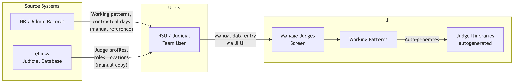
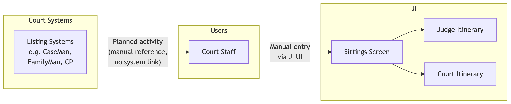
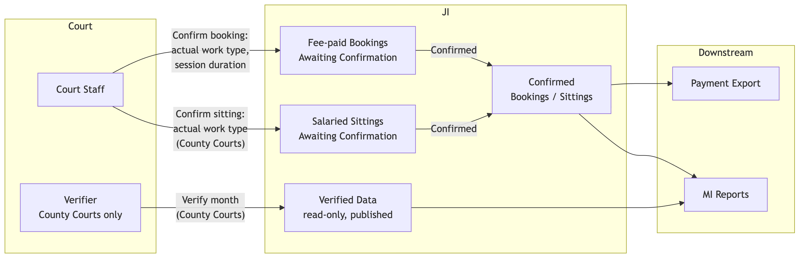
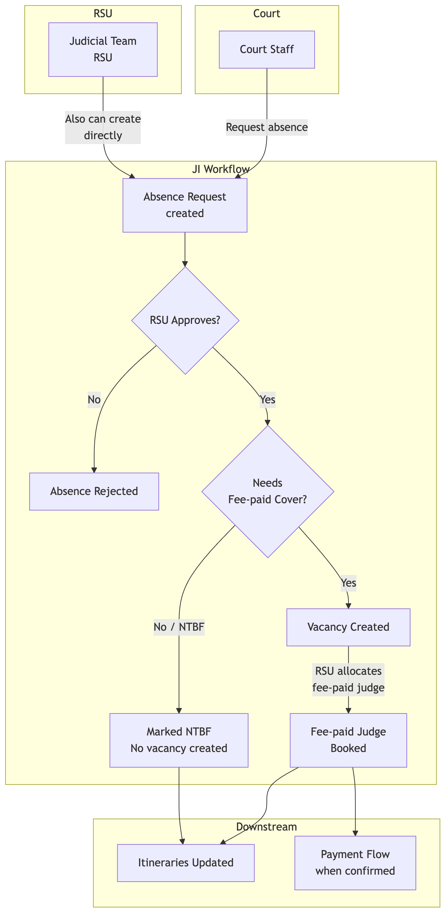
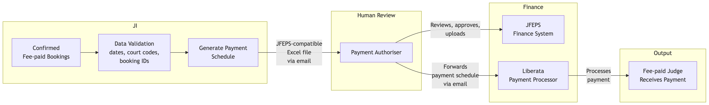
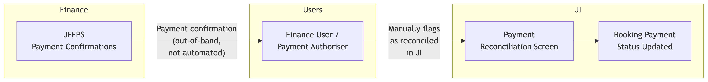
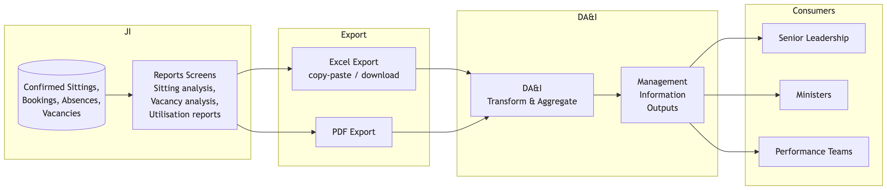
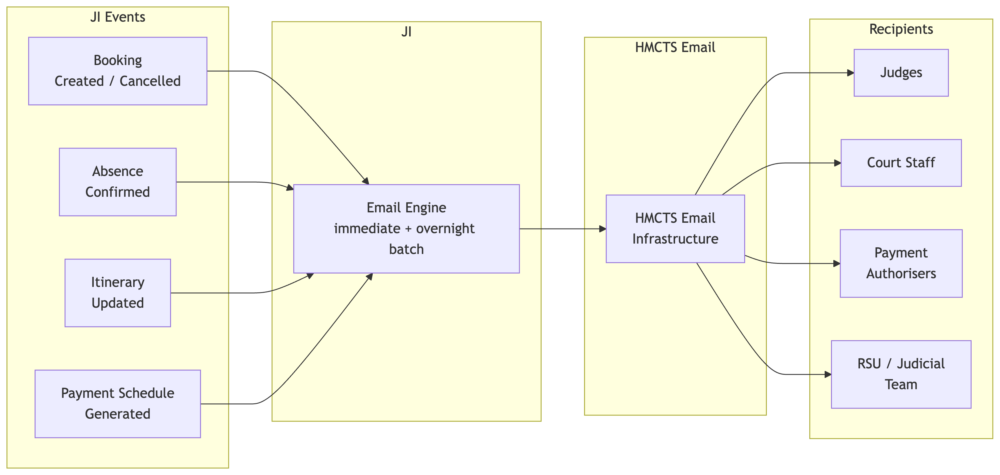

# Judicial Itineraries (JI) - Integration Dependencies

This document maps the integration flows between the Judicial Itineraries (JI) system and external systems, describing what data moves, how it moves, and who is involved at each step.

## At a Glance

| # | Flow | Source | Destination | Data | Mechanism | Frequency | Criticality |
|---|------|--------|-------------|------|-----------|-----------|-------------|
| 1 | [Judge Master Data](#flow-1--judge-master-data-elinks--hr--ji) | eLinks, HR Records | JI | Judge profiles, working patterns, contractual sitting days | Manual entry / manual copy | On change | High |
| 2 | [Planned Activity Capture](#flow-2--planned-activity-capture-listing-systems--ji) | Court Listing Systems | JI | Planned sittings, work types, daily judicial activity | Manual copy into JI | Daily | Medium |
| 3 | [Sitting & Booking Confirmation](#flow-3--sitting--booking-confirmation-court-staff--ji) | Court Staff | JI | Confirmed sittings, actual work types, session durations | Manual entry via JI UI | Daily | High |
| 4 | [Absence & Vacancy Management](#flow-4--absence--vacancy-management-courts--rsu--ji) | Courts, RSU | JI | Absence requests, vacancy creation, NTBF decisions | Manual entry via JI UI with approval workflow | Event-driven | High |
| 5 | [Fee-Paid Payment Export](#flow-5--fee-paid-payment-export-ji--jfeps--liberata) | JI | JFEPS, Liberata | Payment files for fee-paid judges | Excel export, email, manual upload | Weekly | Critical |
| 6 | [Payment Reconciliation](#flow-6--payment-reconciliation-jfeps--ji) | JFEPS | JI | Payment confirmations, discrepancies | Manual flagging in JI | Ongoing | Medium |
| 7 | [Management Information & Reporting](#flow-7--management-information--reporting-ji--dai) | JI | DA&I | Sitting days, utilisation, vacancy/absence analysis | Excel / PDF report exports | Reporting cycles | High |
| 8 | [Notifications & Communications](#flow-8--notifications--communications-ji--hmcts-email) | JI | HMCTS Email, Judges, Court Staff | Itineraries, booking confirmations, absence alerts, payment files | Automated email (some batch) | Event-driven | High |

---

## Flow Index

1. [Judge Master Data (eLinks / HR -> JI)](#flow-1--judge-master-data-elinks--hr--ji)
2. [Planned Activity Capture (Listing Systems -> JI)](#flow-2--planned-activity-capture-listing-systems--ji)
3. [Sitting & Booking Confirmation (Court Staff -> JI)](#flow-3--sitting--booking-confirmation-court-staff--ji)
4. [Absence & Vacancy Management (Courts / RSU -> JI)](#flow-4--absence--vacancy-management-courts--rsu--ji)
5. [Fee-Paid Payment Export (JI -> JFEPS -> Liberata)](#flow-5--fee-paid-payment-export-ji--jfeps--liberata)
6. [Payment Reconciliation (JFEPS -> JI)](#flow-6--payment-reconciliation-jfeps--ji)
7. [Management Information & Reporting (JI -> DA&I)](#flow-7--management-information--reporting-ji--dai)
8. [Notifications & Communications (JI -> HMCTS Email)](#flow-8--notifications--communications-ji--hmcts-email)

---

## Flow 1 -- Judge Master Data (eLinks / HR -> JI)

Judge profile and working pattern data originates in external HR systems and the eLinks Judicial Database, and is manually entered into JI by RSU users. JI is not the system of record for judge employment data; it reflects what has been agreed elsewhere.

| Attribute | Detail |
|-----------|--------|
| **Sources** | eLinks (Judicial Database), HR / administrative records |
| **Destination** | JI (Manage Judges screens) |
| **Data** | Judge names, titles, contact details, judge type (salaried / fee-paid), base location, roles, authorisations, tickets, working patterns (days, locations, work types), contractual sitting days, part-time arrangements, jurisdictional split, retirement dates, payroll numbers, fee payment status |
| **Mechanism** | Manual entry by RSU / judicial team users. The SRS states an eLinks integration requirement (NFR-3: "The system shall support eLinks integration for importing judiciary data") but the technical mechanism is not implemented. |
| **Frequency** | On change -- new judge onboarding, base court transfers, part-time conversions, role updates |
| **Users involved** | RSU Admin, Regional (Full Access) users |
| **Criticality** | High -- all itineraries, bookings, and reports depend on accurate judge data |

<!--
Diagram source (Mermaid). Regenerate flow-1-judge-master-data.png with:
  mmdc -i flow-1-judge-master-data.mmd -o flow-1-judge-master-data.png -b white -s 3
Use   for label line breaks (Mermaid renders a literal \n as text).

flowchart LR
    subgraph Source Systems
        HR[HR / Admin Records]
        EL[eLinks Judicial Database]
    end

    subgraph Users
        RSU[RSU / Judicial Team User]
    end

    subgraph JI
        MJ[Manage Judges Screen]
        WP[Working Patterns]
        ITIN[Judge Itineraries autogenerated]
    end

    HR -- "Working patterns, contractual days (manual reference)" --> RSU
    EL -- "Judge profiles, roles, locations (manual copy)" --> RSU
    RSU -- "Manual data entry via JI UI" --> MJ
    MJ --> WP
    WP -- "Auto-generates" --> ITIN
-->

**Gap:** There is no automated synchronisation. Users must manually keep both eLinks and JI updated. The training documentation notes this will be revisited once the Judicial Database replacement is complete.

---

## Flow 2 -- Planned Activity Capture (Listing Systems -> JI)

Data on how judges plan to spend their working day is sourced from court listing systems and entered into JI manually. There is no direct integration with case management systems (CaseMan, FamilyMan, Common Platform).

| Attribute | Detail |
|-----------|--------|
| **Source** | Court listing systems |
| **Destination** | JI (Sittings, Judge Itinerary screens) |
| **Data** | Planned sittings, work types (Crime, Civil, Family, S9, Off Circuit), session durations (full day / half day AM/PM), sitting locations |
| **Mechanism** | Manual copy from listing systems into JI by HMCTS court staff. Ad-hoc sittings can also be created directly in JI. |
| **Frequency** | Daily (progressive entry recommended) |
| **Users involved** | Court (Full Access), Regional (Full Access) |
| **Criticality** | Medium -- feeds into utilisation reporting once confirmed |

<!--
Diagram source (Mermaid). Regenerate flow-2-planned-activity-capture.png with:
  mmdc -i flow-2-planned-activity-capture.mmd -o flow-2-planned-activity-capture.png -b white -s 3
Use   for label line breaks (Mermaid renders a literal \n as text).

flowchart LR
    subgraph Court Systems
        LS[Listing Systems e.g. CaseMan, FamilyMan, CP]
    end

    subgraph Users
        CS[Court Staff]
    end

    subgraph JI
        SIT[Sittings Screen]
        JI_IT[Judge Itinerary]
        CI[Court Itinerary]
    end

    LS -- "Planned activity (manual reference, no system link)" --> CS
    CS -- "Manual entry via JI UI" --> SIT
    SIT --> JI_IT
    SIT --> CI
-->

**Gap:** No system-to-system integration exists. The documentation explicitly states no direct integration with CaseMan, FamilyMan, or Common Platform.

---

## Flow 3 -- Sitting & Booking Confirmation (Court Staff -> JI)

After a sitting or fee-paid booking occurs, court staff confirm it in JI -- verifying that it took place, recording the actual work type, and adjusting the session duration if needed. Confirmed data drives both payment processing and MI reporting.

| Attribute | Detail |
|-----------|--------|
| **Source** | Court staff (local knowledge of what actually happened) |
| **Destination** | JI (Sittings, Fee-paid Bookings screens) |
| **Data** | Confirmation status (confirmed / cancelled / rejected), actual work type, actual session duration, verifier sign-off (County Courts) |
| **Mechanism** | Manual entry via JI UI. Sittings can be confirmed individually or in bulk. County Courts have an additional verification step by a senior manager. |
| **Frequency** | Daily (strongly recommended), at minimum before monthly verification deadline |
| **Users involved** | Court (Full Access), Court (Enhanced CJ), Regional (Verifier) |
| **Criticality** | High -- unconfirmed bookings cannot be exported for payment; unconfirmed sittings are excluded from MI |

<!--
Diagram source (Mermaid). Regenerate flow-3-sitting-booking-confirmation.png with:
  mmdc -i flow-3-sitting-booking-confirmation.mmd -o flow-3-sitting-booking-confirmation.png -b white -s 3
Use   for label line breaks (Mermaid renders a literal \n as text).

flowchart LR
    subgraph Court
        CS[Court Staff]
        VER[Verifier County Courts only]
    end

    subgraph JI
        FPB[Fee-paid Bookings Awaiting Confirmation]
        SAL[Salaried Sittings Awaiting Confirmation]
        CONF[Confirmed Bookings / Sittings]
        VERIF[Verified Data read-only, published]
    end

    subgraph Downstream
        PAY[Payment Export]
        MI[MI Reports]
    end

    CS -- "Confirm booking: actual work type, session duration" --> FPB
    CS -- "Confirm sitting: actual work type (County Courts)" --> SAL
    FPB -- "Confirmed" --> CONF
    SAL -- "Confirmed" --> CONF
    VER -- "Verify month (County Courts)" --> VERIF
    CONF --> PAY
    CONF --> MI
    VERIF --> MI
-->

**Note:** Accuracy of confirmation directly affects payment correctness. The training documentation emphasises that "the accuracy of the payment schedules sent to Liberata is highly dependent on the checking that goes on here."

---

## Flow 4 -- Absence & Vacancy Management (Courts / RSU -> JI)

Absence recording triggers a multi-step workflow involving court staff, RSU judicial teams, and vacancy/booking management. This is an internal JI workflow with human actors at each step.

| Attribute | Detail |
|-----------|--------|
| **Actors** | Court staff (requesters), RSU / Judicial Team (approvers), Court staff (vacancy decision) |
| **System** | JI (Absences, Vacancies, Fee-paid Bookings screens) |
| **Data** | Absence type, dates, NTBF status, vacancy requirements, fee-paid judge allocations, booking confirmations |
| **Mechanism** | Multi-step approval workflow within JI UI. Email notifications at each stage. |
| **Frequency** | Event-driven |
| **Criticality** | High -- drives vacancy creation, fee-paid bookings, and downstream payments |

<!--
Diagram source (Mermaid). Regenerate flow-4-absence-vacancy-management.png with:
  mmdc -i flow-4-absence-vacancy-management.mmd -o flow-4-absence-vacancy-management.png -b white -s 3
Use   for label line breaks (Mermaid renders a literal \n as text).

flowchart TD
    subgraph Court
        CS[Court Staff]
    end

    subgraph RSU
        JT[Judicial Team RSU]
    end

    subgraph JI Workflow
        ABS[Absence Request created]
        APPROVE{RSU Approves?}
        REJECT[Absence Rejected]
        COVER{Needs Fee-paid Cover?}
        NTBF[Marked NTBF No vacancy created]
        VAC[Vacancy Created]
        BOOK[Fee-paid Judge Booked]
    end

    subgraph Downstream
        ITIN[Itineraries Updated]
        PAY[Payment Flow when confirmed]
    end

    CS -- "Request absence" --> ABS
    JT -- "Also can create directly" --> ABS
    ABS --> APPROVE
    APPROVE -- "Yes" --> COVER
    APPROVE -- "No" --> REJECT
    COVER -- "Yes" --> VAC
    COVER -- "No / NTBF" --> NTBF
    VAC -- "RSU allocates fee-paid judge" --> BOOK
    BOOK --> ITIN
    NTBF --> ITIN
    BOOK --> PAY
-->

---

## Flow 5 -- Fee-Paid Payment Export (JI -> JFEPS -> Liberata)

This is the most operationally critical integration flow. JI generates payment files from confirmed fee-paid bookings and routes them through a human approval chain to the finance system and payment processor.

| Attribute | Detail |
|-----------|--------|
| **Source** | JI (Payments screen) |
| **Destinations** | JFEPS (finance system), Liberata (payment processor) |
| **Data** | Judge details, payroll numbers, court codes, sitting dates, session types (full/half day), booking IDs, work types, fee amounts, London weighting |
| **Format** | JFEPS-compatible Excel file |
| **Mechanism** | JI validates data (dates, court codes, booking IDs) -> generates Excel -> emails to Payment Authoriser -> authoriser reviews and forwards to Liberata -> authoriser uploads to JFEPS |
| **Frequency** | Weekly |
| **Users involved** | RSU / Judicial Team (generates schedule), Payment Authoriser (reviews and forwards) |
| **Criticality** | Critical -- Crown Courts rely on this as the only mechanism to pay fee-paid judges without manual individual payments |

<!--
Diagram source (Mermaid). Regenerate flow-5-fee-paid-payment-export.png with:
  mmdc -i flow-5-fee-paid-payment-export.mmd -o flow-5-fee-paid-payment-export.png -b white -s 3
Use   for label line breaks (Mermaid renders a literal \n as text).

flowchart LR
    subgraph JI
        CONF[Confirmed Fee-paid Bookings]
        VAL[Data Validation dates, court codes, booking IDs]
        GEN[Generate Payment Schedule]
    end

    subgraph Human Review
        PA[Payment Authoriser]
    end

    subgraph Finance
        JFEPS[JFEPS Finance System]
        LIB[Liberata Payment Processor]
    end

    subgraph Output
        PAID[Fee-paid Judge Receives Payment]
    end

    CONF --> VAL
    VAL --> GEN
    GEN -- "JFEPS-compatible Excel file via email" --> PA
    PA -- "Reviews, approves, uploads" --> JFEPS
    PA -- "Forwards payment schedule via email" --> LIB
    LIB -- "Processes payment" --> PAID
-->

**Note:** JI does not hold bank details or process payments directly. Sensitive financial data remains in JFEPS and Liberata. Double-submission is prevented by tracking which bookings have been exported.

---

## Flow 6 -- Payment Reconciliation (JFEPS -> JI)

After payments are processed, finance users reconcile the results back into JI to track which payments succeeded, which are pending, and flag discrepancies.

| Attribute | Detail |
|-----------|--------|
| **Source** | JFEPS / Finance System (payment confirmations) |
| **Destination** | JI (Payment Reconciliation screen) |
| **Data** | Payment status (paid / pending / queried), reconciliation notes, discrepancy flags |
| **Mechanism** | Finance users manually check JFEPS payment confirmations, then flag payments as reconciled in JI. No automated data feed from JFEPS back to JI. |
| **Frequency** | Ongoing as payments are processed |
| **Users involved** | Finance / Payment Authoriser |
| **Criticality** | Medium -- prevents double-payment and surfaces discrepancies |

<!--
Diagram source (Mermaid). Regenerate flow-6-payment-reconciliation.png with:
  mmdc -i flow-6-payment-reconciliation.mmd -o flow-6-payment-reconciliation.png -b white -s 3
Use   for label line breaks (Mermaid renders a literal \n as text).

flowchart LR
    subgraph Finance
        JFEPS[JFEPS Payment Confirmations]
    end

    subgraph Users
        FIN[Finance User / Payment Authoriser]
    end

    subgraph JI
        REC[Payment Reconciliation Screen]
        STATUS[Booking Payment Status Updated]
    end

    JFEPS -- "Payment confirmation (out-of-band, not automated)" --> FIN
    FIN -- "Manually flags as reconciled in JI" --> REC
    REC --> STATUS
-->

**Gap:** Reconciliation is entirely manual. There is no automated feed from JFEPS back into JI. Finance users must cross-reference two systems.

---

## Flow 7 -- Management Information & Reporting (JI -> DA&I)

JI is the primary source of sitting day data for Civil, Family, and Crown Courts. DA&I extracts this data for management information, performance reporting, and strategic decision-making.

| Attribute | Detail |
|-----------|--------|
| **Source** | JI (Reports screens) |
| **Destination** | DA&I team systems, senior leadership, ministers |
| **Data** | Sitting day summaries, judicial utilisation, vacancy analysis, booking analysis, absence/official business analysis, jurisdictional splits, work type distributions |
| **Format** | Excel and PDF exports from JI report screens |
| **Mechanism** | Export-based -- users run reports in JI, copy/paste or download to Excel/PDF. DA&I then transforms and aggregates. Manual extraction via spreadsheets also used. |
| **Frequency** | Aligned to reporting cycles (monthly, quarterly, annual) |
| **Users involved** | MI / Reporting Users, DA&I analysts |
| **Criticality** | High -- ministers require performance reporting across jurisdictions; JI is the primary data source for courts |

<!--
Diagram source (Mermaid). Regenerate flow-7-mi-reporting.png with:
  mmdc -i flow-7-mi-reporting.mmd -o flow-7-mi-reporting.png -b white -s 3
Use   for label line breaks (Mermaid renders a literal \n as text).

flowchart LR
    subgraph JI
        DATA[(Confirmed Sittings, Bookings, Absences, Vacancies)]
        RPT[Reports Screens Sitting analysis, Vacancy analysis, Utilisation reports]
    end

    subgraph Export
        XLS[Excel Export copy-paste / download]
        PDF[PDF Export]
    end

    subgraph DA&I
        ETL[DA&I Transform & Aggregate]
        MI[Management Information Outputs]
    end

    subgraph Consumers
        LEAD[Senior Leadership]
        MIN[Ministers]
        PERF[Performance Teams]
    end

    DATA --> RPT
    RPT --> XLS
    RPT --> PDF
    XLS --> ETL
    PDF --> ETL
    ETL --> MI
    MI --> LEAD
    MI --> MIN
    MI --> PERF
-->

**Gap:** Tribunals data is not captured in JI. Tribunal sitting data is collected manually via spreadsheets managed by different Chamber Presidents' Offices, leaving a significant gap in cross-jurisdictional reporting.

---

## Flow 8 -- Notifications & Communications (JI -> HMCTS Email)

JI uses HMCTS email infrastructure as a transport layer for operational notifications, itinerary distribution, and payment file delivery.

| Attribute | Detail |
|-----------|--------|
| **Source** | JI (various screens) |
| **Destination** | HMCTS email infrastructure -> judges, court staff, RSU, Payment Authorisers |
| **Data** | See trigger table below |
| **Mechanism** | Automated email from JI. Some emails are sent immediately on action; others (e.g. booking acknowledgements) are batched via an overnight process. |
| **Frequency** | Event-driven |
| **Criticality** | High -- operational communications depend on email delivery |

**Email triggers:**

| Trigger Event | Recipients | Content |
|---------------|-----------|---------|
| Booking created | Fee-paid judge | Booking confirmation with dates, court, work type |
| Booking cancelled / rejected | Impacted judge and court staff | Cancellation notification |
| Absence confirmed | Judge | Absence acknowledgement |
| Itinerary updated | Judge and relevant staff | Updated itinerary |
| Payment schedule generated | Payment Authoriser | JFEPS-compatible Excel file attached |
| Sitting/booking changes | Court staff | Alerts within system and optionally via email |

<!--
Diagram source (Mermaid). Regenerate flow-8-notifications.png with:
  mmdc -i flow-8-notifications.mmd -o flow-8-notifications.png -b white -s 3
Use   for label line breaks (Mermaid renders a literal \n as text).

flowchart LR
    subgraph JI Events
        BK[Booking Created / Cancelled]
        AB[Absence Confirmed]
        IT[Itinerary Updated]
        PS[Payment Schedule Generated]
    end

    subgraph JI
        EM[Email Engine immediate + overnight batch]
    end

    subgraph HMCTS Email
        SMTP[HMCTS Email Infrastructure]
    end

    subgraph Recipients
        JDG[Judges]
        CST[Court Staff]
        PA[Payment Authorisers]
        RSU[RSU / Judicial Team]
    end

    BK --> EM
    AB --> EM
    IT --> EM
    PS --> EM
    EM --> SMTP
    SMTP --> JDG
    SMTP --> CST
    SMTP --> PA
    SMTP --> RSU
-->

---

## Key Observations

1. **No API integrations exist.** Every integration is either manual data entry, file-based export (Excel/PDF), or email. This limits automation and introduces data quality risks from manual transcription.

2. **The payment flow is the most critical end-to-end integration.** It spans four steps (confirmation -> export -> authorisation -> payment) with human checkpoints at each stage. Any delay in court confirmation cascades into delayed payments.

3. **eLinks integration is aspirational, not operational.** The SRS records it as a non-functional requirement, but no automated data exchange is implemented today.

4. **Reconciliation has no return feed.** Payment outcomes from JFEPS are not automatically reflected in JI. Finance users must manually bridge the two systems.

5. **Tribunals are a blind spot.** JI has no integration with Tribunal listing or scheduling systems. Extending coverage to Tribunals (Employment, Immigration & Asylum, SSCS) is a stated strategic priority.

6. **Future integration pressure.** The Actuals programme and Scheduling & Listing (S&L) reforms both require JI data. The current export-only model will not scale to support these needs.

---

## Source Documents

This analysis is based on the following input documents:

- High Level Capabilities JI.docx
- JI Functional and Non Functional Requirements.docx
- Judicial Itineraries High Level Requirements.docx
- Judicial Itinerary KB.docx
- OPT JI Training Brief DRAFT 02.doc
- UCD resource request.docx
