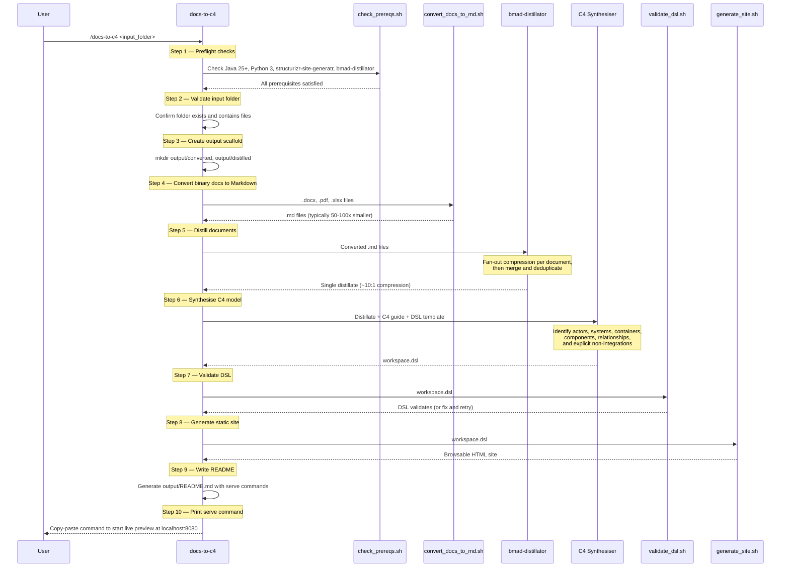
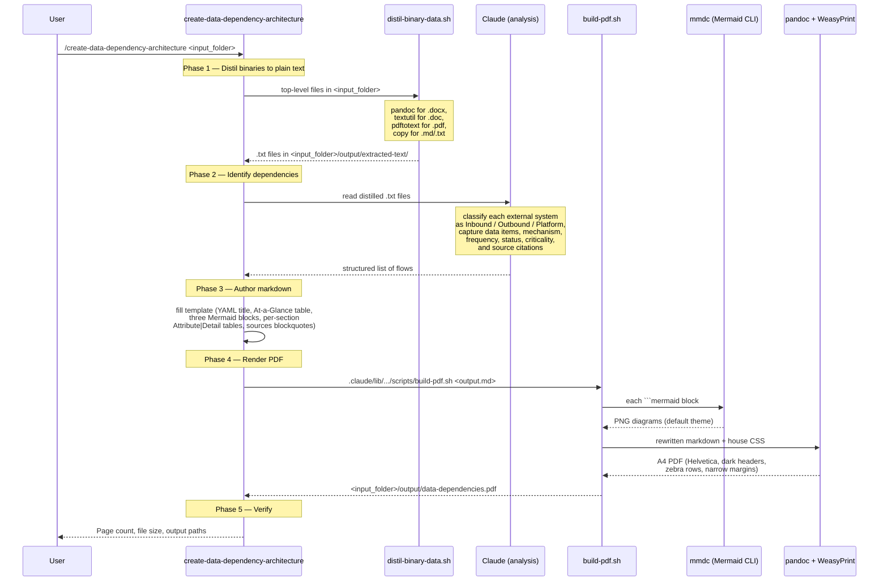
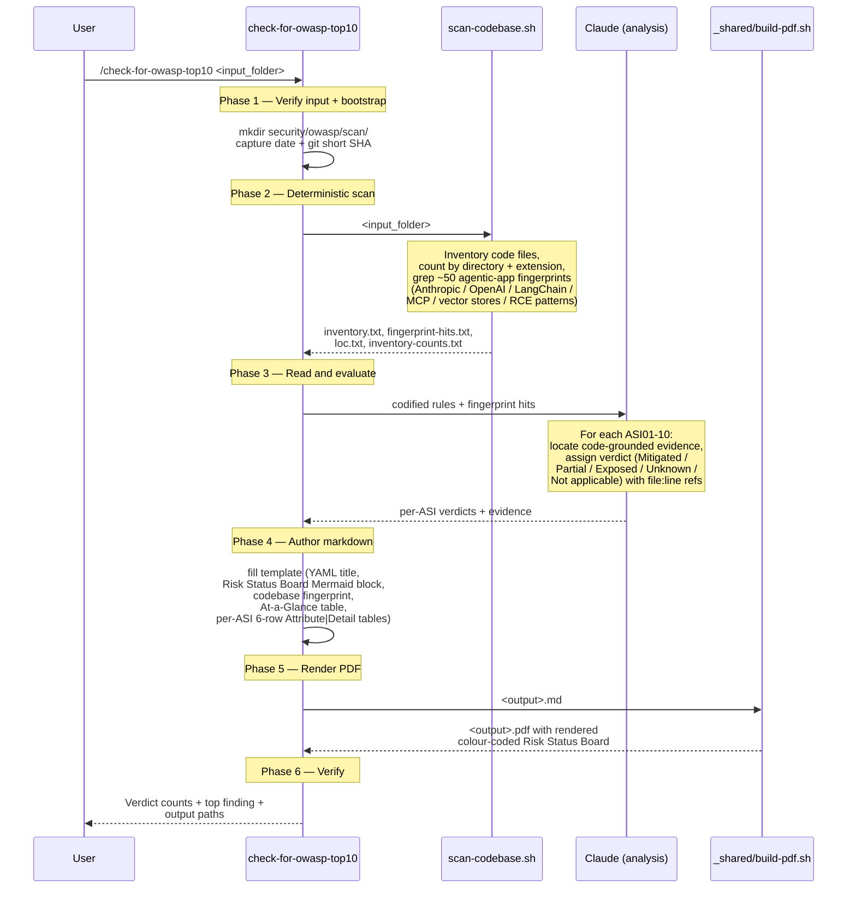

# Claude Code skills shipped from this repo

This repository provides four Claude Code slash commands for analysing and documenting software systems. They were built to produce the AS-IS analysis pack and supporting artefacts for the JI → RAM Pathfinder programme, and are reusable against any input folder.

| Slash command | What it does |
|---|---|
| [`/docs-to-c4`](#slash-command--docs-to-c4) | Turn a folder of mixed-format documents into a browsable C4 architecture model (Structurizr DSL + static site) |
| [`/create-data-dependency-architecture`](#slash-command--create-data-dependency-architecture) | Catalogue a system's inbound and outbound data dependencies as a styled PDF |
| [`/create-functional-modules-architecture`](#slash-command--create-functional-modules-architecture) | Catalogue a system's functional modules (one detail section per module) as a styled PDF |
| [`/check-for-owasp-top10`](#slash-command--check-for-owasp-top-10) | Audit a codebase against the OWASP Top 10 for Agentic Applications 2026 and produce a Markdown + PDF report with a colour-coded *Risk Status Board* headline diagram |

The three PDF-producing commands share a single house style (Helvetica typography, dark-navy headers, zebra rows, A4 with narrow margins) and a shared build pipeline at [`../.claude/lib/_shared/`](../.claude/lib/_shared/README.md) — the same `doc-style.css`, `mermaid-config.json`, `build-pdf.sh`, `md_to_pdf.py` and `distil-binary-data.sh` are owned by `_shared/` and consumed by all three skills. There is no per-skill duplication.

## Slash command — Docs to C4

### Purpose

This skill automates the creation of [C4 architecture models](https://c4model.com/) from existing documentation. Rather than manually reading through requirements, design specs, and capability documents to draw architecture diagrams by hand, this skill extracts system structure directly from your documents and produces a browsable, interactive C4 model.

The quality of the generated model reflects the quality of the input documentation. Well-structured documents with clear descriptions of systems, integrations, actors, and boundaries will produce rich, detailed models. Sparse or ambiguous documentation will produce simpler models with gaps clearly flagged for follow-up.

### Overview

A Claude Code skill that transforms a folder of mixed-format documents (.docx, .pdf, .xlsx, .md) into a browsable C4 architecture model, powered by [Structurizr](https://structurizr.com/).

Give it a pile of requirements docs, design specs, or capability documents and it produces:

- A **Structurizr DSL workspace** with System Context, Container, and Component views
- A **static browsable site** you can share with your team
- A **live preview server** for interactive exploration

### Supported platform

| Platform | Status |
|----------|--------|
| macOS (Apple Silicon & Intel) | Supported |
| Linux | Not tested |
| Windows | Not tested |

### Prerequisites

The command requires the following tools on your PATH. Install them all before first use:

```sh
# Java 25+ (required by structurizr-site-generatr)
brew install openjdk@25

# Python 3.10+ (required for document conversion)
brew install python@3

# Structurizr Site Generatr (generates the browsable C4 site)
brew tap avisi-cloud/tools
brew install structurizr-site-generatr

# Claude Code CLI (the slash command runs inside Claude Code)
# See https://docs.anthropic.com/en/docs/claude-code/overview
npm install -g @anthropic-ai/claude-code
```

#### BMAD plugin

The command depends on `bmad-distillator` for document compression. Install the [BMAD plugin](https://github.com/bmadcode/BMAD-METHOD) for Claude Code so that the `bmad-distillator` skill is available in your session.

#### Verify prerequisites

Run the preflight check script to confirm everything is in place:

```sh
bash .claude/lib/docs-to-c4/scripts/check_prereqs.sh
```

Expected output:

```
OK — prerequisites satisfied.
  java: openjdk version "25" 2025-09-16
  python3: Python 3.14.0
  structurizr-site-generatr: /opt/homebrew/bin/structurizr-site-generatr
  bmad-distillator: /path/to/.claude/skills/bmad-distillator
```

### Installation

Clone the repository:

```sh
git clone git@github.com:hmcts/ram-analysis.git
cd ram-analysis
```

The slash command entry-point lives at `.claude/commands/docs-to-c4.md`; the implementation (scripts, assets, references) lives at `.claude/lib/docs-to-c4/`. Both are auto-discovered by Claude Code when you open a session in this project directory.

On first run, the command creates a Python virtual environment at `.claude/lib/docs-to-c4/scripts/python/.venv/` and installs its Python dependencies (`python-docx`, `pypdf`, `openpyxl`) automatically. No manual pip install required.

### Usage

From within a Claude Code session in this project:

```
/docs-to-c4 /path/to/your/documents
```

Or with an explicit system name:

```
/docs-to-c4 /path/to/your/documents "My System Name"
```

The command runs end-to-end on demand and places all output inside `<input_folder>/output/`.

### How it works



### Output structure

All generated artefacts are placed inside `<input_folder>/output/`:

```
<input_folder>/
├── ...source documents (untouched)...
└── output/
    ├── converted/           # Binary docs converted to .md
    ├── distilled/           # Compressed distillate for C4 modelling
    ├── workspace.dsl        # Structurizr DSL — the C4 model
    ├── site/                # Static browsable site
    └── README.md            # Regeneration and serve commands
```

Source documents are never modified.

### Viewing the model

After the skill completes, it prints the exact command to start the live preview server. It looks like:

```sh
/path/to/.claude/lib/docs-to-c4/scripts/serve_site.sh /path/to/output/workspace.dsl
```

Open `http://localhost:8080` in your browser. Stop the server with Ctrl+C.

### C4 views generated

| View | What it shows |
|------|---------------|
| **System Context** | The system, its users (by role), external systems it integrates with, and systems it explicitly does *not* integrate with (architectural boundaries) |
| **Container** | Deployable units inside the system (web apps, APIs, databases) with technology labels |
| **Component** | Internal structure of containers where the source docs describe modules, services, or functional areas |

The skill only models what the source documents describe. It does not infer or hallucinate architecture.

### Supported input formats

| Format | How it's handled |
|--------|-----------------|
| `.docx` | Text, headings, and tables extracted via python-docx |
| `.pdf` | Page-by-page text extraction via pypdf |
| `.xlsx` | Sheet-by-sheet table extraction via openpyxl |
| `.md`, `.txt`, `.csv`, `.json`, `.yaml` | Copied as-is |

### Re-running the command

The command is idempotent — running it again on the same input folder produces an equivalent model. However, **re-running will overwrite previous output** including `workspace.dsl`, the distillate, converted files, and the generated site. If you have manually edited `workspace.dsl`, back it up before re-running.

The document converter supports a `--skip-existing` flag to avoid re-converting files that already have output, but the command does not use this by default.

### Command file structure

```
.claude/
├── commands/
│   └── docs-to-c4.md                   # Slash command entry-point (/docs-to-c4)
└── lib/
    └── docs-to-c4/
        ├── SKILL.md                    # Pipeline specification
        ├── assets/
        │   └── workspace-template.dsl  # Starter DSL template with styles
        ├── references/
        │   ├── c4-model-guide.md       # C4 level primer
        │   └── structurizr-dsl-guide.md # DSL syntax crib sheet
        └── scripts/
            ├── check_prereqs.sh        # Preflight check (Java, Python, tools, BMAD)
            ├── convert_docs_to_md.sh   # Shell wrapper for document conversion
            ├── validate_dsl.sh         # DSL validation via dry-run generation
            ├── generate_site.sh        # Full static site generation
            ├── serve_site.sh           # Live preview server
            └── python/
                ├── convert_docs_to_md.py # Python document converter
                └── requirements.txt    # Python dependencies
```

## Slash command — Create Data Dependency Architecture

### Purpose

This command produces a deterministic, styled PDF cataloguing a system's data dependencies on other systems, in both directions. Rather than freehand-writing an integration document each time and arguing over what shape it should take, the command encodes the content shape, the visual style, and the build pipeline so every run for every system produces an artefact in the same format.

The quality of the output reflects the quality of the input documentation — the command never invents dependencies, every entry traces to a specific section of one of the input documents.

### Overview

A Claude Code slash command that turns a folder of mixed-format documents (.docx, .doc, .pdf, .pptx, .md, .txt) into a styled, reviewable PDF that catalogues the system's inbound and outbound data flows.

Give it a folder of capability documents, requirements specs and operational guides and it produces:

- A **top-of-document At-a-Glance summary table** listing every flow in one compact view
- **Three Mermaid diagrams** (rendered to PNG before embedding): a top-level *Data flow overview*, plus *Inbound flow* and *Outbound flow* detail diagrams showing the human actors and intermediate steps between source/destination and the system
- A **compact `Attribute / Detail` table** under every numbered dependency, with source citations
- A **rendered PDF** in the house style (Helvetica, dark navy headers with white text, zebra-striped rows, ArchiMate-style rectangular diagrams)

### Supported platform

| Platform | Status |
|----------|--------|
| macOS (Apple Silicon & Intel) | Supported |
| Linux | Should work — drop-in replacement for `textutil` needed (e.g. `libreoffice --headless`) |
| Windows | Not tested |

### Prerequisites

The command requires the following tools on your PATH. Install them all before first use:

```sh
# Python 3.10+ (typing syntax in the build script)
brew install python@3

# Pandoc (Markdown -> HTML, .docx -> text)
brew install pandoc

# Mermaid CLI (renders diagram blocks to PNG before embedding)
npm install -g @mermaid-js/mermaid-cli

# Poppler (provides pdftotext for ingesting .pdf source documents)
brew install poppler

# textutil ships with macOS — used for legacy .doc files
```

WeasyPrint (the PDF rendering engine pandoc uses via `--pdf-engine=weasyprint`) is **not** installed system-wide — the shared `build-pdf.sh` creates a Python virtual environment under `.claude/lib/_shared/scripts/python/.venv/` on first run and installs WeasyPrint there from `requirements.txt`, then prepends the venv's `bin/` to `PATH` so pandoc finds it. No manual pip install required; deleting `.venv/` and re-running rebuilds it.

`textutil` is built into macOS and used to extract text from the legacy `.doc` binary format. On Linux, swap in `libreoffice --headless --convert-to txt` or `antiword`. PowerPoint `.pptx` files are handled by pandoc directly — no extra dependency.

### Installation

The slash command entry-point lives at `.claude/commands/create-data-dependency-architecture.md`; the skill-specific files (template, references, the manual-flow keyword scanner) live at `.claude/lib/create-data-dependency-architecture/`; the **shared** PDF pipeline (CSS, Mermaid config, build scripts, distiller) lives at [`../.claude/lib/_shared/`](../.claude/lib/_shared/README.md). All three are auto-discovered by Claude Code when you open a session in this project directory. There is no separate bootstrap step — the command is fully self-contained.

If you want to call the build pipeline from outside a Claude session (e.g. as part of a docs-build CI step), invoke `.claude/lib/_shared/scripts/build-pdf.sh` directly — it bootstraps its own venv from `.claude/lib/_shared/scripts/python/requirements.txt` and reads the house style from `.claude/lib/_shared/assets/`.

### Usage

From within a Claude Code session in this project:

```
/create-data-dependency-architecture /path/to/your/documents
```

Or with an explicit system name:

```
/create-data-dependency-architecture /path/to/your/documents "My System Name"
```

The command runs end-to-end on demand and places all output inside `<input_folder>/output/`. The repo running the command is never written to — tooling lives with the skill, data (inputs and outputs) lives with the input folder.

### How it works



### Output structure

All generated artefacts are placed inside `<input_folder>/output/` — alongside the input data, never inside the repo running the command. Authoring guides, build scripts, CSS, Mermaid configuration and the document template all live inside `.claude/lib/create-data-dependency-architecture/`, separate from any per-run output:

```
<input_folder>/
├── ...source documents (untouched, top level)...
└── output/
    ├── extracted-text/                 # Plain-text extractions of each source binary
    ├── data-dependencies.md            # Source markdown with YAML front matter
    ├── data-dependencies.pdf           # Rendered PDF (the deliverable)
    └── data-dependencies.assets/       # Build artefacts (kept for inspection)
        ├── build.md                    # Pandoc-ready markdown after Mermaid substitution
        ├── diagram-1.png               # Data flow overview (Inbound / Platform / Outbound)
        ├── diagram-2.png               # Inbound flow — Source -> Actors -> JI screens
        └── diagram-3.png               # Outbound flow — JI -> Actors -> Destination
```

Source documents are never modified; the command works from the plain-text extractions in `output/extracted-text/`.

### Output document shape

Every PDF produced by this command has the same structure, in the same order:

| Section | What it contains |
|---------|------------------|
| **Title block** | YAML-driven title + subtitle, centred, dark navy |
| **Lead paragraph + bullets** | Inbound vs Outbound definition |
| **At a Glance** | Compact 5-column summary of every flow (no Status column — that lives in the per-section table) |
| **Data flow overview** | Single Mermaid diagram clustering Inbound / Platform / Outbound around the central system |
| **Inbound dependencies** | Numbered detail entries, each with a 1–2 sentence lead, an 8-row `Attribute / Detail` table at 20% / 80% column split, and a source-citation blockquote |
| **Inbound flow** | Mermaid diagram tracing each source through the actors and JI screens that consume it |
| **Outbound dependencies** | Numbered detail entries with a 9-row `Attribute / Detail` table (extra `Format` row) |
| **Outbound flow** | Mermaid diagram tracing JI's outputs through actors to each destination |
| **Summary** | 3–5 high-level observations |
| **Source Documents** | Exact list of input files actually consumed |

### Re-running the command

The command is **deterministic** — running it again on the same input folder produces a byte-equivalent document (modulo PNG rasterisation). Re-running **overwrites** previous output. If you have manually edited `data-dependencies.md`, back it up before re-running.

### Command file structure

The skill's own files are minimal — most of the heavy lifting comes from [`../.claude/lib/_shared/`](../.claude/lib/_shared/README.md):

```
.claude/
├── commands/
│   └── create-data-dependency-architecture.md  # Slash command entry-point
└── lib/
    ├── _shared/                                # Shared house pipeline (consumed by this
    │   │                                         skill, the functional-modules skill, and
    │   │                                         the OWASP skill — see _shared/README.md)
    │   ├── README.md
    │   ├── assets/
    │   │   ├── doc-style.css                   # House CSS (Helvetica, dark headers,
    │   │   │                                     zebra rows, 8.5pt tables, A4 with
    │   │   │                                     2cm × 1.25cm margins)
    │   │   └── mermaid-config.json             # Mermaid theme: default + Helvetica
    │   └── scripts/
    │       ├── build-pdf.sh                    # Venv-bootstrapping shell wrapper
    │       ├── distil-binary-data.sh           # Top-level-only binary -> text extractor
    │       │                                     (.docx, .pptx, .doc, .pdf, .md, .txt)
    │       └── python/
    │           ├── md_to_pdf.py                # Pre-renders Mermaid -> PNG, then
    │           │                                 pandoc --wrap=none -> WeasyPrint
    │           ├── requirements.txt            # pip deps (weasyprint)
    │           └── .venv/                      # auto-created on first build (gitignored)
    └── create-data-dependency-architecture/
        ├── SKILL.md                            # Pipeline specification (5 phases)
        ├── scripts/
        │   └── find-manual-flows.sh            # Phase 2a discovery floor (skill-specific)
        ├── templates/
        │   └── data-dependencies.template.md   # Output skeleton with placeholders
        └── references/
            ├── OUTPUT-STRUCTURE.md             # Deterministic content shape spec
            ├── STYLE-GUIDE.md                  # Author-facing house style for the pipeline
            └── LESSONS-LEARNED.md              # Critical settings + non-obvious gotchas
                                                # (e.g. markdown separator-dash widths
                                                # drive pandoc colgroup widths)
```

## Slash command — Create Functional Modules Architecture

A sibling of the data-dependency command above. Same workflow (distil → discover → author → render), same house style, but produces a **module-organised** view of the system rather than a data-flow view: one detail section per module covering purpose, capabilities, user actions, business rules, NFRs and source citations.

Spec: `.claude/lib/create-functional-modules-architecture/SKILL.md`. Slash-command entry-point: `.claude/commands/create-functional-modules-architecture.md`.

```
/create-functional-modules-architecture /path/to/your/documents
```

Output lands in `<input_folder>/output-functional-modules/` (deliberately a different top-level folder from the data-dependency skill's `<input_folder>/output/` so the two skills' artefacts never mix).

## Slash command — Check for OWASP Top 10

### Purpose

This command audits a codebase against the **OWASP Top 10 for Agentic Applications 2026** (the December 2025 release from the OWASP GenAI Security Project — Agentic Security Initiative) and produces a deterministic Markdown + PDF report. Rather than running yet another generic SAST tool over an agentic application, this command evaluates the code against the ten ASI risks specifically — agent goal hijack, tool misuse, identity & privilege abuse, agentic supply chain, unexpected code execution, memory & context poisoning, insecure inter-agent communication, cascading failures, human-agent trust exploitation, and rogue agents.

Verdicts are **evidence-based**: every claim in the report traces to a `file:line` reference in the code. When evidence is absent, the verdict is `Unknown` — never silently `Mitigated`.

### Overview

A Claude Code slash command that scans a folder of source code and produces:

- A **Markdown report** at `<input_folder>/security/owasp/owasp-agentic-top10-report.md`, diff-friendly for review
- A **rendered PDF** at the same path with `.pdf` extension, in the shared house style
- A **headline *Risk Status Board* diagram** — a 2×5 grid of ASI tiles tinted by verdict (red Exposed, amber Partial, green Mitigated, dark grey Unknown, light grey Not applicable) so the posture is readable at a glance before any prose
- A **codified rules reference** at `.claude/lib/check-for-owasp-top10/references/OWASP-AGENTIC-TOP10.md` distilling the source PDF into per-ASI "what to look for in code" + verdict rubric
- A **scan artefacts folder** at `<input_folder>/security/owasp/scan/` (file inventory, fingerprint hits, LOC) so the discovery floor is byte-stable across re-runs

### Supported platform

| Platform | Status |
|----------|--------|
| macOS (Apple Silicon & Intel) | Supported |
| Linux | Should work — `ripgrep` recommended for fast fingerprint scans; `grep -rn` fallback included |
| Windows | Not tested |

### Prerequisites

The command requires the following tools on your PATH:

```sh
# Bash, find, awk, wc, sort — all standard

# ripgrep (recommended; falls back to grep if missing)
brew install ripgrep

# For Phase 5 (PDF rendering), the same tools the data-dependency skill needs:
brew install python@3 pandoc
npm install -g @mermaid-js/mermaid-cli
```

WeasyPrint is auto-installed into the shared venv at `.claude/lib/_shared/scripts/python/.venv/` on first PDF build. If a PDF-rendering tool is missing the skill still produces the Markdown report and tells you which tool was missing.

### Usage

From within a Claude Code session in this project:

```
/check-for-owasp-top10 /path/to/your/codebase
```

The command runs end-to-end on demand. The codebase is read-only; only `<input_folder>/security/owasp/` is written to.

### How it works



### Output structure

```
<input_folder>/
├── ...source code (untouched)...
└── security/
    └── owasp/
        ├── scan/
        │   ├── inventory.txt                       # Sorted list of code files scanned
        │   ├── inventory-counts.txt                # Counts by top-level dir + extension
        │   ├── loc.txt                             # Total lines of code
        │   └── fingerprint-hits.txt                # Agentic-app pattern matches
        ├── owasp-agentic-top10-report.md           # Phase 4 markdown deliverable
        ├── owasp-agentic-top10-report.pdf          # Phase 5 PDF deliverable
        └── owasp-agentic-top10-report.assets/      # Build artefacts (kept for inspection)
            ├── build.md
            └── diagram-1.png                       # Risk Status Board (the headline visual)
```

The codebase under review is never modified. The repo running the command is never written to.

### Output document shape

Every report produced by this command has the same structure, in the same order:

| Section | What it contains |
|---------|------------------|
| **Title block** | YAML-driven title + subtitle + review date, centred, dark navy |
| **Lead paragraph** | What the report measures, scope and limitations of the review |
| **Executive Summary** | 3–5 bullets: per-verdict counts, top finding by name, biggest systemic gap, biggest mitigation, agentic-fingerprint sentence |
| **Risk Status Board** | The headline Mermaid diagram — 2×5 grid of ASI tiles, colour-coded by verdict, fixed palette across all OWASP reports |
| **Codebase Fingerprint** | `Attribute / Detail` table: path, languages, file count, LOC, frameworks detected, vector stores, MCP/A2A surfaces, tools registered, external integrations, review date / commit |
| **At a Glance** | 5-column summary table covering all ten ASI entries (number, title, verdict, severity, headline) |
| **Per-ASI detail entries** | One section per ASI01–ASI10, each with a 6-row Attribute / Detail table (Verdict, Severity, Affirmative evidence, Risk signals, Coverage gap, Recommendation) and a sources blockquote |
| **Codebase scan summary** | Top-level directories scanned, exclusion patterns, tools used, unread files |
| **Limitations of static review** | What this report cannot assess (runtime behaviour, network policy, IAM, prompt content, behavioural alignment) |
| **References** | Pointers to the OWASP source and the codified rules |

### Re-running the command

The command is **idempotent** — running it again on the same codebase replaces all four output files (markdown, PDF, build markdown, diagram PNG). The scan artefacts are byte-stable across re-runs, so any churn in the report reflects either changes in the codebase or in the per-ASI evaluation, not in the scan.

To preserve a previous report, commit / archive `<input_folder>/security/owasp/owasp-agentic-top10-report.md` before re-running.

### Command file structure

```
.claude/
├── commands/
│   └── check-for-owasp-top10.md                 # Slash command entry-point
└── lib/
    ├── _shared/                                 # Shared house pipeline (Phase 5 PDF render)
    │   └── ...                                  # See _shared/README.md
    └── check-for-owasp-top10/
        ├── SKILL.md                             # Pipeline specification (6 phases)
        ├── scripts/
        │   └── scan-codebase.sh                 # Phase 2 inventory + fingerprint scan
        ├── templates/
        │   └── report.template.md               # Output skeleton (incl. Risk Status Board)
        └── references/
            ├── OWASP-AGENTIC-TOP10.md           # Codified rules — what to look for, verdict rubric
            ├── OUTPUT-STRUCTURE.md              # Deterministic content shape (incl. headline-diagram spec)
            └── owasp-top10-source-extract.txt   # Plain-text extraction of the source PDF
```

## Shared build pipeline

Three of the four slash commands (`create-data-dependency-architecture`, `create-functional-modules-architecture`, `check-for-owasp-top10`) consume a single shared library at [`../.claude/lib/_shared/`](../.claude/lib/_shared/README.md):

```
.claude/lib/_shared/
├── README.md                       # Ownership / consumer map
├── assets/
│   ├── doc-style.css               # House CSS — every PDF this repo produces uses it
│   └── mermaid-config.json         # House Mermaid theme — every diagram uses it
└── scripts/
    ├── build-pdf.sh                # Venv-bootstrapping wrapper around md_to_pdf.py
    ├── distil-binary-data.sh       # Binary -> plain-text extractor
    │                                 (.docx, .pptx, .doc, .pdf, .md, .markdown, .txt)
    └── python/
        ├── md_to_pdf.py            # Pre-renders Mermaid -> PNG, then pandoc + WeasyPrint
        └── requirements.txt        # pip deps (weasyprint)
```

The `_shared/` library is **not a slash command**. The leading underscore signals "supporting library, not a skill" and sorts before any real skill folder. Editing `doc-style.css` here updates the visual style of every PDF this repo's commands produce; editing it in any single skill is forbidden by the skill specs because there are no per-skill copies.

The single documented divergence is the OWASP report's *Risk Status Board* `classDef` palette — that's data-driven (verdict colour conveys risk level) and lives inside the report markdown, not in the shared CSS.

The `docs-to-c4` command is independent — it has its own toolchain (Java + structurizr-site-generatr) and does not consume `_shared/`.
